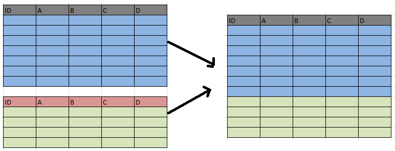
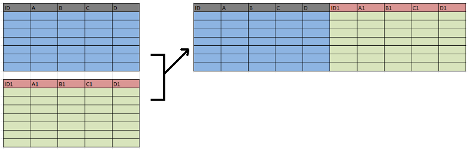

# Joining Data

**Summary**

+------------------+-----------------------------------------------------------------+---------------------------------------------------------------------------------------+
|                  | Mutating joins                                                  | Filtering joins                                                                       |
+==================+:================================================================+=======================================================================================+
| **descriptions** | combine the variables from two tables.                          | keeps or removes observations from the first table, but it doesn't add new variables. |
+------------------+-----------------------------------------------------------------+---------------------------------------------------------------------------------------+
| **verbs**        | **`inner_join`**                                                | **`semi_join()`**                                                                     |
|                  |                                                                 |                                                                                       |
|                  | Keeps only observations which match exactly between two tables. | Filter the first table for observations which also exist in the second table.         |
|                  |                                                                 |                                                                                       |
|                  | {width="103"}                  | {width="113"}                                         |
|                  |                                                                 |                                                                                       |
|                  | **`left_join`**                                                 | **`anti_join()`**                                                                     |
|                  |                                                                 |                                                                                       |
|                  | Keep all observations from the first table in your joins.       | Filter the first table for observations that do not exist in the second table.        |
|                  |                                                                 |                                                                                       |
|                  | {width="103"}                   | {width="113"}                                         |
|                  |                                                                 |                                                                                       |
|                  | **`right_join`**                                                |                                                                                       |
|                  |                                                                 |                                                                                       |
|                  | Keep all observations from the second table in your joins.      |                                                                                       |
|                  |                                                                 |                                                                                       |
|                  | {width="99"}                   |                                                                                       |
|                  |                                                                 |                                                                                       |
|                  | **`full_join`**                                                 |                                                                                       |
|                  |                                                                 |                                                                                       |
|                  | Keep all observations from both tables.                         |                                                                                       |
|                  |                                                                 |                                                                                       |
|                  | {width="110" height="70"}       |                                                                                       |
+------------------+-----------------------------------------------------------------+---------------------------------------------------------------------------------------+
|                  |                                                                 |                                                                                       |
+------------------+-----------------------------------------------------------------+---------------------------------------------------------------------------------------+

Load datasets from [Rebrickable](https://rebrickable.com/downloads/). And library package.

```{r message=FALSE, warning=FALSE}
library(tidyverse)

sets <- read_csv("data/lego/sets.csv")
themes <- read_csv("data/lego/themes.csv")
parts <- read_csv("data/lego/parts.csv")
part_categories <- read_csv("data/lego/part_categories.csv")
inventories <- read_csv("data/lego/inventories.csv")
inventory_parts <- read_csv("data/lego/inventory_parts.csv")
colors <- read_csv("data/lego/colors.csv")
```

## Inner join

{width="226"}

An inner join keeps an observation only if it has an exact match between the first and the second tables.

`by` argument tells inner join how to match the tables. If there are same variables name in each table, `suffix` argument can change variable name by adding characters you assign.

Syntax:

``` r
table1 %>%
    inner_join(table2, by = c(table2_key = table1_key), suffix = c("_chr1", "_chr2"))

# For example
sets %>%
    inner_join(themes, by = c("theme_id" = "id"), suffix = c("_set", "_theme"))
```

### Join by keys

```{r}
# Add the correct verb, table, and joining column
parts %>% 
  inner_join(part_categories, by = c("part_cat_id" = "id"))
```

```{r}
# Use the suffix argument to replace .x and .y suffixes
parts %>% 
    inner_join(part_categories, by = c("part_cat_id" = "id"), 
               suffix = c("_part", "_category"))
```

### Join with a one-to-many relationship

This is an example of a **one-to-many** relationship. And `by` the same variable. Notice that the table increased in the number of rows after the join.

```{r}
# Combine the parts and inventory_parts tables
parts %>%
    inner_join(inventory_parts, by = "part_num")
```

### Join in either direction

An `inner_join` works the same way with either table in either position. The table that is specified first is arbitrary, since you will end up with the same information in the resulting table either way.(table先後順序不同所得結果一樣)

```{r}
# Combine the parts and inventory_parts tables
inventory_parts %>%
  inner_join(parts, by = "part_num")
```

This is the same join as the last exercise, but the order of the tables is reversed. For an `inner_join`, either direction will yield a table that contains the same information! Note that the columns will appear in a different order depending on which table comes first.

### Join three or more tables

{width="470"}

```{r}
sets %>%
  # Add inventories using an inner join 
  inner_join(inventories, by = "set_num") %>%
  # Add inventory_parts using an inner join 
  inner_join(inventory_parts, by = c("id" = "inventory_id"))
```

```{r}
# Count the number of colors and sort
sets %>%
  inner_join(inventories, by = "set_num") %>%
  inner_join(inventory_parts, by = c("id" = "inventory_id")) %>%
  inner_join(colors, by = c("color_id" = "id"), 
             suffix = c("_set", "_color")) %>%
  count(name_color) %>%
  arrange(desc(n))
```

## Left & Right Joins

### Left join

{width="237"}

**Left joining two sets by part and color**

Each of these observations isn't just a part, but a *combination of a part and a color*. Notice, you can specify this with `by = c("var1", "var2")`. That specifies we want to join on both columns.

```{r}
# Prepare tables
inventory_parts_joined <- inventories %>%
    inner_join(inventory_parts, by = c("id" = "inventory_id")) %>%
    select(-id, -version) %>%
    arrange(desc(quantity))

millennium_falcon <- inventory_parts_joined %>%
  filter(set_num == "7965-1")

star_destroyer <- inventory_parts_joined %>%
  filter(set_num == "75190-1")

# Combine the star_destroyer and millennium_falcon tables
millennium_falcon %>%
  left_join(star_destroyer, by = c("part_num", "color_id"), 
            suffix = c("_falcon", "_star_destroyer"))
```

**Left joining two sets by color**

```{r}
# Aggregate Millennium Falcon for the total quantity in each part
millennium_falcon_colors <- millennium_falcon %>%
  group_by(color_id) %>%
  summarize(total_quantity = sum(quantity))

# Aggregate Star Destroyer for the total quantity in each part
star_destroyer_colors <- star_destroyer %>%
  group_by(color_id) %>%
  summarize(total_quantity = sum(quantity))

# Left join the Millennium Falcon colors to the Star Destroyer colors
millennium_falcon_colors %>%
  left_join(star_destroyer_colors, by = "color_id", 
            suffix = c("_falcon", "_star_destroyer"))
```

**Finding an observation that doesn't have a match**

For example, the inventories table has a version column, for when a LEGO kit gets some kind of change or upgrade. It would be fair to assume that all sets (which joins well with inventories) would have at least a version 1.

And use the `replace_na`, which takes a list of column names and the values with which `NAs` should be replaced, to clean up our table.

``` r
replace_na(list(colname = replace_value))
```

```{r}
inventory_version_1 <- inventories %>%
  filter(version == 1)

colnames(inventory_version_1)
colnames(sets)

# Join versions to sets
sets %>%
  left_join(inventory_version_1, by = "set_num") %>%
  # Filter for where version is na
  filter(is.na(version)) %>%
  # Use replace_na to replace missing values in the version column
  replace_na(list(version = 0))
```

### Right join

{width="238"}

In this exercise, we'll count the `part_cat_id` from `parts`, before using a `right_join` to join with `part_categories`. The reason we do this is because we don't only want to know the count of `part_cat_id` in `parts`, but we also want to know if there are any `part_cat_id`s *not* present in `parts`.

```{r}
parts %>%
  # Count the part_cat_id
  count(part_cat_id) %>%
  # Right join part_categories
  right_join(part_categories, by = c("part_cat_id" = "id")) %>%
  # Filter for NA
  filter(is.na(n))
```

**Joining tables to themselves**

In the `themes` table, you'll notice there is both an `id` column and a `parent_id` column. Keeping that in mind, you can join the `themes` table to itself to determine the *parent-child relationships* that exist for different themes.

-   Joining themes to their children

In this exercise, you'll try a similar approach of joining themes to their own *children*, which is similar but reversed.

```{r}
themes %>% 
  # Inner join the themes table
  inner_join(themes, by = c("id" = "parent_id"), suffix = c("_parent", "_child")) %>%
  # Filter for the "Harry Potter" parent name 
  filter(name_parent == "Harry Potter")
```

-   Joining themes to their grandchildren

Some themes actually have grandchildren: their children's children. Here, we can inner join `themes` to a filtered version of itself again to establish a connection between our last join's children and their children.

```{r}
# Join themes to itself again to find the grandchild relationships
themes %>% 
  inner_join(themes, by = c("id" = "parent_id"), suffix = c("_parent", "_child")) %>%
  inner_join(themes, by = c("id_child" = "parent_id"), suffix = c("_parent", "_grandchild"))
```

-   Left joining a table to itself

```{r}
themes %>% 
  # Left join the themes table to its own children
  left_join(themes, by = c("id" = "parent_id"), suffix = c("_parent", "_child")) %>%
  # Filter for themes that have no child themes
  filter(is.na(name_child))
```

## Full, Semi & Anti Joins

### Full join

{width="248"}

``` r
# keep all both
batmobile %>%
  full_join(batwing, by = c("part_num", "color_id"), 
  suffix = c("_batmobile", "_batwing"))
```

**Differences between Batman and Star Wars**

Now, you'll compare two themes, each of which is made up of many sets. Since each theme is made up of many sets, combining these tables is the first step towards being able to compare different themes.

```{r}
inventory_parts_joined <- inventories %>%
  inner_join(inventory_parts, by = c("id" = "inventory_id")) %>%
  arrange(desc(quantity)) %>%
  select(-id, -version)
```

```{r}
# Start with inventory_parts_joined table
inventory_sets_themes <- inventory_parts_joined %>%
    # Combine with the sets table 
    inner_join(sets, by = "set_num") %>%
    # Combine with the themes table 
    inner_join(themes, by = c("theme_id" = "id"), suffix = c("_set", "_theme"))

inventory_sets_themes
```

**Aggregating each theme**

Before doing this comparison, you'll want to aggregate the data to learn more about the pieces that are a part of each theme, as well as the colors of those pieces.

```{r}
# filtered for each theme
batman <- inventory_sets_themes %>%
  filter(name_theme == "Batman")

star_wars <- inventory_sets_themes %>%
  filter(name_theme == "Star Wars")

# Count the part number and color id, weight by quantity
batman_parts <- batman %>%
    count(part_num, color_id, wt = quantity); batman_parts

star_wars_parts <- star_wars %>%
    count(part_num, color_id, wt = quantity); star_wars_parts
```

**Full joining Batman and Star Wars LEGO parts**

Now that you've got separate tables for the pieces in the `batman` and `star_wars` themes, you'll want to be able to combine them to see any similarities or differences between the two themes.

```{r}
parts_joined <- batman_parts %>%
    # Combine the star_wars_parts table 
    full_join(star_wars_parts, by = c("part_num", "color_id"), 
              suffix = c("_batman", "_star_wars")) %>%
    # Replace NAs with 0s in the n_batman and n_star_wars columns 
    replace_na(list(n_batman = 0,
                    n_star_wars = 0))
parts_joined
```

**Comparing Batman and Star Wars LEGO parts**

However, we have more information about each of these parts that we can gain by combining this table with some of the information we have in other tables.

```{r}
parts_joined %>%
  # Sort the number of star wars pieces in descending order 
  arrange(desc(n_star_wars)) %>%
  # Join the colors table to the parts_joined table
  inner_join(colors, by = c("color_id" = "id")) %>%
  # Join the parts table to the previous join 
  inner_join(parts, by = "part_num", suffix = c("_color", "_part"))
```

### Semi & Anti joins

**Something within one set but not another**

Determine which parts are in both the `batwing` and `batmobile` sets, and which sets are in one, but not the other.

```{r}
# Two sets
batmobile <- inventory_parts_joined %>%
  filter(set_num == "7784-1") %>%
  select(-set_num)

batwing <- inventory_parts_joined %>%
  filter(set_num == "70916-1") %>%
  select(-set_num)

# Filter the batwing set for parts that are also in the batmobile set
batwing %>%
  semi_join(batmobile, by = "part_num")

# Filter the batwing set for parts that aren't in the batmobile set
batwing %>%
  anti_join(batmobile, by = "part_num")
```

**What colors are included in at least one set?**

you could also use a filtering join like `semi_join` to find out which colors ever appear in any inventory part.

```{r}
# Use inventory_parts to find colors included in at least one set
colors %>%
  semi_join(inventory_parts, by = c("id" = "color_id"))
```

**Which set is missing version 1?**

Let's start by looking at the first version of each set to see if there are any sets that don't include a first version.

```{r}
# Use filter() to extract version 1 
version_1_inventories <- inventories %>%
  filter(version == 1); version_1_inventories

# Use anti_join() to find which set is missing a version 1
sets %>%
  anti_join(version_1_inventories, by = "set_num")
```

This is likely a data quality issue, and `anti_join` is a great tool for finding problems like that.

### Visualizing set differences

**Aggregating sets to look at their differences**

To compare two individual sets, and the kinds of LEGO pieces that comprise them, we'll need to aggregate the data into separate themes.

In addition to being able to view the sets for Batman and Star Wars separately, adding the column also allowed us to be able to look at the fraction differences between the sets, rather than only being able to compare the numbers of pieces.

```{r}
inventory_parts_themes <- inventories %>%
  inner_join(inventory_parts, by = c("id" = "inventory_id")) %>%
  arrange(desc(quantity)) %>%
  select(-id, -version) %>%
  inner_join(sets, by = "set_num") %>%
  inner_join(themes, by = c("theme_id" = "id"), suffix = c("_set", "_theme"))

batman_colors <- inventory_parts_themes %>%
  # Filter the inventory_parts_themes table for the Batman theme
  filter(name_theme == "Batman") %>%
  group_by(color_id) %>%
  summarize(total = sum(quantity)) %>%
  # Add a fraction column of the total divided by the sum of the total 
  mutate(fraction = total / sum(total))

# Filter and aggregate the Star Wars set data; add a fraction column
star_wars_colors <- inventory_parts_themes %>%
  filter(name_theme == "Star Wars") %>%
  group_by(color_id) %>%
  summarize(total = sum(quantity)) %>%
  mutate(fraction = total / sum(total))
```

**Combining sets**

Prior to visualizing the data, you'll want to combine these tables to be able to directly compare the themes' colors.

```{r}
batman_colors %>%
  # Join the Batman and Star Wars colors
  full_join(star_wars_colors, by = "color_id", suffix = c("_batman", "_star_wars")) %>%
  # Replace NAs in the total_batman and total_star_wars columns
  replace_na(list(total_batman = 0, total_star_wars = 0)) %>%
  inner_join(colors, by = c("color_id" = "id")) %>%
  # Create the difference and total columns
  mutate(difference = fraction_batman - fraction_star_wars,
         total = total_batman + total_star_wars) %>%
  # Filter for totals greater than 200
  filter(total >= 200)
```

**Visualizing the difference: Batman and Star Wars**

Now you'll create a bar plot with one bar for each color (`name`), showing the difference in fractions.

```{r}
library(forcats)

colors_joined <- batman_colors %>%
  full_join(star_wars_colors, by = "color_id", suffix = c("_batman", "_star_wars")) %>%
  replace_na(list(total_batman = 0, total_star_wars = 0)) %>%
  inner_join(colors, by = c("color_id" = "id")) %>%
  mutate(difference = fraction_batman - fraction_star_wars,
         total = total_batman + total_star_wars) %>%
  filter(total >= 200) %>%
  replace_na(list(difference = 0)) %>%
  mutate(name = fct_reorder(name, difference))


# we need to add # to create our palette
colors_joined$rgb <- paste("#", colors_joined$rgb, sep="")
color_palette <- setNames(colors_joined$rgb, colors_joined$name)

# Create a bar plot using colors_joined and the name and difference columns
ggplot(colors_joined, aes(x = name, y = difference, fill = name)) +
  geom_col() +
  coord_flip() +
  scale_fill_manual(values = color_palette, guide = "none") +
  labs(y = "Difference: Batman - Star Wars")
```

## Case study: Joins on Stack Overflow Data

### Load dataset

Three of the Stack Overflow survey datasets are `questions`, `question_tags`, and `tags`:

-   `questions`: an ID and the score, or how many times the question has been upvoted; the data only includes R-based questions.

-   `question_tags`: a tag ID for each question and the question's id.

-   `tags`: a tag id and the tag's name, which can be used to identify the subject of each question, such as ggplot2 or dplyr.

```{r message=FALSE, warning=FALSE}
questions <- read_csv("data/stackoverflow/questions.csv")
question_tags <- read_csv("data/stackoverflow/question_tags.csv")
tags <- read_csv("data/stackoverflow/tags.csv")
answers <- read_csv("data/stackoverflow/answers.csv")

colnames(questions)
colnames(question_tags)
colnames(tags)
colnames(answers)
```

### Stack Overflow questions

#### Left joining questions and tags

Note that we'll be using `left_join`s in this exercise to ensure we keep all questions, even those without a corresponding tag. However, since we know the `questions` data is all R data, we'll want to manually tag these as R questions with `replace_na`.

```{r}
questions_with_tags <- questions %>%
  left_join(question_tags, by = c("id" = "question_id")) %>%
  left_join(tags, by = c("tag_id" = "id")) %>%
  replace_na(list(tag_name = "only-r"))

questions_with_tags
```

#### Comparing scores across tags

```{r}
questions_with_tags %>% 
  # Group by tag_name
  group_by(tag_name) %>%
  # Get mean score and num_questions (total number of questions: n())
  summarize(score = mean(score),
        	num_questions = n()) %>%
  # Sort num_questions in descending order
  arrange(desc(num_questions))
```

#### What tags never appear on R questions

The `tags` table includes all Stack Overflow tags, but some have nothing to do with `R`. How could you filter for just the tags that never appear on an R question? The `tags` and `question_tags` tables have been preloaded for you.

```{r}
# Using a join, filter for tags that are never on an R question
tags %>%
  anti_join(question_tags, by = c("id" = "tag_id"))
```

### Joining questions and answers

#### Finding gaps between questions and answers

Now we'll join together `questions` with `answers` so we can measure the time between questions and answers.

```{r}
questions %>%
  # Inner join questions and answers with proper suffixes
  inner_join(answers, by = c("id" = "question_id"), 
             suffix = c("_question", "_answer")) %>%
  # Subtract creation_date_question from creation_date_answer to create gap
  mutate(gap = as.integer(as.Date(creation_date_answer, format = "%m/%d/%Y") - as.Date(creation_date_question, format = "%m/%d/%Y")))
```

#### Joining question and answer counts

We can also determine how many questions actually yield answers. If we count the number of answers for each question, we can then join the answers counts with the `questions` table.

```{r}
# Count and sort the question id column in the answers table
answer_counts <- answers %>%
  count(question_id, sort = TRUE)

# Combine the answer_counts and questions tables
question_answer_counts <- questions %>%
  left_join(answer_counts, by = c("id" = "question_id")) %>%
  # Replace the NAs in the n column
  replace_na(list(n = 0)); question_answer_counts
```

#### Joining questions, answers, and tags

Let's build on the last exercise by adding the `tags` table to our previous joins. This will allow us to do a better job of identifying which R topics get the most traction on Stack Overflow.

```{r}
tagged_answers <- question_answer_counts %>%
  # Join the question_tags tables
  inner_join(question_tags, by = c("id" = "question_id")) %>%
  # Join the tags table
  inner_join(tags, by =c("tag_id" = "id")); tagged_answers
```

#### Average answers by question

You can use `tagged_answers` to determine, on average, how many answers each questions gets.

Some of the important variables from this table include: `n`, the number of answers for each question, and `tag_name`, the name of each tag associated with each question.

```{r}
tagged_answers %>%
  # Aggregate by tag_name
  group_by(tag_name)  %>%
  # Summarize questions and average_answers
  summarize(questions = n(),
            average_answers = mean(n)) %>%
  # Sort the questions in descending order
  arrange(desc(questions))
```

### The bind_rows verb

``` r
# 增加row = rbind()
bind_rows()

#增加column = cbind()
bind_cols()
```

**`bind_rows()` / `rbind()`**

{width="402"}

**`bind_cols()` / `cbind()`**

{width="405"}

#### Joining questions and answers with tags

To learn more about the `questions` and `answers` tables, you'll want to use the `question_tags` table to understand the tags associated with each question that was asked, and each answer that was provided. You'll be able to combine these tables using two inner joins on both the `questions` table and the `answers` table.

```{r}
# Inner join the question_tags and tags tables with the questions table
questions_with_tags <- questions %>%
  inner_join(question_tags, by = c("id" = "question_id")) %>%
  inner_join(tags, by = c("tag_id" = "id")); questions_with_tags

# Inner join the question_tags and tags tables with the answers table
answers_with_tags <- answers %>%
  inner_join(question_tags, by = "question_id") %>%
  inner_join(tags, by = c("tag_id" = "id")); answers_with_tags
```

#### Binding and counting posts with tags

First, you'll want to combine these tables into a single table called `posts_with_tags`. Once the information is consolidated into a single table, you can add more information by creating a date variable using the `lubridate` package.

```{r}
# Combine the two tables into posts_with_tags
posts_with_tags <- bind_rows(questions_with_tags %>% mutate(type = "question"),
                             answers_with_tags %>% mutate(type = "answer"))

# Add a year column, then count by type, year, and tag_name
by_type_year_tag <- posts_with_tags %>%
  mutate(year = year(as.Date(creation_date, format = "%m/%d/%Y"))) %>%
  count(type, year, tag_name); by_type_year_tag
```

#### Visualizing questions and answers in tags

Let's create a plot to examine the information that the table contains about questions and answers for the `dplyr` and `ggplot2` tags.

```{r}
# Filter for the dplyr and ggplot2 tag names 
by_type_year_tag_filtered <- by_type_year_tag %>%
  filter(tag_name %in% c("dplyr", "ggplot2")); by_type_year_tag_filtered

# Create a line plot faceted by the tag name 
ggplot(by_type_year_tag_filtered, aes(x = year, y = n, color = type)) +
  geom_line() +
  facet_wrap(~ tag_name)
```

Notice answers on `dplyr` questions are growing faster than `dplyr` questions themselves; meaning the average `dplyr` question has more answers than the average `ggplot2` question.
