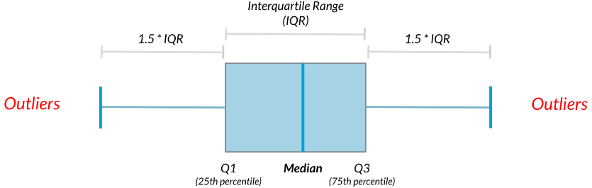
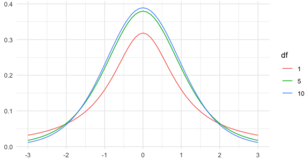

# Introduction to Statistics

## Summary Statistics

### Measures of center

-   Mean: sum of all the data points divided by the total number of data points.
-   Median: middle value of the dataset where 50% of the data is less than the median, and 50% of the data is greater than the median.
-   Mode: most frequent value.

You'll be working with the [**2018 Food Carbon Footprint Index**](https://www.nu3.de/blogs/nutrition/food-carbon-footprint-index-2018) from nu3. The `food_consumption` dataset contains information about the kilograms of food consumed per person per year in each country in each food category (`consumption`) as well as information about the carbon footprint of that food category (`co2_emissions`) measured in kilograms of carbon dioxide, or CO2, per person per year in each country.

```{r message=FALSE}
#library package
library(tidyverse)

# Load dataset
food_consumption <- read_rds("data/food_consumption.rds")
```

When you want to compare summary statistics between groups, it's much easier to do a `group_by()` and one `summarize()` instead of filtering and calling the same functions multiple times.

```{r}
food_consumption %>%
  # Filter for Belgium and USA
  filter(country %in% c("Belgium", "USA")) %>%
  # Group by country
  group_by(country) %>%
  # Get mean_consumption and median_consumption
  summarize(mean_consumption = mean(consumption),
            median_consumption = median(consumption))
```

#### Mean vs. median

*Visualizing*

Right-skewed

```{r}
food_consumption %>%
  # Filter for rice food category
  filter(food_category == "rice") %>%
  # Create histogram of co2_emission
  ggplot(aes(x = co2_emission)) +
    geom_histogram()
```

*Central tendency*

Given the skew of this data, the measure median of central tendency best summarizes the kilograms of CO2 emissions per person per year for rice.

```{r}
food_consumption %>%
  # Filter for rice food category
  filter(food_category == "rice") %>% 
  # Get mean_co2 and median_co2
  summarize(mean_co2 = mean(co2_emission),
            median_co2 = median(co2_emission))
```

### Measures of spread

Useful functions:

Variance = `var()`

Standard Deviation = `sd()`

Quartiles = `quantile()` / `quantile(data, probs = ())`

Mean absolute deviation = `mean(abs(dist))`

Boxplots use quartiles

#### Quartiles, quantiles, and quintiles

Quantiles are a great way of summarizing numerical data since they can be used to measure center and spread, as well as to get a sense of where a data point stands in relation to the rest of the dataset.

```{r}
# Calculate the quartiles of co2_emission
quantile(food_consumption$co2_emission)

# Calculate the six quantiles that split up the data into 5 pieces (quintiles) of the co2_emission column
quantile(food_consumption$co2_emission, probs = seq(0, 1, 0.2))

# Calculate the eleven quantiles of co2_emission that split up the data into ten pieces (deciles)
quantile(food_consumption$co2_emission, probs = seq(0, 1, 0.1))
```

#### Variance & standard deviation

Variance and standard deviation are two of the most common ways to measure the spread of a variable, especially when making predictions.

```{r}
# Calculate variance and sd of co2_emission for each food_category
food_consumption %>% 
  group_by(food_category) %>% 
  summarize(var_co2 = var(co2_emission),
            sd_co2 = sd(co2_emission))

# Plot food_consumption with co2_emission on x-axis
ggplot(food_consumption, aes(x = co2_emission)) +
  # Create a histogram
  geom_histogram() +
  # Create a separate sub-graph for each food_category
  facet_wrap(~ food_category)
```

Beef has the biggest amount of variation in its CO2 emissions, while eggs, nuts, and soybeans have relatively small amounts of variation.

#### Finding outliers using IQR

Outliers can have big effects on statistics like mean, as well as statistics that rely on the mean, such as variance and standard deviation. Interquartile range, or IQR, is another way of measuring spread that's less influenced by outliers. IQR is also often used to find outliers. If a value is less than Q1−1.5×IQR or greater than Q3+1.5×IQR, it's considered an outlier. In fact, this is how the lengths of the whiskers in a `ggplot2` box plot are calculated.

{width="512"}

IQR = Q3 - Q1

Outlier = data \< Q1 − 1.5 × IQR *or* data \> Q3 + 1.5 × IQR

```{r}
# Calculate total co2_emission per country: emissions_by_country
emissions_by_country <- food_consumption %>%
  group_by(country) %>%
  summarize(total_emission = sum(co2_emission))

# Compute the first and third quartiles and IQR of total_emission
q1 <- quantile(emissions_by_country$total_emission, 0.25); q1
q3 <- quantile(emissions_by_country$total_emission, 0.75); q3
iqr <- q3 - q1; iqr

# Calculate the lower and upper cutoffs for outliers
lower <- q1 - 1.5 * iqr
upper <- q3 + 1.5 * iqr

# Filter emissions_by_country to find outliers
emissions_by_country %>%
  filter(total_emission < lower | total_emission > upper)
```

## Random Numbers and Probability

### Chances

#### Calculating probabilities

{width="289"}

You want to randomly select a few of the deals that he's worked on over the past year so that you can look at them more deeply. Before you start selecting deals, you'll first figure out what the chances are of selecting certain deals.

```{r}
# Load dataset
amir_deals <- read_rds("data/seller_1.rds")


amir_deals %>%
  # Count the deals for each product
  count(product) %>%
  # Calculate probability of picking a deal with each product
  mutate(prob = n / sum(n))
```

#### Sampling deals

**With or without replacement?**

*With replacement*: 抽出後放回, events are independent, `sample_n(n, replace = T)`

-   Flipping a coin 3 times

-   Rolling a die twice

*Without replacement*: 抽出後不放回, events are dependent, `sample_n()`

-   From a deck of cards, dealing 3 players 7 cards each

-   Randomly picking 3 people to work on the weekend from a group of 20 people

-   Randomly selecting 5 products from the assembly line to test for quality assurance

Now it's time to randomly pick five deals so that you can reach out to each customer and ask if they were satisfied with the service they received. You'll try doing this both with and without replacement.

Additionally, you want to make sure this is done randomly and that it can be reproduced in case you get asked how you chose the deals, so you'll need to set the random seed `set.seed()` before sampling.

In this case, without replacement sampling would be suitable.

```{r}
# Set random seed to 31
set.seed(31)

# Sample 5 deals without replacement
amir_deals %>%
  sample_n(5)

# Sample 5 deals with replacement
amir_deals %>%
  sample_n(5, replace = TRUE)
```

### Discrete distributions

{width="321"}

#### Creating a probability distribution

A new restaurant opened a few months ago, and the restaurant's management wants to optimize its seating space based on the size of the groups that come most often. On one night, there are 10 groups of people waiting to be seated at the restaurant, but instead of being called in the order they arrived, they will be called randomly. In this exercise, you'll investigate the probability of groups of different sizes getting picked first.

```{r}
# create restaurant_groups dataset
group_id <- LETTERS[seq(1, 10)]
group_size <- c(2, 4, 6, 2, 2, 2, 3, 2, 4, 2)
restaurant_groups <- data.frame(group_id, group_size); restaurant_groups
```

```{r}
# Create a histogram of group_size
ggplot(restaurant_groups, aes(x = group_size)) +
  geom_histogram(bins = 5)
```

```{r}
# Create probability distribution
size_distribution <- restaurant_groups %>%
  # Count number of each group size
  count(group_size) %>%
  # Calculate probability
  mutate(probability = n / sum(n))

size_distribution
```

```{r}
# Calculate expected group size
expected_val <- sum(size_distribution$group_size * size_distribution$probability)

expected_val
```

```{r}
# Calculate probability of picking group of 4 or more
size_distribution %>%
  # Filter for groups of 4 or larger
  filter(group_size >= 4) %>%
  # Calculate prob_4_or_more by taking sum of probabilities
  summarize(prob_4_or_more = sum(probability))
```

#### Law of large numbers

As the size of your sample increases, the sample mean will approach the expected value.

### Continuous distributions

{width="311"}

The sales software used at your company is set to automatically back itself up, but no one knows exactly what time the back-ups happen. It is known, however, that back-ups happen exactly every 30 minutes. Amir comes back from sales meetings at random times to update the data on the client he just met with. He wants to know how long he'll have to wait for his newly-entered data to get backed up.

```{r}
# Min and max wait times for back-up that happens every 30 min
min <- 0
max <- 30

# Calculate probability of waiting less than 5 mins
prob_less_than_5 <- punif(5, min = 0, max = 30)
prob_less_than_5

# Calculate probability of waiting more than 5 mins
prob_greater_than_5 <- punif(5, min = 0, max = 30, lower.tail = FALSE)
prob_greater_than_5

# Calculate probability of waiting 10-20 mins
prob_between_10_and_20 <- punif(20, min = 0, max = 30) - punif(10, min = 0, max = 30)
prob_between_10_and_20
```

To give Amir a better idea of how long he'll have to wait, you'll simulate Amir waiting 1000 times and create a histogram to show him what he should expect.

Notice: `simulation_nb`, `runif`

```{r}
# Create dataset, normal distribution
wait_times <- data.frame(simulation_nb = 1:1000)

# Set random seed to 334
set.seed(334)

# Generate 1000 wait times between 0 and 30 mins, save in time column
wait_times %>%
  mutate(time = runif(1000, min = 0, max = 30)) %>%
  # Create a histogram of simulated times
  ggplot(aes(x = time)) +
    geom_histogram(bins = 30)
```

### Binomial distribution

Probability distribution of the number of successes in a sequence of independent trials.

-   *n*: total number of trials

-   *p*: probability of success

Binary outcomes:

{width="96"}

``` r
rbinom(n of trials, n of coins, probability of heads/success)

# 1 = head, 0 = tail

# A single flip
rbinom(1, 1, 0.5)

# 8 flips of 1 coin with 50% chance of success
rbinom(8, 1, 0.5)

# 10 flips of 3 coin with 25% chance of success
rbinom(10, 3, 0.25)

# p(head = n)
dbinom(num heads, num trials, prob of heads)

# p(head >= or <= n)
pbinom(num heads, num trials, prob of heads, lower.tail = T or F)
```

#### Simulating

Assume that Amir usually works on 3 deals per week, and overall, he wins 30% of deals he works on. Each deal has a binary outcome: it's either lost, or won, so you can model his sales deals with a binomial distribution. In this exercise, you'll help Amir simulate a year's worth of his deals so he can better understand his performance.

```{r}
# Set random seed to 10
set.seed(10)

# Simulate a single deal
rbinom(1, 1, 0.3)

# Simulate 1 week of 3 deals
rbinom(1, 3, 0.3)

# Simulate 52 weeks of 3 deals
deals <- rbinom(52, 3, 0.3)

# Calculate mean deals won per week
mean(deals)
```

#### Calculating binomial probabilities

Just as in the last exercise, assume that Amir wins 30% of deals. He wants to get an idea of how likely he is to close a certain number of deals each week. In this exercise, you'll calculate what the chances are of him closing different numbers of deals using the binomial distribution.

```{r}
# What's the probability that Amir closes all 3 deals in a week?
# Probability of closing 3 out of 3 deals
dbinom(3, 3, 0.3)

# What's the probability that Amir closes 1 or fewer deals in a week?
# Probability of closing <= 1 deal out of 3 deals
pbinom(1, 3, 0.3)

# What's the probability that Amir closes more than 1 deal?
# Probability of closing > 1 deal out of 3 deals
pbinom(1, 3, 0.3, lower.tail = F)
1 - pbinom(1, 3, 0.3)
```

#### Expected value

{width="379"}

Now Amir wants to know how many deals he can expect to close each week if his win rate changes. Luckily, you can use your binomial distribution knowledge to help him calculate the expected value in different situations.

```{r}
# Expected number won with 30% win rate
won_30pct <- 3 * 0.3
won_30pct

# Expected number won with 25% win rate
won_25pct <- 3 * 0.25
won_25pct

# Expected number won with 35% win rate
won_35pct <- 3 * 0.35
won_35pct
```

## More Distributions & Central Limit Theorem

### Normal distribution

Areas under the normal distribution

-   68% falls within 1 standard deviation
-   95% falls within 2 standard deviations
-   99.7% falls within 3 standard deviations

Get percentage or value

``` r
# Percent
pnorm(value, mean = , sd = , lower.tail = )

# Value
qnorm(probability, mean = , sd = , lower.tail = )
```

Generating random numbers

``` r
# Generate 10 random number
rnorm(10, mean = , sd = )
```

#### Visualing distribution

Since each deal Amir worked on (both won and lost) was different, each was worth a different amount of money. These values are stored in the `amount` column of `amir_deals` As part of Amir's performance review, you want to be able to estimate the probability of him selling different amounts, but before you can do this, you'll need to determine what kind of distribution the `amount` variable follows.

```{r}
# Histogram of amount with 10 bins
ggplot(amir_deals, aes(x = amount)) +
    geom_histogram(bins = 10)
```

#### Probabilities from the normal distribution

Since each deal Amir worked on (both won and lost) was different, each was worth a different amount of money. These values are stored in the `amount` column of `amir_deals` and follow a normal distribution with a mean of 5000 dollars and a standard deviation of 2000 dollars. As part of his performance metrics, you want to calculate the probability of Amir closing a deal worth various amounts.

```{r}
# Probability of deal < 7500
pnorm(7500, mean = 5000, sd = 2000)

# Probability of deal > 1000
pnorm(1000, mean = 5000, sd = 2000, lower.tail = FALSE)

# Probability of deal between 3000 and 7000
pnorm(7000, mean = 5000, sd = 2000) - pnorm(3000, mean = 5000, sd = 2000)

# Calculate amount that 75% of deals will be more than
qnorm(0.75, mean = 5000, sd = 2000, lower.tail = F)
```

#### Simulating under new conditions

The company's financial analyst is predicting that next quarter, the worth of each sale will increase by 20% and the volatility, or standard deviation, of each sale's worth will increase by 30%. To see what Amir's sales might look like next quarter under these new market conditions, you'll simulate new sales amounts using the normal distribution and store these in the `new_sales` data frame.

```{r}
# Calculate new average amount
new_mean <- 5000 * 1.2

# Calculate new standard deviation
new_sd <- 2000 * 1.3

# Simulate 36 sales
new_sales <- data.frame(sale_num = 1:36)
new_sales <- new_sales %>% 
  mutate(amount = rnorm(36, mean = new_mean, sd = new_sd)); new_sales

# Create histogram with 10 bins
ggplot(new_sales, aes(x = amount)) +
  geom_histogram(bins = 10)
```

### Central limit theorem

The sampling distribution of a statistic becomes closer to the normal distribution as the number of trials increases.

It's important to note that the central limit theorem only applies when samples are taken *randomly* and are *independent*.

Regardless of the shape of the distribution you're taking sample means from, the central limit theorem will apply if the sampling distribution contains enough sample means.

`sample()` works the same way as `sample_n()`, except it samples from a vector instead of a data frame.

``` r
sample(vector to sample from, size of the sample, replace = T/F)
```

`replicate()` use to repeat doing the same thing.

``` r
replicate(num of replication, run code)
```

#### The CLT in action

The central limit theorem states that a sampling distribution of a sample statistic approaches the normal distribution as you take more samples, no matter the original distribution being sampled from.

In this exercise, you'll focus on the sample mean and see the central limit theorem in action while examining the `num_users` column of `amir_deals` more closely, which contains the number of people who intend to use the product Amir is selling.

```{r}
# Set seed to 104
set.seed(104)

# Sample 20 num_users from amir_deals and take mean
sample(amir_deals$num_users, size = 20, replace = TRUE) %>%
  mean()

# Repeat the above 100 times
sample_means <- replicate(100, sample(amir_deals$num_users, size = 20, replace = TRUE) %>% mean())

# Create data frame for plotting
samples <- data.frame(mean = sample_means)

# Histogram of sample means
ggplot(samples, aes(x = mean)) +
  geom_histogram(bins = 10)
```

#### The mean of means

You want to know what the average number of users (`num_users`) is per deal, but you want to know this number for the entire company so that you can see if Amir's deals have more or fewer users than the company's average deal. The problem is that over the t year, the company has worked on more than ten thousand deals, so it's not realistic to compile all the data. Instead, you'll estimate the mean by taking several random samples of deals, since this is much easier than collecting data from everyone in the company.

```{r}
# Load dataset
all_deals <- read.table(file = "data/all_deals.txt", header = TRUE)

# Set seed to 321
set.seed(321)

# Take 30 samples of 20 values of num_users, take mean of each sample
sample_means <- replicate(30, sample(all_deals$num_users, 20) %>% mean())

# Calculate mean of sample_means
mean(sample_means)

# Calculate mean of num_users in amir_deals
mean(amir_deals$num_users)
```

Amir's average number of users is very close to the overall average, so it looks like he's meeting expectations.

### Poisson distribution

A Poisson process is a process where events appear to happen at a certain rate, but completely at random. Example:

-   Number of people arriving at a restaurant per hour.
-   Number of earthquakes in California per year.

The Poisson distribution describes the probability of some number of events happening over a fixed period of time.(discrete)

Lambda (λ): average number of events per time interval.(event)

{width="433"}

Notice: Lambda changes the shape of the distribution. But no matter what, the distribution's peak is always at its lambda value.

Syntax:

Note that if you provide `dpois()` or `ppois()` with a non-integer, it returns 0 and throws a warning since the Poisson distribution only applies to integers.

``` r
# Probability of a single value
dpois(value, lambda = )

# Probability of less than or equal to
ppois(value, lambda = )

# Probability of greater than
ppois(value, lambda = , lower.tail = FALSE)

# Sampling from a Poisson distribution
rpois(num of sample, lambda = )
```

#### Tracking lead responses

Your company uses sales software to keep track of new sales leads. It organizes them into a queue so that anyone can follow up on one when they have a bit of free time. Since the number of lead responses is a countable outcome over a period of time, this scenario corresponds to a Poisson distribution. On average, Amir responds to 4 leads each day. In this exercise, you'll calculate probabilities of Amir responding to different numbers of leads.

```{r}
# What's the probability that Amir responds to 5 leads in a day, given that he responds to an average of 4?
# Probability of 5 responses
dpois(5, lambda = 4)

# Amir's coworker responds to an average of 5.5 leads per day. What is the probability that she answers 5 leads in a day?
# Probability of 5 responses from coworker
dpois(5, lambda = 5.5)

# Probability of 2 or fewer responses
ppois(2, lambda = 4)

# Probability of > 10 responses
ppois(10, lambda = 4, lower.tail = F)
```

### Exponential distribution

Probability of time between Poisson events. (continuous) Example:

-   Probability of \< 10 minutes between restaurant arrivals.
-   Probability of 6-8 months between earthquakes.

Lambda (λ): rate

{width="408"}

Notice: The rate(λ) affects the shape of the distribution and how steeply it declines.

Expected value of exponential distribution

-   In terms of rate (Poisson): λ
-   In terms of time (exponential): 1/λ

Syntax:

``` r
pexp(value, rate = )

# For example
# P (wait < 1 min)
pexp(1, rate = 0.5)

# P (wait > 4 min)
pexp(4, rate = 0.5, lower.tail = FALSE)

# P (1 min < wait < 4 min)
pexp(4, rate = 0.5) - pexp(1, rate = 0.5)
```

#### Modeling time between leads

To further evaluate Amir's performance, you want to know how much time it takes him to respond to a lead after he opens it. On average, it takes 2.5 hours for him to respond. In this exercise, you'll calculate probabilities of different amounts of time passing between Amir receiving a lead and sending a response.

```{r}
# 2.5 is the time expected value, which equal to 1/λ. So in order to get rate(λ), we have to 1 / 2.5 first. (1/λ = 2.5 > λ = 1/2.5)

# Probability response takes < 1 hour
pexp(1, rate = 1 / 2.5)

# Probability response takes > 4 hours
pexp(4, rate = 1 / 2.5, lower.tail = F)

# Probability response takes 3-4 hours
pexp(4, rate = 1/2.5) - pexp(3, rate = 1/2.5)
```

### (Student's) t-distribution

Similar shape as the normal distribution, but it does have thicker tails and higher variance than the normal distribution.

Has parameter degrees of freedom (df) which affects the thickness of the tails. Higher df will closer to normal distribution.

{width="386"}

### Log-normal distribution

Variable whose logarithm is normally distributed. Example:

-   Adult blood pressure
-   Number of hospitalizations in the 2003 SARS outbreak

{width="392"}

## Correlation and Experimental Design

### Correlation

#### Visualizing relationships

To visualize relationships between two variables, we can use a scatterplot created using `geom_point`. We can add a linear trendline to the scatterplot using `geom_smooth`. We'll set the method argument to "`lm`" to indicate that we want a linear trendline, and `se` to `FALSE` so that there aren't error margins around the line.

``` r
ggplot(df, aes(x, y)) +
  geom_point() +
  # Adding a trendline
  geom_smooth(method = "lm", se = FALSE)
```

#### Computing correlation

The correlation coefficient can't account for any relationships that aren't linear, regardless of strength.

``` r
# between -1~1
cor(df$x, df$y)

# To ignore data points where one or both values are missing
cor(df$x, df$y, use = "pairwise.complete.obs")
```

#### Relationships between variables

You'll be working with a dataset `world_happiness` containing results from the [**2019 World Happiness Report**](https://worldhappiness.report/ed/2019/). The report scores various countries based on how happy people in that country are. It also ranks each country on various societal aspects such as social support, freedom, corruption, and others. The dataset also includes the GDP per capita and life expectancy for each country.

```{r}
# Create dataset
world_happiness <- readRDS("data/world_happiness_sugar.rds")

# Create a scatterplot of happiness_score vs. life_exp
ggplot(world_happiness, aes(x = life_exp, y = happiness_score)) +
    geom_point() +
    geom_smooth(method = "lm", se = FALSE)

# Correlation between life_exp and happiness_score
cor(world_happiness$life_exp, world_happiness$happiness_score)
```

### Correlation caveats

Non-linear relationships: always visualize your data.

Skewed data: transformations

-   Log transformation (`log(x)`)
-   Square root transformation (`sqrt(x)`)
-   Reciprocal transformation (`1 / x`)
-   Combinations of these, e.g.:
    -   `log(x)` and `log(y)`
    -   `sqrt(x)` and `1 / y`

Correlation does not imply causation.

Confounding variables.

```{r}
# Scatterplot of gdp_per_cap and life_exp
ggplot(world_happiness, aes(x = gdp_per_cap, y = life_exp)) +
    geom_point()

# Correlation between gdp_per_cap and life_exp
cor(world_happiness$gdp_per_cap, world_happiness$life_exp)
```

Log transformations are great to use on variables with a skewed distribution, such as GDP.

```{r}
# Create log_gdp_per_cap column
world_happiness <- world_happiness %>%
  mutate(log_gdp_per_cap = log(gdp_per_cap))

# Scatterplot of happiness_score vs. log_gdp_per_cap
ggplot(world_happiness, aes(x = log_gdp_per_cap, y = happiness_score)) +
  geom_point()

# Calculate correlation
cor(world_happiness$log_gdp_per_cap, world_happiness$happiness_score)
```

Does sugar improve happiness?

```{r}
# Scatterplot of grams_sugar_per_day and happiness_score
ggplot(world_happiness, aes(x = grams_sugar_per_day, y = happiness_score)) +
    geom_point()

# Correlation between grams_sugar_per_day and happiness_score
cor(world_happiness$happiness_score, world_happiness$grams_sugar_per_day)
```

Increased sugar consumption is associated with a higher happiness score. If correlation always implied that one thing causes another, people may do some nonsensical things, like eat more sugar to be happier.

### Design of experiments

-   Controlled experiments vs Observational studies
    -   Gold standard of experiments: randomized controlled trial, placebo, double-blind trial
    -   Observational: participants are not assigned randomly to groups, establish association not causation
-   Longitudinal vs. Cross-sectional studies
