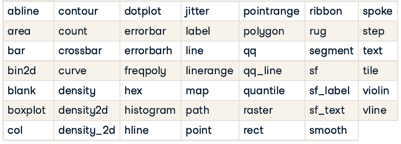
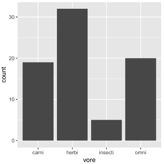
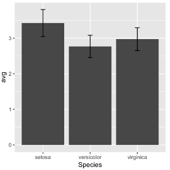

# Introduction to Data Visualization with ggplot2

## Introduction

### Data columns types affect plot types

The `mtcars` dataset contains information on 32 cars from a 1973 issue of Motor Trend magazine.

```{r}
library(ggplot2)

str(mtcars)
```

After changing variable data type, the x-axis does not contain variables like 5 or 7, only the values that are present in the dataset.

```{r}
# Original command
ggplot(mtcars, aes(cyl, mpg)) +
  geom_point()

# Change the command below so that cyl is treated as factor
ggplot(mtcars, aes(factor(cyl), mpg)) +
  geom_point()
```

### The grammar of graphics

**The seven grammatical elements**

|             |                                                   |                                |
|------------------|-----------------------------|-------------------------|
| **Element** | **Description**                                   |                                |
| Data        | The data-set being plotted.                       | essential grammatical elements |
| Aesthetics  | The scales onto which we map our data.            | essential grammatical elements |
| Geometries  | The visual elements used for our data.            | essential grammatical elements |
| Themes      | All non-data ink.                                 |                                |
| Statistics  | Representations of our data to aid understanding. |                                |
| Coordinates | The space on which the data will be plotted.      |                                |
| Facets      | Plotting small multiples.                         |                                |

**Jargon for each element**

{width="481"}

#### Mapping data columns to aesthetics

```{r}
# Edit to add a color aesthetic mapped to disp
ggplot(mtcars, aes(wt, mpg, color = disp)) +
  geom_point()

# Change the color aesthetic to a size aesthetic
ggplot(mtcars, aes(wt, mpg, size = disp)) +
  geom_point()
```

### ggplot2 layers

#### Adding geometries

`geom_smooth()` adds a smooth trend curve.

```{r}
str(diamonds)

ggplot(diamonds, aes(carat, price)) +
  geom_point() +
  geom_smooth()
```

#### Changing one geom or every geom

`geom_point()` has an `alpha` argument that controls the opacity of the points. A value of 1 (the default) means that the points are totally opaque; a value of 0 means the points are totally transparent (and therefore invisible).

```{r}
# Make the points 40% opaque
ggplot(diamonds, aes(carat, price, color = clarity)) +
  geom_point(alpha = 0.4) +
  geom_smooth()
```

#### Saving plots as variables

Plots can be saved as variables, which can be added to later on using the `+` operator. This is really useful if you want to make multiple related plots from a common base.

```{r}
# Draw a ggplot
plt_price_vs_carat <- ggplot(
  # Use the diamonds dataset
  diamonds,
  # For the aesthetics, map x to carat and y to price
  aes(carat, price)
)

# Add a point layer to plt_price_vs_carat
plt_price_vs_carat + geom_point()
```

```{r}
# Edit this to make points 20% opaque: plt_price_vs_carat_transparent
plt_price_vs_carat_transparent <- plt_price_vs_carat + geom_point(alpha = 0.2)

# See the plot
plt_price_vs_carat_transparent
```

```{r}
# Edit this to map color to clarity,
# Assign the updated plot to a new object
plt_price_vs_carat_by_clarity <- plt_price_vs_carat + 
    geom_point(aes(color = clarity))

# See the plot
plt_price_vs_carat_by_clarity
```

## Aesthetics

### Visible aesthetics

**Typical visible aesthetics**

| Aesthetic | Description                                            |
|-----------|--------------------------------------------------------|
| x         | X axis position                                        |
| y         | Y axis position                                        |
| fill      | Fill color (點的填滿顏色)                              |
| color     | Color of points, outlines of othergeoms (點的外框顏色) |
| size      | Area or radius of points, thickness of lines           |
| alpha     | Transparency (點的透明度)                              |
| linetype  | line dash pattern                                      |
| labels    | Text on a plot or axes                                 |
| shape     | Shape of points                                        |

`label` and `shape` are only applicable to *categorical* data.

#### Aesthetics: color, shape and size

```{r}
# transformed cyl, am into a factor fcyl, fam
mtcars$fcyl <- factor(mtcars$cyl)
mtcars$fam <- factor(mtcars$am)
str(mtcars)

# Map x to wt, y to mpg and color to fcyl
ggplot(mtcars, aes(wt, mpg, color = fcyl)) +
  # Set the shape and size of the points
  geom_point(shape = 1, size = 4)
```

#### Aesthetics: color vs. fill

Typically, the `color` aesthetic changes the *outline* of a geom and the `fill` aesthetic changes the *inside*. `geom_point()` is an exception: you use `color` (not `fill`) for the point color. However, some shapes have special behavior.

The default `geom_point()` uses `shape = 19`: a solid circle. An alternative is `shape = 21`: a circle that allow you to use *both* `fill` for the inside *and* `color` for the outline. This is lets you to map two aesthetics to each point.

All shape values are described on the `?points` help page.

{width="279"}

```{r}
# Map fcyl to fill
ggplot(mtcars, aes(wt, mpg, fill = fcyl)) +
  geom_point(shape = 1, size = 4)
```

```{r}
ggplot(mtcars, aes(wt, mpg, fill = fcyl)) +
  # Change point shape; set alpha
  geom_point(shape = 21, size = 4, alpha = 0.6)
```

```{r}
# Map color to fam
ggplot(mtcars, aes(wt, mpg, fill = fcyl, color = fam)) +
  geom_point(shape = 21, size = 4, alpha = 0.6)
```

Notice that mapping a categorical variable onto fill doesn't change the colors, although a legend is generated! This is because the default shape for points only has a color attribute and not a fill attribute! Use fill when you have another shape (such as a bar), or when using a point that does have a fill and a color attribute, such as `shape = 21`, which is a circle with an outline. Any time you use a solid color, make sure to use alpha blending to account for over plotting.

#### Comparing aesthetics

```{r}
# Establish the base layer
plt_mpg_vs_wt <- ggplot(mtcars, aes(x = wt, y = mpg))

# Map fcyl to size
plt_mpg_vs_wt +
  geom_point(aes(size = fcyl))
```

```{r}
# Map fcyl to alpha, not size
plt_mpg_vs_wt +
  geom_point(aes(alpha = fcyl))
```

```{r}
# Map fcyl to shape, not alpha
plt_mpg_vs_wt +
  geom_point(aes(shape = fcyl))
```

```{r}
# Use text layer and map fcyl to label
plt_mpg_vs_wt +
  geom_text(aes(label = fcyl))
```

### Using attributes

Set attributes in `geom_*()`. Attributes are always called in the geom layer!

#### Attributes: color, shape, size and alpha

This time you'll use these arguments to set *attributes* of the plot, not map variables onto *aesthetics*.

You can specify colors in R using **hex codes**: a hash followed by two hexadecimal numbers each for red, green, and blue (`"#RRGGBB"`). Hexadecimal is base-16 counting. You have 0 to 9, and A representing 10 up to F representing 15. Pairs of hexadecimal numbers give you a range from 0 to 255. `"#000000"` is "black" (no color), `"#FFFFFF"` means "white", and \`"#00FFFF" is cyan (mixed green and blue).

```{r}
# A hexadecimal color
my_blue <- "#4ABEFF"

ggplot(mtcars, aes(wt, mpg)) +
  # Set the point color and alpha
  geom_point(color = my_blue, alpha = 0.6)
```

```{r}
# Change the color mapping to a fill mapping
ggplot(mtcars, aes(wt, mpg, fill = fcyl)) +
  # Set point size and shape
  geom_point(color = my_blue,
             size = 10,
             shape = 1)
```

#### Attributes: conflicts with aesthetics

```{r}
ggplot(mtcars, aes(wt, mpg, color = fcyl)) +
  # Add point layer with alpha 0.5
  geom_point(alpha = 0.5)
```

```{r}
ggplot(mtcars, aes(wt, mpg, color = fcyl)) +
  # Add text layer with label rownames of the dataset mtcars and color red
  geom_text(label = rownames(mtcars),
            color = "red")
```

```{r}
ggplot(mtcars, aes(wt, mpg, color = fcyl)) +
  # Add points layer with shape 24 and color yellow
  geom_point(shape = 24,
             color = "yellow")
```

Notice that adding more aesthetic mappings to your plot is not always a good idea! You may just increase complexity and decrease readability.

```{r}
# 3 aesthetics: qsec vs. mpg, colored by fcyl
ggplot(mtcars, aes(x = mpg, y = qsec, color = fcyl)) +
  geom_point()

# 4 aesthetics: add a mapping of shape to fam
ggplot(mtcars, aes(mpg, qsec, color = fcyl, shape = fam)) +
  geom_point()

# 5 aesthetics: add a mapping of size to hp / wt
ggplot(mtcars, aes(mpg, qsec, color = fcyl, shape = fam, size = hp/wt)) +
  geom_point()
```

Between the x and y dimensions, the color, shape, and size of the points, your plot displays five dimensions of the dataset.

### Modifying aesthetics

#### Adjustment for overlapping

**Positions**

`position = "*"` or `position_*()`

-   identity: default. Don't adjust data positions.

-   dodge: preserves the vertical position of a geom while adjusting the horizontal position. `position_dodge(width = NULL, preserve = c("total", "single"))`.

-   stack: stacks bars on to of each other. This is the default of `geom_bar` and `geom_area`.

-   fill: stacks bars and standardizes each stack to have constant height.

-   jitter: add some random noise on both the x and y axes. `position_jitter(width = NULL, height = NULL, seed = num)`

-   jitterdodage

-   nudge

#### Scale functions

`scale_*_*()` Appropriately enough, we can access all the scales with the scale underscore functions. The second part of the function defines which scale we want to modify. The third part must match the type of data we are using.

-   `scale_x_*()` / `scale_x_continuous()`
-   `scale_y_*()`
-   `scale_color_()` / `scale_color_discrete()`
    -   Also `scale_colour_*()` / `scale_colour_*()`
-   `scale_fill_*()`
-   `scale_shape_*()`
-   `scale_linetype_*()`
-   `scale_size_*()`

There are many arguments for the scale functions. Most common are `limits`, `breaks`, `expand` and `labels`.

-   `limits`: describe the scale's range.

    {width="563"}

-   `breaks`: control the tick mark positions.

    {width="561"}

-   `expand`: a numeric vector of length two, giving a multiplicative and additive constant used to expand the range of the scales so that there is a small gap between the data and the axes.

    {width="563"}

-   `labels`: adjust the category names.

-   `labs`: change the axis labels.

```{r}
ggplot(mtcars, aes(fcyl, fill = fam)) +
  geom_bar() +
  # Set the axis labels
  labs(x = "Number of Cylinders",
       y = "Count")
```

`scale_fill_manual()` defines properties of the color scale (i.e. axis). The first argument sets the legend title. `values` is a named vector of colors to use.

```{r}
levels(mtcars$fam) <- c("automatic", "manual")
str(mtcars$fam)

palette <- c(automatic = "#377EB8", manual = "#E41A1C")

ggplot(mtcars, aes(fcyl, fill = fam)) +
  geom_bar() +
  labs(x = "Number of Cylinders", y = "Count") +
  # Set the fill color scale
  scale_fill_manual("Transmission", values = palette)
```

```{r}
# Set the position
ggplot(mtcars, aes(fcyl, fill = fam)) +
  geom_bar(position = "dodge") +
  labs(x = "Number of Cylinders", y = "Count")
  scale_fill_manual("Transmission", values = palette)
```

#### Setting a dummy aesthetic

You can make univariate plots in `ggplot2`, but you will need to add a fake `y` axis by mapping y to zero.

When using setting y-axis limits, you can specify the limits as separate arguments, or as a single numeric vector. That is, `ylim(low, high)` or `ylim(c(low, high))`.

```{r}
# Plot 0 vs. mpg
ggplot(mtcars, aes(x = mpg, y = 0)) +
  # Add jitter 
  geom_point(position = "jitter") +
  # Set the y-axis limits
  ylim(-2, 2)
```

### Aesthetics best practices

**Mapping continuous variables**

{width="537"}

**Mapping categorical variables**

{width="391"}

## Geometries

`geom_*`

{width="459"}

Each geom is associated with specific aesthetic mappings, some of which are essential, some of which are optional(e.g, alpha, color, fill, shape, size, stroke).

**Common plot types**

{width="306"}

### Scatter plots

-   Possible geoms: points, jitter, abline, smooth, count

-   Essential aes: x, y

#### Overplotting 1: large datasets

Typically, alpha blending (i.e. adding transparency) is recommended when using solid shapes. Alternatively, you can use opaque, hollow shapes.

Small points are suitable for large datasets with regions of high density (lots of overlapping).

```{r}
# Plot price vs. carat, colored by clarity
plt_price_vs_carat_by_clarity <- ggplot(diamonds, aes(carat, price, color = clarity))

# Add a point layer with tiny points
plt_price_vs_carat_by_clarity + 
    geom_point(alpha = 0.5, shape = ".")
```

```{r}
# Set transparency to 0.5
plt_price_vs_carat_by_clarity + geom_point(alpha = 0.5, shape = 16)
```

#### Overplotting 2: Aligned values

This occurs when one axis is continuous and the other is categorical, which can be overcome with some form of jittering.

```{r}
# Plot base
plt_mpg_vs_fcyl_by_fam <- ggplot(mtcars, aes(fcyl, mpg, color = fam))

# Default points are shown for comparison
plt_mpg_vs_fcyl_by_fam + geom_point()
```

```{r}
# Alter the point positions by jittering, width 0.3
plt_mpg_vs_fcyl_by_fam + 
    geom_point(position = position_jitter(width = 0.3))
```

```{r}
# Now jitter and dodge the point positions
plt_mpg_vs_fcyl_by_fam + 
    geom_point(position = position_jitterdodge(jitter.width = 0.3, 
                                               dodge.width = 0.3))
```

#### Overplotting 3: Low-precision data

This results from low-resolution measurements like in the iris dataset, which is measured to 1mm precision. It's similar to case 2, but in this case we can jitter on both the x and y axis.

Notice that `jitter` can be a geom itself (i.e. `geom_jitter()`), an argument in `geom_point()` (i.e. `position = "jitter"`), or a position function, (i.e. `position_jitter()`).

```{r}
ggplot(iris, aes(Sepal.Length, Sepal.Width, color = Species)) +
  # Swap for jitter layer with width 0.1
  geom_jitter(width = 0.1, alpha = 0.5)
```

```{r}
ggplot(iris, aes(Sepal.Length, Sepal.Width, color = Species)) +
  # Set the position to jitter
  geom_point(alpha = 0.5,
             position = "jitter")
```

```{r}
ggplot(iris, aes(Sepal.Length, Sepal.Width, color = Species)) +
  # Use a jitter position function with width 0.1
  geom_point(alpha = 0.5,
             position = position_jitter(width = 0.1))
```

#### Overplotting 4: Integer data

This can be type `integer` (i.e. 1 ,2, 3...) or categorical (i.e. class `factor`) variables. `factor` is just a special class of type `integer`.

You'll typically have a small, defined number of intersections between two variables, which is similar to case 3, but you may miss it if you don't realize that integer and factor data are the same as low precision data.

```{r message=FALSE, warning=FALSE}
library(tidyverse)
Vocab <- read_csv("data/Vocab.csv")

# Examine the structure of Vocab
str(Vocab)

# Convert data structure
Vocab$sex <- factor(Vocab$sex)
str(Vocab)
```

```{r}
# Plot vocabulary vs. education
ggplot(Vocab, aes(education, vocabulary)) +
  # Add a point layer
  geom_point()
```

```{r}
ggplot(Vocab, aes(education, vocabulary)) +
  # Change to a jitter layer
  geom_jitter()
```

```{r}
ggplot(Vocab, aes(education, vocabulary)) +
  # Set the transparency to 0.2
  geom_jitter(alpha = 0.2)
```

```{r}
ggplot(Vocab, aes(education, vocabulary)) +
  # Set the shape to 1
  geom_jitter(alpha = 0.2, shape = 1)
```

Notice how jittering and alpha blending serves as a great solution to the overplotting problem here. Setting the `shape` to `1` didn't really help, but it was useful in the previous exercises when you had less data. You need to consider each plot individually.

### Histograms

A histogram is a special type of bar plot that shows the binned distribution of a continuous variable.

-   Essential aes: x (continuous variable)
-   A plot of binned values.
-   Always set a meaningful bin widths for your data.
-   No spaces between bars.
-   X axis labels are between bars (represent intervals and not actual values).

#### Drawing histograms

Recall that histograms cut up a continuous variable into discrete bins and, by default, maps the internally calculated `count` variable (the number of observations in each bin) onto the y aesthetic. An internal variable called `density` can be accessed by using the `..` notation, i.e. `..density..`. Plotting this variable will show the relative frequency, which is the height times the width of each bin.

```{r}
# Plot mpg
ggplot(mtcars, aes(mpg)) +
  # Add a histogram layer
  geom_histogram()
```

```{r}
ggplot(mtcars, aes(mpg)) +
  # Set the binwidth to 1
  geom_histogram(binwidth = 1)
```

If you want to use density on the y-axis be sure to set your binwidth to an intuitive value.

```{r}
# Map y to ..density..
ggplot(mtcars, aes(mpg, ..density..)) +
  geom_histogram(binwidth = 1)
```

```{r}
datacamp_light_blue <- "#51A8C9"

ggplot(mtcars, aes(mpg, ..density..)) +
  # Set the fill color to datacamp_light_blue
  geom_histogram(binwidth = 1, fill = datacamp_light_blue)
```

#### Positions in histograms

`geom_histogram()`, a special case of `geom_bar()`, has a position argument.

-   `stack` (default): Bars for different groups are stacked on top of each other.

```{r}
# Update the aesthetics so the fill color is by fam
ggplot(mtcars, aes(mpg, fill = fam)) +
  geom_histogram(binwidth = 1)
```

-   `dodge`: Bars for different groups are placed side by side.

```{r}
ggplot(mtcars, aes(mpg, fill = fam)) +
  # Change the position to dodge
  geom_histogram(binwidth = 1,
                 position = "dodge")
```

-   `fill`: Bars for different groups are shown as proportions.

```{r}
ggplot(mtcars, aes(mpg, fill = fam)) +
  # Change the position to fill
  geom_histogram(binwidth = 1, 
                 position = "fill")
```

-   `identity`: Plot the values as they appear in the dataset.

```{r}
ggplot(mtcars, aes(mpg, fill = fam)) +
  # Change the position to identity, with transparency 0.4
  geom_histogram(binwidth = 1, 
                 position = "identity", 
                 alpha = 0.4)
```

### Bar plots

{width="503"}

-   A categorical X-axis
-   Two types:
    -   Absolute counts

        {width="213"}

    -   Distributions: dynamite plots (avg & sd)

        {width="213"}

Note that the function `geom_col()` is just `geom_bar()` where both the `position` and `stat` arguments are set to `"identity"`. It is used when we want the heights of the bars to represent the exact values in the data.

#### Position in bar and col plots

All positions are available.

```{r}
# Plot fcyl, filled by fam
ggplot(mtcars, aes(fcyl, fill = fam)) +
  # Add a bar layer
  geom_bar()
```

```{r}
ggplot(mtcars, aes(fcyl, fill = fam)) +
  # Set the position to "fill"
  geom_bar(position = "fill")
```

```{r}
ggplot(mtcars, aes(fcyl, fill = fam)) +
  # Change the position to "dodge"
  geom_bar(position = "dodge")
```

#### Overlapping bar plots

You can use `position_dodge()` (and `position_jitter()`) is to specify *how much* dodging (or jittering) you want.

```{r}
ggplot(mtcars, aes(cyl, fill = fam)) +
  # Change position to use the functional form, with width 0.2
  geom_bar(position = position_dodge(width = 0.2))
```

```{r}
ggplot(mtcars, aes(cyl, fill = fam)) +
  # Set the transparency to 0.6
  geom_bar(position = position_dodge(width = 0.2), 
           alpha = 0.6)
```

#### Sequential color palette

In this bar plot, we'll fill each segment according to an ordinal variable. The best way to do that is with a sequential color palette.

```{r}
# Convert data structure
Vocab$vocabulary <- factor(Vocab$vocabulary, ordered = T)

# Plot education, filled by vocabulary
ggplot(Vocab, aes(education, fill = vocabulary)) +
    geom_bar()
```

```{r}
# Plot education, filled by vocabulary
ggplot(Vocab, aes(education, fill = vocabulary)) +
  # Add a bar layer with position "fill"
  geom_bar(position = "fill")
```

Notice warning massage.

```{r}
# Plot education, filled by vocabulary
ggplot(Vocab, aes(education, fill = vocabulary)) +
  # Add a bar layer with position "fill"
  geom_bar(position = "fill") +
  # Add a brewer fill scale with default palette
  scale_fill_brewer()
```

```{r}
library(RColorBrewer)

# Definition of a set of blue colors
blues <- brewer.pal(9, "Blues") # from the RColorBrewer package

# 1 - Make a color range using colorRampPalette() and the set of blues
blue_range <- colorRampPalette(blues)

# Plot education, filled by vocabulary
ggplot(Vocab, aes(education, fill = vocabulary)) +
  # Add a bar layer with position "fill"
  geom_bar(position = "fill") +
  # Add a brewer fill scale with default palette
 scale_fill_manual(values = blue_range(11))
```

### Line plots

Very well-suited in time series.

-   Possible geoms: line, path

-   Essential aes: x, y

When we have multiple lines, we have to consider which aesthetic is more appropriate in allowing us to distinguish individual trends. Aesthetic:

-   `linetype`
-   `size`
-   `color`: The most salient choice, when available, since it allows the easiest way of distinguishing between each series.

`geom_area()`: which defaults to position `"stack"`, so instead of overlapping time series, they are added together at each point.

`geom_area(position = "fill")`: we'll get a proportion the total capture for each fish at each time-point. Note that we'd need to change the `y` axis label since these are no longer counts! This kind of plot is pretty popular in looking at proportional trends over time. A difficulty with this kind of plot is that only the bottom and top groups are actually drawn on a common scale, all the other ones are irregular shapes so they can be a bit difficult to decipher.

`geom_ribbon()`: want to have overlapping areas plots. In this case we'd have to force the `y-min` to be `0`. We need to set the `alpha` level so that we can see the overlap. There is still a challenge in deciphering all the time series, in particularly at the bottom, where there are many overlapping series.

#### Basic line plots

The `economics` dataset contains a time series for unemployment and population statistics from the Federal Reserve Bank of St. Louis in the United States.

```{r}
# Print the head of economics
head(economics)

# Using economics, plot unemploy vs. date
ggplot(economics, aes(date, unemploy)) +
  # Make it a line plot
  geom_line()
```

```{r}
# Change the y-axis to the proportion of the population that is unemployed
ggplot(economics, aes(x = date, y = unemploy / pop)) +
  geom_line()
```

#### Multiple time series

`fish.species` contains the global capture rates of seven salmon species from 1950--2010.

```{r}
# Read dataset
fish <- load("data/fish.RData")

str(fish.species)
str(fish.tidy)
```

```{r}
# Plot the Rainbow Salmon time series
ggplot(fish.species, aes(x = Year, y = Rainbow)) +
  geom_line()

# Plot the Pink Salmon time series
ggplot(fish.species, aes(x = Year, y = Pink)) +
  geom_line()

# Plot multiple time-series by grouping by species
ggplot(fish.tidy, aes(Year, Capture)) +
  geom_line(aes(group = Species))

# Plot multiple time-series by coloring by species
ggplot(fish.tidy, aes(x = Year, y = Capture, color = Species)) +
  geom_line()
```

## Themes

-   All non-data ink.
-   Visual elements not part of the data.

{width="206"}

### Themes from scratch

#### Moving the legend

To change stylistic elements of a plot, call `theme()` and set plot properties to a new value. For example, the following changes the legend position.

``` r
p + theme(legend.position = new_value)
```

Here, the new value can be

-   `"top"`, `"bottom"`, `"left"`, or `"right'"`: place it at that side of the plot.

-   `"none"`: don't draw it.

-   `c(x, y)`: `c(0, 0)` means the bottom-left and `c(1, 1)` means the top-right.

```{r}
plt_prop_unemployed_over_time <- 
    ggplot(economics, aes(date, unemploy/pop )) + 
        geom_line(aes(color = pce)) + 
        theme(legend.position = "right") +
        ggtitle("unemployed proportion over time")
 

# View the default plot
plt_prop_unemployed_over_time
```

```{r}
# Remove legend entirely
plt_prop_unemployed_over_time +
  theme(legend.position = "none")
```

```{r}
# Position the legend at the bottom of the plot
plt_prop_unemployed_over_time +
  theme(legend.position = "bottom")
```

```{r}
# Position the legend inside the plot at (0.6, 0.1)
plt_prop_unemployed_over_time +
  theme(legend.position = c(0.6, 0.1))
```

#### Modifying theme elements

Many plot elements have multiple properties that can be set. For example, line elements in the plot such as axes and gridlines have a color, a thickness (`size`), and a line type (solid line, dashed, or dotted). To set the style of a line, you use [**`element_line()`**](https://www.rdocumentation.org/packages/ggplot2/topics/margin). Similarly, `element_rect()` changes rectangles and `element_text()` changes text. You can remove a plot element using `element_blank()`.

```{r}
plt_prop_unemployed_over_time +
  theme(
    # For all rectangles, set the fill color to grey92
    rect = element_rect(fill = "grey92"),
    # For the legend key, turn off the outline
    legend.key = element_rect(color = NA)
  )
```

```{r}
plt_prop_unemployed_over_time +
  theme(
    rect = element_rect(fill = "grey92"),
    legend.key = element_rect(color = NA),
    # Turn off axis ticks
    axis.ticks = element_blank(),
    # Turn off the panel grid
    panel.grid = element_blank()
  )
```

```{r}
plt_prop_unemployed_over_time +
  theme(
    rect = element_rect(fill = "grey92"),
    legend.key = element_rect(color = NA),
    axis.ticks = element_blank(),
    panel.grid = element_blank(),
    # Add major y-axis panel grid lines back
    panel.grid.major.y = element_line(
      # Set the color to red
      color = "red",
      # Set the size to 0.5
      size = 0.5,
      # Set the line type to dotted
      linetype = "dotted"
      )
    )
```

``` {r}
plt_prop_unemployed_over_time +
  theme(
    rect = element_rect(fill = "grey92"),
    legend.key = element_rect(color = NA),
    axis.ticks = element_blank(),
    panel.grid = element_blank(),
    panel.grid.major.y = element_line(
      color = "red",
      size = 0.5,
      linetype = "dotted"
    ),
    # Set the axis text color to grey25
    axis.text = element_text(color = "grey25"),
    # Set the plot title font face to italic and font size to 16
    plot.title = element_text(size = 16, face = "italic")
  )
```

#### Modifying whitespace

**Whitespace** means all the non-visible margins and spacing in the plot.

To set a single whitespace value, use [**`unit(x, unit)`**](https://www.rdocumentation.org/packages/grid/topics/unit), where `x` is the amount and `unit` is the unit of measure.

Borders require you to set 4 positions, so use [**`margin(top, right, bottom, left, unit)`**](https://www.rdocumentation.org/packages/ggplot2/topics/margin).

The default unit is `"pt"` (points), which scales well with text. Other options include "cm", "in" (inches) and "lines" (of text).

```{r}
plt_mpg_vs_wt_by_cyl <- 
    ggplot(mtcars, aes(mpg, wt, color = fcyl)) + 
        geom_point() + 
        theme(panel.border = element_rect(color = "blue",
                                          fill = NA, 
                                          size = 0.6,
                                          linetype = "dotted"),
              legend.box.background = element_rect(color = "blue",
                                                   fill = NA, 
                                                   size = 0.6,
                                                   linetype = "dotted"),
              legend.position = "right")

plt_mpg_vs_wt_by_cyl
```

```{r}
plt_mpg_vs_wt_by_cyl +
  theme(
    # Set the axis tick length to 2 lines
    axis.ticks.length = unit(2, "lines")
  )

plt_mpg_vs_wt_by_cyl +
  theme(
    # Set the legend key size to 3 centimeters
    legend.key.size = unit(3, "cm")
  )
  
plt_mpg_vs_wt_by_cyl +
  theme(
    # Set the legend margin to (20, 30, 40, 50) points
    legend.margin = ggplot2::margin(20, 30, 40, 50, "pt")
  )

plt_mpg_vs_wt_by_cyl +
  theme(
    # Set the plot margin to (10, 30, 50, 70) millimeters
    plot.margin = ggplot2::margin(10, 30, 50, 70, "mm")
  )
```

### Theme flexibility

#### Built-in themes

In addition to making your own themes, there are several [**out-of-the-box solutions**](https://ggplot2.tidyverse.org/reference/ggtheme.html) that may save you lots of time.

-   [**`theme_gray()`**](http://www.rdocumentation.org/packages/ggplot2/functions/ggtheme) is the default.

-   [**`theme_bw()`**](http://www.rdocumentation.org/packages/ggplot2/functions/ggtheme) is useful when you use transparency.

-   [**`theme_classic()`**](http://www.rdocumentation.org/packages/ggplot2/functions/ggtheme) is more traditional.

-   [**`theme_void()`**](http://www.rdocumentation.org/packages/ggplot2/functions/ggtheme) removes everything but the data.

``` {r}
# Add a black and white theme
plt_prop_unemployed_over_time +
  theme_bw()
  
# Add a classic theme
plt_prop_unemployed_over_time +
  theme_classic()
  
# Add a void theme
plt_prop_unemployed_over_time +
  theme_void()
```

#### Exploring ggthemes

Outside of `ggplot2`, another source of built-in themes is the `ggthemes` package.

``` {r}
library(ggthemes)

# Use the fivethirtyeight theme
plt_prop_unemployed_over_time +
  theme_fivethirtyeight()

# Use Tufte's theme
plt_prop_unemployed_over_time +
  theme_tufte()
  
# Use the Wall Street Journal theme
plt_prop_unemployed_over_time +
  theme_wsj()
```

#### Setting themes

Reusing a theme across many plots helps to provide a consistent style. You have several options for this.

1.  Assign the theme to a variable, and add it to each plot.

2.  Set your theme as the default using [**`theme_set()`**](https://www.rdocumentation.org/packages/ggplot2/topics/theme_get).

A good strategy that you'll use here is to begin with a built-in theme then modify it.

``` {r}
# Save the theme as theme_recession
theme_recession <- theme(
  rect = element_rect(fill = "grey92"),
  legend.key = element_rect(color = NA),
  axis.ticks = element_blank(),
  panel.grid = element_blank(),
  panel.grid.major.y = element_line(color = "white", size = 0.5, linetype = "dotted"),
  axis.text = element_text(color = "grey25"),
  plot.title = element_text(face = "italic", size = 16),
  legend.position = c(0.6, 0.1)
)

# Combine the Tufte theme with theme_recession
theme_tufte_recession <- theme_tufte() + theme_recession

# Add the Tufte recession theme to the plot
plt_prop_unemployed_over_time + theme_tufte_recession
```

Using `theme_set()` will also get the same output.
``` r
# Set theme_tufte_recession as the default theme
theme_set(theme_tufte_recession)

# Draw the plot (without explicitly adding a theme)
plt_prop_unemployed_over_time
```

#### Publication-quality plots

```{r}
plt_prop_unemployed_over_time +
  # Add Tufte's theme
  theme_tufte()
```

```{r}
plt_prop_unemployed_over_time +
  theme_tufte() +
  # Add individual theme elements
  theme(
    # Turn off the legend
    legend.position = "none",
    # Turn off the axis ticks
    axis.ticks = element_blank()
    )
```

```{r}
plt_prop_unemployed_over_time +
  theme_tufte() +
  # Add individual theme elements
  theme(
    legend.position = "none",
    axis.ticks = element_blank(),
    # Set the axis title's text color to grey60
    axis.title = element_text(color = "grey60"),
    # Set the axis text's text color to grey60
    axis.text = element_text(color = "grey60")
  )
```

```{r}
plt_prop_unemployed_over_time +
  theme_tufte() +
  # Add individual theme elements
  theme(
    legend.position = "none",
    axis.ticks = element_blank(),
    axis.title = element_text(color = "grey60"),
    axis.text = element_text(color = "grey60"),
    # Set the panel gridlines major y values
    panel.grid.major.y = element_line(
      # Set the color to grey60
      color = "grey60",
      # Set the size to 0.25
      size = 0.25,
      # Set the linetype to dotted
      linetype = "dotted"
    )
  )
```

### Effective explanatory plots

#### Using geoms for explanatory plots

```{r message=FALSE, warning=FALSE}
gm2007 <- read_csv("data/gm2007.csv")

# Add a geom_segment() layer
ggplot(gm2007, aes(x = lifeExp, y = country, color = lifeExp)) +
  geom_point(size = 4) +
  geom_segment(aes(xend = 30, yend = country), size = 2)
```

```{r}
# Add a geom_text() layer
ggplot(gm2007, aes(x = lifeExp, y = country, color = lifeExp)) +
  geom_point(size = 4) +
  geom_segment(aes(xend = 30, yend = country), size = 2) +
  geom_text(aes(label = lifeExp), color = "white", size = 1.5)
```

```{r}
# Set the color scale
palette <- brewer.pal(5, "RdYlBu")[-(2:4)]

# Modify the scales
ggplot(gm2007, aes(x = lifeExp, y = country, color = lifeExp)) +
  geom_point(size = 4) +
  geom_segment(aes(xend = 30, yend = country), size = 2) +
  geom_text(aes(label = round(lifeExp,1)), color = "white", size = 1.5) +
  scale_x_continuous("", expand = c(0, 0), limits = c(30, 90), position = "top") +
  scale_color_gradientn(colors = palette)
```

```{r}
# Set the color scale
palette <- brewer.pal(5, "RdYlBu")[-(2:4)]

# Add a title and caption
plt_country_vs_lifeExp <- ggplot(gm2007, aes(x = lifeExp, y = country, color = lifeExp)) +
  geom_point(size = 4) +
  geom_segment(aes(xend = 30, yend = country), size = 2) +
  geom_text(aes(label = round(lifeExp,1)), color = "white", size = 1.5) +
  scale_x_continuous("", 
                     expand = c(0,0), 
                     limits = c(30,90), 
                     position = "top") +
  scale_color_gradientn(colors = palette) +
  labs(title = "Highest and lowest life expectancies, 2007",
       caption = "Source: gapminder")

plt_country_vs_lifeExp
```

#### Using annotate() for embellishments

In this exercise, you'll use `annotate()` to add text and a curve to the plot.

```{r}
# Define the theme
plt_country_vs_lifeExp +
  theme_classic() +
  theme(axis.line.y = element_blank(),
        axis.ticks.y = element_blank(),
        axis.text = element_text(color = "black"),
        axis.title = element_blank(),
        legend.position = "none")
```

```{r message=FALSE, warning=FALSE}
gm2007_full <- read_csv("data/gm2007_full.csv")

global_mean <- mean(gm2007_full$lifeExp)
x_start <- global_mean + 4
y_start <- 5.5
x_end <- global_mean
y_end <- 7.5


plt_country_vs_lifeExp +
  theme_classic() +
  theme(axis.line.y = element_blank(),
        axis.ticks.y = element_blank(),
        axis.text = element_text(color = "black"),
        axis.title = element_blank(),
        legend.position = "none") +
  # Add a vertical line
  geom_vline(xintercept = global_mean, 
             color = "grey40", 
             linetype = 3)
```

```{r}
plt_country_vs_lifeExp +
  theme_classic() +
  theme(axis.line.y = element_blank(),
        axis.ticks.y = element_blank(),
        axis.text = element_text(color = "black"),
        axis.title = element_blank(),
        legend.position = "none") +
  geom_vline(xintercept = global_mean, 
             color = "grey40", 
             linetype = 3) +
  # Add text
  annotate(
    "text",
    x = x_start, y = y_start,
    label = "The\nglobal\naverage",
    vjust = 1, size = 3, color = "grey40"
  )
```

```{r}
plt_country_vs_lifeExp +
  theme_classic() +
  theme(axis.line.y = element_blank(),
        axis.ticks.y = element_blank(),
        axis.text = element_text(color = "black"),
        axis.title = element_blank(),
        legend.position = "none") +
  geom_vline(xintercept = global_mean, 
             color = "grey40", 
             linetype = 3) +
  annotate(
    "text",
    x = x_start, y = y_start,
    label = "The\nglobal\naverage",
    vjust = 1, size = 3, color = "grey40"
  ) +
  # Add a curve
  annotate(
    "curve",
    x = x_start, y = y_start,
    xend = x_end, yend = y_end,
    arrow = arrow(length = unit(0.2, "cm"), type = "closed"),
    color = "grey40"
  )
```
