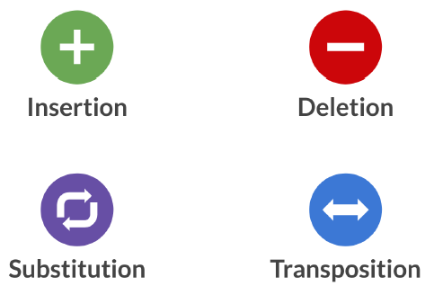
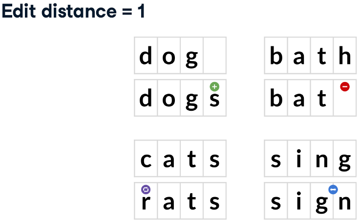

# Cleaning Data in R

## Common Data Problems

### Data type constraints

-   Glimpsing at data types

-   Checking data types:

    -   `is.*()`, return `TRUE`/`FALSE`

    -   `class(), return data type`

-   Converting data types

    -   `as.*()`

    -   notice for factor to numeric: `as.numeric(as.character())`

#### Converting data types

Throughout this chapter, you'll be working with San Francisco bike share ride data called `bike_share_rides`. It contains information on start and end stations of each trip, the trip duration, and some user information.

```{r}
library(tidyverse)
bike_share_rides <- read_rds("data/bike_share_rides_ch1_1.rds")
```

```{r}
# Glimpse at bike_share_rides
glimpse(bike_share_rides)

# Summary of user_birth_year
summary(bike_share_rides$user_birth_year)

# Convert user_birth_year to factor: user_birth_year_fct
bike_share_rides <- bike_share_rides %>%
  mutate(user_birth_year_fct = as.factor(user_birth_year))

# check user_birth_year_fct is a factor
is.factor(bike_share_rides$user_birth_year_fct)

# Summary of user_birth_year_fct
summary(bike_share_rides$user_birth_year_fct)
```

#### Trimming strings

Another common dirty data problem is having extra bits like percent signs or periods in numbers, causing them to be read in as `characters`. In order to be able to crunch these numbers, the extra bits need to be removed and the numbers need to be converted from `character` to `numeric`.

```{r}
bike_share_rides <- bike_share_rides %>%
  # Remove 'minutes' from duration: duration_trimmed
  mutate(duration_trimmed = str_remove(duration, "minutes"),
         # Convert duration_trimmed to numeric: duration_mins
         duration_mins = as.numeric(duration_trimmed))

# Glimpse at bike_share_rides
glimpse(bike_share_rides)

# Assert duration_mins is numeric
is.numeric(bike_share_rides$duration_mins)

# Calculate mean duration
mean(bike_share_rides$duration_mins)
```

### Range constraints

-   Finding out of range values (不可能出現的值)

    For example:

    -   SAT score: 400-1600 -\> 352 or 1700 are out of range
    -   Adult heart rate: 60-100 beats per minute

-   Handling out of range values

    -   Remove rows

    -   Treat as missing ( `NA` )

    -   Replace with range limit

    -   Replace with other value based on domain knowledge and/or knowledge of dataset

#### Numerical data constraints

Bikes are not allowed to be kept out for more than 24 hours, or 1440 minutes at a time, but issues with some of the bikes caused inaccurate recording of the time they were returned. In this exercise, you'll replace erroneous data with the range limit (1440 minutes).

```{r message=FALSE}
# Load dataset
bike_share_rides <- read_csv("data/bike_share_rides_duration.csv")

# Create breaks
breaks <- c(min(bike_share_rides$duration_min), 0, 1440, 
            max(bike_share_rides$duration_min))

# Create a histogram of duration_min
ggplot(bike_share_rides, aes(duration_min)) +
  geom_histogram(breaks = breaks)

# duration_min_const: replace vals of duration_min > 1440 with 1440
bike_share_rides <- bike_share_rides %>%
  mutate(duration_min_const = replace(duration_min, duration_min > 1440, 1440))

# Make sure all values of duration_min_const are between 0 and 1440
range(bike_share_rides$duration_min_const)
```

#### Date constraints

You'll need to remove any rides from the dataset that have a `date` in the future.

Before you can do this, the `date` column needs to be converted from a `character` to a `Date`. R makes it easy to check if one `Date` object is before (`<`) or after (`>`) another.

```{r}
# Load dataset again and create future data
bike_share_rides <- read_rds("data/bike_share_rides_ch1_1.rds")
bike_share_rides$date <- str_replace_all(bike_share_rides$date, "2017-04-25", "2043-02-17")

# Convert date to Date type 
bike_share_rides <- bike_share_rides %>%
  mutate(date = as.Date(date))

# Make sure all dates are in the past
bike_share_rides %>% filter(date > today())

# Filter for rides that occurred before or on today's date
bike_share_rides_past <- bike_share_rides %>%
  filter(date <= today())

# Make sure all dates from bike_share_rides_past are in the past
max(bike_share_rides_past$date)
```

### Uniqueness constraints

#### Full duplicates

A full duplicate occurs when there are multiple rows that have the same value in every column.

Removing duplicates like this is important, since having the same value repeated multiple times can alter summary statistics like the mean and median.

``` r
# count duplicate
sum(duplicated(dataframe))

# Remove full duplicate
dataframe %>%
    distinct(.keep_all = TRUE)
```

```{r message=FALSE}
# Load dataset
bike_share_rides <- read_csv("data/bike_share_rides_full_duplicated.csv")

# Count the number of full duplicates
sum(duplicated(bike_share_rides))

# Remove duplicates
bike_share_rides_unique <- bike_share_rides %>%
    distinct(.keep_all = TRUE)

# Count the full duplicates in bike_share_rides_unique
sum(duplicated(bike_share_rides_unique))
```

#### Partial duplicates

Partial duplicates are rows of data that have much of the same information and refer to the same data point, but there may be some columns that differ between them.

`ride_id` should be unique

```{r message=FALSE}
# Load dataset
bike_share_rides <- read_csv("data/bike_share_rides_partial_duplicated.csv")

# Find duplicated ride_ids
bike_share_rides %>% 
  # Count the number of occurrences of each ride_id
  count(ride_id) %>% 
  # Filter for rows with a count > 1
  filter(n > 1)
```

**Removing partial duplicates**

``` r
# Remove partial duplicate
dataframe %>%
    distinct(column, .keep_all = TRUE)
```

```{r}
# Remove full and partial duplicates
bike_share_rides_unique <- bike_share_rides %>%
  # Only based on ride_id instead of all cols
  distinct(ride_id, .keep_all = T)

# Find duplicated ride_ids in bike_share_rides_unique
bike_share_rides_unique %>%
  # Count the number of occurrences of each ride_id
  count(ride_id) %>%
  # Filter for rows with a count > 1
  filter(n > 1)
```

**Aggregating partial duplicates**

Another way of handling partial duplicates is to compute a summary statistic of the values that differ between partial duplicates, such as mean, median, maximum, or minimum. This can come in handy when you're not sure how your data was collected and want an average, or if based on domain knowledge, you'd rather have too high of an estimate than too low of an estimate (or vice versa).

```{r}
bike_share_rides %>%
  # Group by ride_id and date
  group_by(ride_id, date) %>%
  # Add duration_min_avg column
  mutate(duration_min_avg = mean(duration_min)) %>%
  # Remove duplicates based on ride_id and date, keep all cols
  distinct(ride_id, date, .keep_all = T) %>%
  # Remove duration_min column
  select(-duration_min)
```

## Categorical and Text Data

### Checking membership

Filtering joins: Keeps or removes observations from the first table without adding columns.

-   Anti-joins: help you *identify* the rows that are causing issues
-   semi-joins: *remove* the issue-causing rows.

{width="398"}

`sfo_survey` containing survey responses from passengers taking flights from San Francisco International Airport (SFO).

`dest_sizes` is available that contains all the possible destination sizes.

Your mission is to find rows with invalid dest_sizes and remove them from the data frame.

```{r}
# Load dataset
sfo_survey <- read_rds("data/sfo_survey_ch2_1.rds")
str(sfo_survey)

# Create a dest_sizes dataframe for validation 
dest_size <- c("Small", "Medium", "Large", "Hub")
passengers_per_day <- c("0-20K", "20K-70K", "70K-100K", "100K+")
dest_sizes <- data.frame(dest_size, passengers_per_day)
str(dest_sizes)
```

```{r}
# Count the number of occurrences of dest_size
sfo_survey %>%
  count(dest_size)
```

```{r}
# Find bad dest_size rows
sfo_survey %>% 
  # Join with dest_sizes data frame to get bad dest_size rows
  anti_join(dest_sizes, by = "dest_size") %>%
  # Select id, airline, destination, and dest_size cols
  select(id, airline, destination, dest_size)
```

```{r}
# Remove bad dest_size rows
sfo_survey %>% 
  # Join with dest_sizes
  semi_join(dest_sizes, by = "dest_size") %>%
  # Count the number of each dest_size
  count(dest_size)
```

### Categorical data problems

-   Inconsistency within a category

    -   Case inconsistency: `str_to_lower()`, `str_to_upper()`
    -   Whitespace inconsistency: `str_trim()`

-   Too many categories

    -   Collapsing categories: `fct_collapse()`

#### Identifying inconsistency

You'll examine the `dest_size` column again as well as the `cleanliness` column and determine what kind of issues.

```{r}
# Load uncleaned data
sfo_survey <- read_delim("data/sfo_survey_not_clean.txt", delim = ",",
                         col_select = 2:13)

# Count dest_size
sfo_survey %>%
  count(dest_size)

# Count cleanliness
sfo_survey %>%
  count(cleanliness)
```

#### Correcting inconsistency

Now that you've identified that `dest_size` has whitespace inconsistencies and `cleanliness` has capitalization inconsistencies, you'll fix the inconsistent values in `sfo_survey`.

```{r}
# Add new columns to sfo_survey
sfo_survey <- sfo_survey %>%
  # dest_size_trimmed: dest_size without whitespace
  mutate(dest_size_trimmed = str_trim(dest_size),
         # cleanliness_lower: cleanliness converted to lowercase
         cleanliness_lower = str_to_lower(cleanliness))

# Count values of dest_size_trimmed
sfo_survey %>%
  count(dest_size_trimmed)

# Count values of cleanliness_lower
sfo_survey %>%
  count(cleanliness_lower)
```

#### Collapsing categories

Allowing the response for `dest_region` to be free text instead of a dropdown menu. This resulted in some inconsistencies in the `dest_region` variable

```{r}
# Count categories of dest_region
sfo_survey %>%
  count(dest_region)

# Categories to map to Europe
europe_categories <- c("EU", "eur", "Europ")

# Add a new col dest_region_collapsed
sfo_survey %>%
  # Map all categories in europe_categories to Europe
  mutate(dest_region_collapsed = fct_collapse(dest_region, 
                                              Europe = europe_categories)) %>%
  # Count categories of dest_region_collapsed
  count(dest_region_collapsed)
```

You've reduced the number of categories from 12 to 9, and you can now be confident that 401 of the survey participants were heading to Europe.

### Cleaning text data

**Unstructured data problems**

-   Formatting inconsistency

    -   `"6171679912"` vs. `"(868) 949-4489"`

    -   `"9239 5849 3712 0039"` vs. `"4490459957881031"`

-   Information inconsistency

    -   `+1 617-167-9912` vs. `617-167-9912`

    -   `"Veronica Hopkins"` vs. `"Josiah"`

-   Invalid data

    -   Phone number `"0492"` is too short

    -   Zip code `"19888"` doesn't exist

**Useful stringr function**

-   `str_detect()`
-   `str_replace_all()`
-   `str_remove_all()`
-   `str_length()`

#### Detecting inconsistent text data

```{r message=FALSE}
sfo_survey <- read_csv("data/sfo_survey_phone.csv")
str(sfo_survey)
```

You found that some phone numbers are written with hyphens (`-`) and some are written with parentheses (`()`). In this exercise, you'll figure out which phone numbers have these issues so that you know which ones need fixing.

```{r}
# Filter for rows with "-" in the phone column
sfo_survey %>%
  filter(str_detect(phone, "-"))
```

Searching for special characters requires using `fixed()` :

`str_detect(column, fixed("$"))`

```{r}
# Filter for rows with "(" or ")" in the phone column
sfo_survey %>%
  filter(str_detect(phone, fixed("(")) | str_detect(phone, fixed(")")))
```

#### Replacing and removing

The customer support team has requested that all phone numbers be in the format `"123 456 7890"`.

```{r}
# Remove parentheses from phone column
phone_no_parens <- sfo_survey$phone %>%
  # Remove "("s
  str_remove_all(fixed("(")) %>%
  # Remove ")"s
  str_remove_all(fixed(")"))

# Add phone_no_parens as column
sfo_survey <- sfo_survey %>%
  mutate(phone_no_parens = phone_no_parens,
  # Replace all hyphens in phone_no_parens with spaces
         phone_clean = str_replace_all(phone_no_parens, "-", " "))

sfo_survey
```

#### Invalid text data

In this exercise, you'll remove any rows with invalid phone numbers.

```{r}
# Check out the invalid numbers
sfo_survey %>%
  filter(str_length(phone_clean) != 12)

# Remove rows with invalid numbers
sfo_survey %>%
  filter(str_length(phone_clean) == 12)
```

## Advanced Data Problems

### Uniformity

-   continuous data points have different units or formats

    -   Temperature: `°C` vs. `°F`

    -   Weight: `kg` vs. `g` vs. `lb`

    -   Money: USD `$` vs. GBP `£` vs. JPY `¥`

    -   Date: `DD-MM-YYYY` vs. `MM-DD-YYYY` vs. `YYYY-MM-DD`

-   Solution:

    -   Finding uniformity issues: plot or statistic

    -   Unit conversion

        -   `ifelse(condition, value_if_true, value_if_false)`

        -   `parse_date_time(date_col, orders = c("format_1", "format_2", …))`

#### Date uniformity

The `accounts` dataset, which contains information about each customer, the amount in their account, and the date their account was opened.

Your boss has asked you to calculate some summary statistics about the average value of each account and whether the age of the account is associated with a higher or lower account value.

In this exercise, you'll investigate the `date_opened` column and clean it up so that all the dates are in the same format.

```{r}
accounts <- read_rds("data/ch3_1_accounts.rds")
head(accounts)
```

```{r}
# Define the date formats
formats <- c("%Y-%m-%d", "%B %d, %Y")

# Convert dates to the same format
accounts %>%
  mutate(date_opened_clean = parse_date_time(date_opened, orders = formats))
```

#### Currency uniformity

When you first plot the data, you'll notice that there's a group of very high values, and a group of relatively lower values.

The bank has two different offices - one in New York, and one in Tokyo, so you suspect that the accounts managed by the Tokyo office are in Japanese yen instead of U.S. dollars.

```{r}
accounts <- accounts %>%
    mutate(date_opened = parse_date_time(date_opened, orders = formats))

# Scatter plot of opening date and total amount
accounts %>%
  ggplot(aes(x = date_opened, y = total)) +
  geom_point()
```

You have a data frame called `account_offices` that indicates which office manages each customer's account, so you can use this information to figure out which `total`s need to be converted from yen to dollars.

The formula to convert yen to dollars is `USD = JPY / 104`.

```{r}
account_offices <- read_csv("data/account_offices.csv")

# Left join accounts and account_offices by id
accounts %>%
  left_join(account_offices, by = "id") %>%
  # Convert totals from the Tokyo office to USD
  mutate(total_usd = ifelse(office == "Tokyo", total/104, total))
```

```{r}
accounts %>%
  left_join(account_offices, by = "id") %>%
  mutate(total_usd = ifelse(office == "Tokyo", total / 104, total)) %>%
  # Scatter plot of opening date vs total_usd
  ggplot(aes(x = date_opened, y = total_usd)) +
    geom_point()
```

### Cross field validation

-   a sanity check on your data to check that one value makes sense based on other values in your dataset.

#### Validating totals

You have a bit more information about each account. There are three different funds that account holders can store their money in.

You'll validate whether the `total` amount in each account is equal to the sum of the amount in `fund_A`, `fund_B`, and `fund_C`.

```{r message=FALSE}
accounts <- read_delim("data/accounts_fund_ages.txt", delim = ",") %>%
    select(-1) %>%
    mutate(date_opened = as.Date(date_opened, format = "%m/%d/%Y"))

head(accounts)
```

```{r}
# Find invalid totals
accounts %>%
  # theoretical_total: sum of the three funds
  mutate(theoretical_total = fund_A + fund_B + fund_C) %>%
  # Find accounts where total doesn't match theoretical_total
  filter(total != theoretical_total)
```

#### Validating age

You're suspicious that there may also be inconsistencies in the `acct_age` column, and you want to see if these inconsistencies are related.

You'll need to validate the age of each account and see if rows with inconsistent `acct_ages` are the same ones that had inconsistent `total`s.

```{r}
# Example
date_difference <- as.Date("2015-09-04") %--% today(); date_difference
as.numeric(date_difference, "years")
floor(as.numeric(date_difference, "years"))
```

```{r}
# Find invalid acct_age
accounts %>%
  # theoretical_age: age of acct based on date_opened
  mutate(theoretical_age = floor(as.numeric(date_opened %--% today(), "years"))) %>%
  # Filter for rows where acct_age is different from theoretical_age
  filter(acct_age != theoretical_age)
```

There are three accounts that all have ages off by one year, but none of them are the same as the accounts that had `total` inconsistencies, so it looks like these two bookkeeping errors may not be related.

### Completeness

**Types of missing data**

{width="548"}

("Missing at random" is actually a misleading name, since there's nothing random about this type of missing data.)

**Dealing with missing data**

-   Simple approaches:

1.  Drop missing data

2.  Impute (fill in) with statistical measures (mean, median, mode..) or domain knowledge

-   More complex approaches:

1.  Impute using an algorithmic approach

2.  Impute with machine learning models

#### Visualizing missing data

You just received a new version of the `accounts` data frame containing data on the amount held and amount invested for new and existing customers. However, there are rows with missing `inv_amount` values.

You know for a fact that most customers below 25 do not have investment accounts yet, and suspect it could be driving the missingness.

```{r message=FALSE}
accounts <- read_csv("data/accounts_missing_values.csv")
str(accounts)
```

```{r message=FALSE}
library(visdat)

vis_miss(accounts)
```

Investigating summary statistics based on missingness is a great way to determine if data is missing completely at random or missing at random.

```{r}
accounts %>%
  # missing_inv: Is inv_amount missing?
  mutate(missing_inv = is.na(inv_amount)) %>%
  # Group by missing_inv
  group_by(missing_inv) %>%
  # Calculate mean age for each missing_inv group
  summarise(avg_age = mean(age))
```

Since the average age for `TRUE` and `FALSE` groups, it is likely that the `inv_amount` is missing mostly in young customers.

```{r}
# Sort by age and visualize missing vals
accounts %>%
  arrange(age) %>%
  vis_miss()
```

#### Treating missing data

You're working with another version of the accounts data that contains missing values for both the `cust_id` and `acct_amount` columns.

```{r message=FALSE}
accounts <- read_delim("data/accounts_treat_missing_data.txt", delim = ",", col_select = -1) 

str(accounts)

print(c(sum(is.na(accounts$cust_id)), sum(is.na(accounts$acct_amount))))
```

You want to figure out how many unique customers the bank has, as well as the average amount held by customers.

You know that rows with missing `cust_id` don't really help you, you will drop rows of `accounts` with missing `cust_id`s.

```{r}
# Create accounts_clean
accounts_clean <- accounts %>%
  # Filter to remove rows with missing cust_id
  filter(!is.na(cust_id))

accounts_clean
```

And impute missing values of `inv_amount` with some domain knowledge, which is that on average, the `acct_amount` is usually 5 times the amount of `inv_amount`.

```{r}
# Create accounts_clean
accounts_clean <- accounts %>%
  # Filter to remove rows with missing cust_id
  filter(!is.na(cust_id)) %>%
  # Add new col acct_amount_filled with replaced NAs
  mutate(acct_amount_filled = ifelse(is.na(acct_amount), inv_amount * 5, acct_amount))

# Assert that cust_id has no missing vals
sum(is.na(accounts_clean$cust_id))

# Assert that acct_amount_filled has no missing vals
sum(is.na(accounts_clean$acct_amount_filled))
```

## Record Linkage

### Comparing strings

**Comparing strings to clean data**

-   In Chapter 2:

    -   `"EU"` , `"eur"` , `"Europ"` → `"Europe"`

-   What if there are too many variations?

    -   `"EU"` , `"eur"` , `"Europ"` , `"Europa"` , `"Erope"` , `"Evropa"` , ... → `"Europe"` ?

    -   Use string distance!

**Types of edit distance**

-   Damerau-Levenshtein (`method = "dl"`)

    -   the [minimum number of steps]{.underline} needed to get from *String A* to *String B*

        -   **Insertion** of a new character.

        -   **Deletion** of an existing character.

        -   **Substitution** of an existing character.

        -   **Transposition** of two existing consecutive characters.

            {width="166"}{width="294"}

            {width="460"}

-   Levenshtein

    -   Considers only substitution, insertion, and deletion

-   LCS (Longest Common Subsequence, `method = "lcs"`)

    -   Considers only insertion and deletion

-   Others

    -   Jaro-Winkler

    -   Jaccard (`method = "jaccard"`)

#### Small distance, small difference

Now you'll practice using the stringdist package to compute string distances using various methods.

It's important to be familiar with different methods, as some methods work better on certain datasets, while others work better on other datasets.

```{r message=FALSE}
library(stringdist)

# Calculate Damerau-Levenshtein distance
stringdist("las angelos", "los angeles", method = "dl")

# Calculate LCS distance
stringdist("las angelos", "los angeles", method = "lcs")

# Calculate Jaccard distance
stringdist("las angelos", "los angeles", method = "jaccard")
```

#### Fixing typos with string distance

`zagat`, is a set of restaurants in New York, Los Angeles, Atlanta, San Francisco, and Las Vegas. The data is from Zagat, a company that collects restaurant reviews, and includes the restaurant names, addresses, phone numbers, as well as other restaurant information.

```{r message=FALSE}
zagat <- read_delim("data/zagat_unclean.txt", delim = ",", col_select = -1)
str(zagat)
```

The `city` column contains the name of the city that the restaurant is located in. However, there are a number of typos throughout the column.

Your task is to map each `city` to one of the five correctly-spelled cities contained in the `cities` data frame.

```{r}
cities <- data.frame(city_actual = c("new york", "los angeles", "atlanta", "san francisco", "las vegas"))
```

```{r}
# Count the number of each city variation
zagat %>%
  count(city)
```

```{r message=FALSE}
library(fuzzyjoin)

# Join zagat and cities and look at results
zagat %>%
  # Left join based on stringdist using city and city_actual cols
  stringdist_left_join(cities, by = c("city" = "city_actual")) %>%
  # Select the name, city, and city_actual cols
  select(name, city, city_actual)
```

### Generating and comparing pairs

**Record linkage** involves linking data together that comes from multiple sources that don't share a common identifier (a regular join won't work), but contain data on the same entity.

**Steps** :

1.  **Clean** the different datasets

2.  **Generate** pairs (rows)

    -   In order to figure out whether any of the rows are matches, we'll need to compare every single row in table A with every single row in table B.

        -   `reclin2` package, `pair(df_A, df_B)`

3.  But there may be too many pairs if we have thousand rows in each table. Solve:

    -   [Blocking]{.underline}: Only consider pairs when they agree on the blocking variable

        -   `pair_blocking(df_A, df_B, on = "common_variable")`

4.  **Compare** pairs

    -   `compare_pairs(on = "variable", default_comparator = method)`

        -   `on` argument : indicate the column of each data frame should be compared (multiple columns by passing a vector of columns)

        -   `default_comparator` argument : indicate how strings should be compared (?cmp_identical)

            -   `default_comparator = cmp_lcs()`
            -   `default_comparator = cmp_jaccard()`
            -   `default_comparator = cmp_jarowinkler()`

5.  **Score** pairs based on how similar they are

6.  **Link** the most similar pairs together


#### Pair blocking

The `zagat` and `fodors` datasets both contain information about various restaurants, including addresses, phone numbers, and cuisine types. 

Some restaurants appear in both datasets, but don't necessarily have the same exact name or phone number written down. 

In this chapter, you'll work towards figuring out which restaurants appear in both datasets.

```{r}
zagat <- read_rds("data/zagat.rds")
fodors <- read_rds("data/fodors.rds")
str(zagat)
str(fodors)
```

The first step towards this goal is to generate pairs of records so that you can compare them. You'll first generate all possible pairs, and then use your newly-cleaned `city` column as a blocking variable.

```{r message=FALSE}
# Load reclin
library(reclin2)

# Generate all possible pairs
pair(zagat, fodors)

# Generate pairs with same city
pair_blocking(zagat, fodors, on = "city") %>% print()
```


By using `city` as a blocking variable, you were able to reduce the number of pairs you'll need to compare from 165,230 pairs to 40,532.

#### Comparing pairs

Choosing a comparator and the columns to compare is highly dataset-dependent, so it's best to try out different combinations to see which works best on the dataset you're working with.

```{r}
# Generate pairs
pair_blocking(zagat, fodors, on = "city") %>%
  # Compare pairs by name using lcs()
  compare_pairs(on = "name", default_comparator = cmp_lcs()) %>%
  print()
```

```{r}
# Generate pairs
pair_blocking(zagat, fodors, on = "city") %>%
  # Compare pairs by name, phone, addr
  compare_pairs(on = c("name", "phone", "addr"), 
                default_comparator = cmp_jarowinkler()) %>%
  print()
```

### Scoring and linking

5.  **Score** pairs based on how similar they are

6.  **Link** the most similar pairs together


The end is near - all that's left to do is:

- score and select pairs

- link the data together

```{r}
# Create pairs
pairs <- pair_blocking(zagat, fodors, on = "city") %>%
  # Compare pairs
  compare_pairs(on = c("name", "addr"), 
                default_comparator = cmp_jarowinkler())

head(pairs)

# Score pairs
pairs <- problink_em(~ name + addr, data = pairs) %>%
    predict(pairs = pairs, add = TRUE)

head(pairs)

# Select pairs
pairs %>%
    select_n_to_m(score = "weights", variable = "select", threshold = 0)

pairs %>%
    select_n_to_m(score = "weights", variable = "select", threshold = 0) %>%
    # Link data 
    link(selection = "select")
```


```r
# More clearly to see what happen

# create and compare pairs
pairs <- pair_blocking(zagat, fodors, on = "city")
pairs <- compare_pairs(pairs, on = c("name", "addr"), 
                       default_comparator = cmp_jarowinkler())

# Scoring probabilistically
# m- and u-probabilities for each of the linkage variables
m <- problink_em(~ name + addr, data = pairs)
print(m)

# Then score the pairs
pairs <- predict(m, pairs = pairs, add = TRUE)

# Select pairs
pairs <- select_n_to_m(pairs, score = "weights", variable = "select", threshold = 0)

# link pairs
linked_data_set <- link(pairs, selection = "select")
linked_data_set
```


