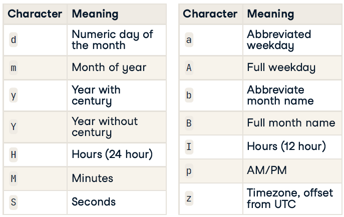

# Working with Dates and Times in R

## Dates and Times in R

### Introduction to dates

**ISO 8601: YYYY-MM-DD**

-   Values ordered from the largest to smallest unit of time

-   Each has a ,xed number of digits, must be padded with leading zeros

-   Either, no separators for computers, or - in dates

-   1st of January 2011 -\> 2011-01-01

#### Specifying dates

```{r}
# The date R 3.0.0 was released
x <- "2013-04-03"

# Examine structure of x
str(x)

# Use as.Date() to interpret x as a date
x_date <- as.Date(x)

# Examine structure of x_date
str(x_date)

# Store April 10 2014 as a Date
april_10_2014 <- as.Date("2014-04-10")
```

#### Automatic import

`anytime()` function in the `anytime` package: automatically parse strings as dates regardless of the format.

```{r message=FALSE}
# Load the readr package
library(readr)

# Use read_csv() to import rversions.csv
releases <- read_csv("data/rversions.csv")

# Examine the structure of the date column
str(releases$date)

# Load the anytime package
library(anytime)

# Various ways of writing Sep 10 2009
sep_10_2009 <- c("September 10 2009", "2009-09-10", "10 Sep 2009", "09-10-2009")

# Use anytime() to parse sep_10_2009
anytime(sep_10_2009)
```

### Why use dates?

-   Dates act like numbers

-   Plotting with dates

```{r}
str(releases)
```

#### Plotting

```{r}
library(ggplot2)

# Set the x axis to the date column
ggplot(releases, aes(x = date, y = type)) +
  geom_line(aes(group = 1, color = factor(major)))

# Limit the axis to between 2010-01-01 and 2014-01-01
ggplot(releases, aes(x = date, y = type)) +
  geom_line(aes(group = 1, color = factor(major))) +
  xlim(as.Date("2010-01-01"), as.Date("2014-01-01"))

# Specify breaks every ten years and labels with "%Y"
ggplot(releases, aes(x = date, y = type)) +
  geom_line(aes(group = 1, color = factor(major))) +
  scale_x_date(date_breaks = "10 years", date_labels = "%Y")
```

#### Arithmetic & logical operators

Since `Date` objects are internally represented as the number of days since 1970-01-01, you can do basic math and comparisons with dates.

You can compare dates with the usual logical operators (`<`, `==`, `>` etc.), find extremes with `min()` and `max()`, and even subtract two dates to find out the time between them.

`Sys.date()` -\> today's date

```{r message=FALSE}
library(dplyr)

# Find the largest date
last_release_date <- max(releases$date)

# Filter row for last release
last_release <- releases %>% filter(date == last_release_date)

# Print last_release
last_release

# How long since last release?
Sys.Date() - last_release_date
```

### What about times?

**ISO 8601: HH:MM:SS**

-   Largest unit to smallest

-   Fixed digits

    -   Hours: 00 \-- 24

    -   Minutes: 00 \-- 59

    -   Seconds: 00 \-- 60 (60 only for leap seconds)

-   No separator or `:`

**Datetimes in R**

-   Two objects types:

    -   `POSIXlt` - list with named components

    -   `POSIXct` - seconds since 1970-01-01 00:00:00

-   `POSIXct` will go in a data frame

-   `as.POSIXct()` turns a string into a `POSIXct` object

**Timezones**

`as.POSIXct("2013-02-27T18:00:00Z", tz = "UTC")`

#### Getting datetimes

-   `as.POSIXct()` expects strings to be in the format `YYYY-MM-DD HH:MM:SS`

-   check your timezone with `Sys.timezone()`

    -   If you want the time to be interpreted in a different timezone, set the `tz` argument of `as.POSIXct()`

```{r}
# Check timezone
Sys.timezone()

# Use as.POSIXct to enter the datetime 
as.POSIXct("2010-10-01 12:12:00")

# Use as.POSIXct again but set the timezone to `"America/Los_Angeles"`
as.POSIXct("2010-10-01 12:12:00", tz = "America/Los_Angeles")

# Examine structure of datetime column
str(releases$datetime)
```

#### Plot

```{r message=FALSE}
# Import "cran-logs_2015-04-17.csv" with read_csv()
logs <- read_csv("data/cran-logs_2015-04-17.csv")

# Print logs
print(logs)

# Store the release time as a POSIXct object
release_time <- as.POSIXct("2015-04-16 07:13:33", tz = "UTC")

# When is the first download of 3.2.0?
logs %>% 
  filter(datetime > release_time, r_version == "3.2.0") %>%
  arrange(datetime)

# Examine histograms of downloads by version
ggplot(logs, aes(x = datetime)) +
  geom_histogram() +
  geom_vline(aes(xintercept = as.numeric(release_time)))+
  facet_wrap(~ r_version, ncol = 1)
```

## Parsing & Manipulating with lubridate

`lubridate` in `tidyverse` package

### Parsing dates

**Parsing dates**

-   `ymd()` : [*y*]{.underline}ear, then [*m*]{.underline}onth, then [*d*]{.underline}ay

    -   `ydm()` , `mdy()` , `myd()` , `dmy()` , `dym()`, `dmy_hms()`, `dmy_hm()`, `dmy_h()` ...

-   `parse_date_time("date", order = "***")`

    -   e.g, `parse_date_time(c("27-02-2013", "2013 Feb 27th"), orders = c("dmy", "ymd"))`

**Formatting characters**

{width="400"}

#### Select the right parsing function

```{r}
library(lubridate)

# Parse x 
x <- "2010 September 20th" # 2010-09-20
ymd(x)

# Parse y 
y <- "02.01.2010"  # 2010-01-02
dmy(y)

# Parse z 
z <- "Sep, 12th 2010 14:00"  # 2010-09-12T14:00
mdy_hm(z)
```

#### Specify an order with parse_date_time

One advantage of `parse_date_time()` is that you can use more format characters.

For example, you can specify weekday names with `A`, `I` for 12 hour time, am/pm indicators with `p` and many others. You can see a whole list on the help page [**`?parse_date_time`**](https://www.rdocumentation.org/packages/lubridate/versions/1.8.0/topics/parse_date_time).

```{r}
# Change to UTC timezone
Sys.setlocale("LC_TIME", "C")

# Specify an order string to parse x
x <- "Monday June 1st 2010 at 4pm"
parse_date_time(x, orders = "AbdY_Ip")

# Specify order to include both "mdy" and "dmy"
two_orders <- c("October 7, 2001", "October 13, 2002", "April 13, 2003", 
  "17 April 2005", "23 April 2017")
parse_date_time(two_orders, orders = c("mdy", "dmy"))

# Specify order to include "dOmY", "OmY" and "Y"
short_dates <- c("11 December 1282", "May 1372", "1253")
parse_date_time(short_dates, orders = c("dOmY", "OmY", "Y"))
```

When a date component is missing, it's just set to `1`

### Manipulating dates

-   `make_date` has arguments year, month and day to allow you to specify a date from its individual components.

    -   `make_date(year, month, day)`

    -   Each argument can be vectors

-   `make_datetime` adds hour, min and sec arguments to build a datetime.

    -   `make_datetime(year, month, day, hour, min, sec)`

#### Import daily weather data

```{r message=FALSE}
library(tidyverse)

# Import CSV with read_csv()
akl_daily_raw <- read_csv("data/akl_weather_daily.csv")

# Print akl_daily_raw
print(akl_daily_raw)

# Parse date 
akl_daily <- akl_daily_raw %>%
  mutate(date = ymd(date))

# Print akl_daily
print(akl_daily)

# Plot to check work
ggplot(akl_daily, aes(x = date, y = max_temp)) +
  geom_line() 
```

#### Import hourly weather data

The date information is spread over three columns `year`, `month` and `mday`, so you'll need to use `make_date()` to combine them.

time information is in a separate `time` column.

One way to construct the datetimes is to paste the `date` and `time` together and then parse them.

```{r message=FALSE}
# Import "akl_weather_hourly_2016.csv"
akl_hourly_raw <- read_csv("data/akl_weather_hourly_2016.csv")

# Print akl_hourly_raw
print(akl_hourly_raw)

# Use make_date() to combine year, month and mday 
akl_hourly  <- akl_hourly_raw  %>% 
  mutate(date = make_date(year = year, month = month, day = mday))

# Parse datetime_string 
akl_hourly <- akl_hourly  %>% 
  mutate(
    datetime_string = paste(date, time, sep = "T"),
    datetime = ymd_hms(datetime_string)
  )

# Print date, time and datetime columns of akl_hourly
akl_hourly %>% select(date, time, datetime)

# Plot to check work
ggplot(akl_hourly, aes(x = datetime, y = temperature)) +
  geom_line()
```

### Extracting parts of a datetime

| Function   | Extracts                              |
|------------|---------------------------------------|
| `year()`   | Year with century                     |
| `month()`  | Month (1-12)                          |
| `day()`    | Day of month (1-31)                   |
| `hour()`   | Hour (0-23)                           |
| `min()`    | Minute (0-59)                         |
| `second()` | Second (0-59)                         |
| `wday()`   | Weekday (1-7)                         |
| `yday()`   | Day of year a.k.a. Julian day (1-366) |
| `tz()`     | Timezone                              |
|            |                                       |

``` r
# Example
x <- ymd("2013-02-23")

# output 2013
year(x)

# output 2
month(x)

#output 23
day(x)
```

**Setting parts of a datetime**

``` r
# Example
x <- ymd("2013-02-23")

# output "2013-02-23"
x

# Set new year, output "2017-02-23"
year(x) <- 2017x
```

**Other useful functions**

| Function      | Extracts                                      |
|---------------|-----------------------------------------------|
| `leap_year()` | In leap year ( 閏年, `TRUE` or `FALSE` )      |
| `am()`        | In morning ( `TRUE` or `FALSE` )              |
| `pm()`        | In afternoon ( `TRUE` or `FALSE` )            |
| `dst()`       | During daylight savings ( `TRUE` or `FALSE` ) |
| `quarter()`   | Quarter of year (1-4)                         |
| `semester()`  | Half of year (1-2)                            |
|               |                                               |

#### What can you extract

```{r}
release_time <- releases$datetime

# Examine the head() of release_time
head(release_time)

# Examine the head() of the months of release_time
head(month(release_time))

# Extract the month of releases 
month(release_time) %>% table()

# Extract the year of releases
year(release_time) %>% table()

# How often is the hour before 12 (noon)?
mean(hour(release_time) < 12)

# How often is the release in am?
# Alternatively use am() to find out how often releases happen in the morning.
mean(am(release_time))
```

R versions have historically been released most in April, June, October and December, 1998 saw 10 releases and about 75% of releases happen in the morning (at least according to UTC).

#### Adding useful labels

Both the [**`month()`**](https://www.rdocumentation.org/packages/lubridate/versions/1.8.0/topics/month) and `wday()` (day of the week) functions have two additional arguments:

-   `label`: Set `label = TRUE` to have the output labelled with month (or weekday) names

-   `abbr`: Set `abbr = FALSE` for those names to be written in full rather than [abbr]{.underline}eviated.

```{r}
# Use wday() to tabulate release by day of the week
# Do you know if 1 is Sunday or Monday?
lubridate::wday(releases$datetime) %>% table()

# Add label = TRUE to make table more readable
lubridate::wday(releases$datetime, label = TRUE) %>% table()

# Create column wday to hold labelled week days
releases$wday <- lubridate::wday(releases$datetime, label = TRUE)

# Plot barchart of weekday by type of release
ggplot(releases, aes(wday)) +
  geom_bar() +
  facet_wrap(~ type, ncol = 1, scale = "free_y")
```

Looks like not too many releases occur on the weekends, and there is quite a different weekday pattern between minor and patch releases.

#### Extracting for plotting

Extracting components from a datetime is particularly useful when exploring data.

Earlier in the chapter you imported daily data for weather in Auckland, and created a time series plot of ten years of daily maximum temperature. While that plot gives you a good overview of the whole ten years, it's hard to see the annual pattern.

In this exercise you'll use components of the dates to help explore the pattern of maximum temperature over the year.

```{r}
head(akl_daily)
```

The first step is to create some new columns to hold the extracted pieces, then you'll use them in a couple of plots.

```{r}
# Add columns for year, yday and month
akl_daily <- akl_daily %>%
  mutate(
    year = lubridate::year(date),
    yday = lubridate::yday(date),
    month = lubridate::month(date, label = TRUE))

# Take a look of mutate outcome
akl_daily %>% select(date, year, yday, month)
```

Each year is a line on this plot, with the x-axis running from Jan 1 to Dec 31.

```{r}
# Plot max_temp by yday for all years
ggplot(akl_daily, aes(x = yday, y = max_temp)) +
  geom_line(aes(group = year), alpha = 0.5)
```

To take an alternate look, create a [**ridgeline plot**](https://blog.revolutionanalytics.com/2017/07/joyplots.html)(formerly known as a joyplot) with `max_temp` on the x-axis, `month` on the y-axis, using `geom_density_ridges()` from the `ggridges` package.

```{r message=FALSE}
library(ggridges)

# Examine distribution of max_temp by month
ggplot(akl_daily, aes(x = max_temp, y = month, height = ..density..)) +
  geom_density_ridges(stat = "density")
```

Looks like Jan, Feb and Mar are great months to visit if you want warm temperatures.

#### Extracting for filter & summarize

Another reason to extract components is to help with filtering observations or creating summaries.

For example, if you are only interested in observations made on weekdays (i.e. not on weekends) you could extract the weekdays then filter out weekends, e.g. `wday(date) %in% 2:6`.

You'll use the hourly data to calculate how many days in each month there was any rain during the day.

```{r}
str(akl_hourly)

# Create new columns hour, month and rainy
akl_hourly <- akl_hourly %>%
  mutate(
    hour = lubridate::hour(datetime),
    month = lubridate::month(datetime, label = TRUE),
    rainy = weather == "Precipitation"
  )

akl_hourly %>% select(datetime, date, hour, month, rainy)
```

Filter to just daytime observations.

```{r}
# Filter for hours between 8am and 10pm (inclusive)
akl_day <- akl_hourly %>% 
  filter(hour >= 8, hour <= 22)
```

Group the observations first by `month`, then by `date`, and summarise by using [**`any()`**](https://www.rdocumentation.org/packages/base/versions/3.6.2/topics/any) on the `rainy` column. *This results in one value per day.*

```{r}
# Summarise for each date if there is any rain
rainy_days <- akl_day %>% 
  group_by(month, date) %>%
  summarise(
    any_rain = any(rainy)
  )

rainy_days
```

Summarise again by summing `any_rain`. *This results in one value per month.*

```{r}
# Summarise for each month, the number of days with rain
rainy_days %>% 
  summarise(
    days_rainy = sum(any_rain)
  )
```

At least in 2016, it looks like you'll still need to pack a raincoat if you visit in Jan, Feb or March.

`days_in_month` get the number of days in the month of a date-time.(該月份有幾天)

### Rounding datetimes

**Rounding in lubridate**

-   `round_date()` - round to *nearest* (四捨五入)

-   `ceiling_date()` - round *up* (無條件進位)

-   `floor_date()` - round *down* (無條件捨去)

-   Possible values of `unit` :

    -   `"second"` , `"minute"` , `"hour"` , `"day"` , `"week"` , `"month"` , `"bimonth"` , `"quarter"` , `"halfyear"` , or `"year"` .

    -   Or multiples, e.g `"2 years"` , `"5 minutes"`

#### Practice rounding

That last technique of subtracting a rounded datetime from an unrounded one is a really useful trick to remember.

```{r}
r_3_4_1 <- ymd_hms("2016-05-03 07:13:28 UTC")

# Round down to day
floor_date(r_3_4_1, unit = "day")

# Round to nearest 5 minutes
round_date(r_3_4_1, unit = "5 minutes")

# Round up to week 
ceiling_date(r_3_4_1, unit = "week")

# Subtract r_3_4_1 rounded down to day
r_3_4_1 - floor_date(r_3_4_1, unit = "day")
```

#### Rounding with the weather data

The advantage of rounding over extracting is that it maintains the context of the unit.

You'll explore how many observations per hour there really are in the hourly Auckland weather data.

```{r}
# Create day_hour, datetime rounded down to hour
akl_hourly <- akl_hourly %>%
  mutate(
    day_hour = floor_date(datetime, unit = "hour")
  )

akl_hourly %>% select(datetime, day_hour)
```

Count how many observations there are in each hour. What looks like the most common value?

```{r}
# Count observations per hour  
akl_hourly %>% 
  count(day_hour) 
```

Filter for observations where `n` is not equal to 2.

```{r}
# Find day_hours with n != 2  
akl_hourly %>% 
  count(day_hour) %>%
  filter(n != 2) %>% 
  arrange(desc(n))
```

92 hours that don't have two measurements. Interestingly there are four measurements on 2016-04-03 and 2016-09-25, they happen to be the days Daylight Saving starts and ends.

## Arithmetic with Dates and Times

### Taking differences of datetimes

**Subtraction of datetimes**

-   `difftime(time1, time2)`

    -   is the same as `time1 - time2`

    -   takes an argument `units` which specifies the units for the difference.

    -   `units` = `"secs"` , `"mins"` , `"hours"` , `"days"` , or `"weeks"`

-   `lubridate` functions `today()` and `now()`: return the current date and time in your system's timezone.

``` r
today()
# [1] "2023-11-10"

now()
# [1] "2023-11-10 10:53:08 CST"
```

```{r}
# The date of landing and moment of step
date_landing <- mdy("July 20, 1969")
moment_step <- mdy_hms("July 20, 1969, 02:56:15", tz = "UTC")

# How many days since the first man on the moon?
difftime(today(), date_landing, units = "days")

# How many seconds since the first man on the moon?
difftime(now(), moment_step, units = "secs")
```

*How many seconds are in a day?*

There are 24 hours in a day, 60 minutes in an hour, and 60 seconds in a minute, so there should be `24*60*60` = `86400` seconds, right? --- Not always!🙄

```{r}
# Three dates
mar_11 <- ymd_hms("2017-03-11 12:00:00", 
  tz = "America/Los_Angeles")
mar_12 <- ymd_hms("2017-03-12 12:00:00", 
  tz = "America/Los_Angeles")
mar_13 <- ymd_hms("2017-03-13 12:00:00", 
  tz = "America/Los_Angeles")

# Difference between mar_13 and mar_12 in seconds
# This should match your intuition.
difftime(mar_13, mar_12, units = "secs")

# Difference between mar_12 and mar_11 in seconds
# Surprised?
difftime(mar_12, mar_11, units = "secs")
```

Why would a day only have 82800 seconds? At 2am on Mar 12th 2017, Daylight Savings started in the Pacific timezone. That means a whole hour of seconds gets skipped between noon on the 11th and noon on the 12th.

### Time spans

**Time spans in lubridate**

-   Duration

    -   represent an exact number of seconds

    -   use case: only care about physical time (seconds elapsed)

    -   datetime + duration of one day = datetime + 86400 seconds

-   Period

    -   represent human units

    -   use case: interested in human interpretaions of time

    -   datetime + period of one day = same time on the next date

-   Interval

    -   represent a starting and ending point

    -   use case: when you have a start and end, and figure out how long a span is in human units

**Functions to create time spans**

{width="276"}

#### Adding or subtracting a time span

Duration vs Period

```{r}
# Add a period of one week to mon_2pm
mon_2pm <- dmy_hm("27 Aug 2018 14:00")
mon_2pm + weeks(1)

# Add a duration of 81 hours to tue_9am
tue_9am <- dmy_hm("28 Aug 2018 9:00")
tue_9am + dhours(81)

# Subtract a period of five years from today()
today() - years(5)

# Subtract a duration of five years from today()
today() - dyears(5)
```

Why did subtracting a duration of five years from today, give a different answer to subtracting a period of five years?

Periods know about leap years, and since five years ago includes at least one leap year, the period of five years is longer than the duration of 365\*5 days.

#### Arithmetic with timespans

You can add and subtract timespans to create different length timespans, and even multiply them by numbers.

For example, to create a duration of three days and three hours: `ddays(3) + dhours(3)`, `3*ddays(1) + 3*dhours(1)` or `3*(ddays(1) + dhours(1))`

There was an eclipse over North America on 2017-08-21 at 18:26:40. It's possible to predict the next eclipse with similar geometry by calculating the time and date one [**Saros**](https://eclipse.gsfc.nasa.gov/SEsaros/SEsaros.html) in the future.

-   One Saros = 223 Synodic Months

-   One Synodic Month = 29d 12h 44m 03s

```{r}
# Time of North American Eclipse 2017
eclipse_2017 <- ymd_hms("2017-08-21 18:26:40")

# Duration of 29 days, 12 hours, 44 mins and 3 secs
synodic <- ddays(29) + dhours(12) + dminutes(44) + dseconds(3)

# 223 synodic months
saros <- 223 * synodic

# Add saros to eclipse_2017
eclipse_2017 + saros
```

#### Generate sequences of datetimes

By combining addition and multiplication with sequences you can generate sequences of datetimes.

```{r}
1:10 * days(1)
```

Then by adding this sequence to a specific datetime, you can construct a sequence of datetimes from 1 day up to 10 days into the future.

```{r}
today() + 1:10 * days(1)
```

You had a meeting this morning at 8am and you'd like to have that meeting at the same time and day every two weeks for a year. Generate the meeting times.

```{r}
# Add a period of 8 hours to today
today_8am <- today() + hours(8); today_8am

# Sequence of two weeks from 1 to 26
every_two_weeks <- 1:26 * weeks(2); every_two_weeks

# Create datetime for every two weeks for a year
today_8am + every_two_weeks
```

#### Tricky thing about months

In general `lubridate` returns the same *day of the month* in the next month, but since the 31st of February, April, June, September, November don't exist, `lubridate` returns `NA`s.

```{r}
jan_31 <- as.Date("2023-01-31")

# A sequence of 1 to 12 periods of 1 month
# output: "1m 0d 0H 0M 0S", "2m 0d 0H 0M 0S"..."12m 0d 0H 0M 0S"
month_seq <- 1:12 * months(1)

# Add 1 to 12 months to jan_31
jan_31 + month_seq
```

Alternative addition and subtraction operators: `%m+%` & `%m-%`

Rather than returning an `NA` for a non-existent date, they roll back to the last existing date.

```{r}
# Replace + with %m+%
jan_31 %m+% month_seq

# Replace + with %m-%
jan_31 %m-% month_seq
```

Use `add_with_rollback(x, months(), roll_to_first = TRUE)` to rollback to the first day of the month instead of the last day of the previous month.

```{r}
add_with_rollback(jan_31, months(1), roll_to_first = TRUE)
```

### Intervals

Rather than representing an amount of time like a period or duration, interval have a specific start and end datetime.

**Creating intervals**

-   `datetime1 %--% datetime2`

-   `interval(datetime1, datetime2)`

**Operating on an interval**

-   `int_start()` : extract the start of the interval.

-   `int_end()` : extract the end of the interval.

-   `int_length()` : finds the length of the interval in seconds.

-   `as.period()`

-   `as.duration()`

**Comparing intervals**

-   date `%within%` interval : return `TRUE` if the datetime is inside the interval, vice versa.

-   `int_overlaps(int_1, int_2)` : return `TRUE` if there are any times that are inside both intervals.

#### Examining intervals

Practice by exploring the reigns of kings and queens of Britain (and its historical dominions).

```{r message=FALSE}
library(readxl)

# Load dataset
monarchs <- read_excel("data/monarchs.xlsx")
str(monarchs)

# Convert data type
monarchs <- monarchs %>%
    mutate(from = as.POSIXct(from, format = "%Y-%m-%d %H:%M:%S"),
           to = as.POSIXct(to, format = "%Y-%m-%d %H:%M:%S"))

monarchs
```

```{r}
# Create an interval for reign
monarchs <- monarchs %>%
  mutate(reign = from %--% to) 

# Find the length of reign, and arrange
monarchs %>%
  mutate(length = int_length(reign)) %>% 
  arrange(desc(length)) %>%
  select(name, length, dominion)
```

#### Comparing intervals and datetimes

A common task with intervals is to ask if a certain time is inside the interval or whether it overlaps with another interval.

The operator `%within%` tests if the datetime (or interval) on the left hand side is within the interval of the right hand side.

`int_overlaps()` performs a similar test, but will return true if two intervals overlap at all.

`halleys` is a data set describing appearances of Halley's comet.

Practice to find out which monarchs saw Halley's comet around 1066.

```{r}
halleys <- read_excel("data/halleys.xlsx")
str(halleys)
```

`perihelion_date` is the date the Comet is closest to the Sun.

`start_date` and `end_date` are the range of dates the comet is visible from Earth.

```{r}
# convert data type
halleys <- halleys %>%
    mutate(perihelion_date = as.Date(perihelion_date, format = "%Y-%m-%d"),
           start_date = as.Date(start_date, format = "%Y-%m-%d"),
           end_date = as.Date(end_date, format = "%Y-%m-%d"))

halleys
```

Work with one appearance.

```{r}
# New column for interval from start to end date
halleys <- halleys %>% 
  mutate(visible = start_date %--% end_date)

# The visitation of 1066
halleys_1066 <- halleys[14, ]; halleys_1066
```

```{r}
# Monarchs in power on perihelion date
monarchs %>% 
  filter(halleys_1066$perihelion_date %within% reign) %>%
  select(name, from, to, dominion)

# Monarchs whose reign overlaps visible time
monarchs %>% 
  filter(int_overlaps(reign, halleys_1066$visible)) %>%
  select(name, from, to, dominion)
```

Looks like the Kings of England Edward the Confessor and Harold II would have been able to see the comet.

#### Converting to durations and periods

Intervals are the most specific way to represent a span of time since they retain information about the exact start and end moments.

They can be converted to periods (`as.period()`) and durations (`as.duration`) exactly:

Calculate both the exact number of seconds elapsed between the start and end date, as well as the perceived change in clock time.

Try to get better representations of the length of the monarchs reigns.

```{r}
# New columns for duration and period
monarchs <- monarchs %>%
  mutate(
    duration = as.duration(reign),
    period = as.period(reign)) 
    
# Examine results    
monarchs %>%
  select(name, duration, period)
```

## Problems in practice

### Time zones

**IANA Timezones**

```{r}
OlsonNames()
```

**Setting and extracting timezone**

-   setting: set `tz = "timezone_name"` argument

-   extracting: function `tz()`

**Manipulating timezones**

-   `force_tz()`: change the timezone without changing the clock time

-   `with_tz()` - view the same instant in a different timezone

#### Setting the timezone

If you import a datetime and it has the wrong timezone, you can set it with `force_tz(date, tzone = "tz")`.

To watch New Zealand in the Women's World Cup Soccer games in 2015, but the times listed on the FIFA website were all in times local to the venues. In this exercise you'll help to set the timezones.

```{r}
# Game2: CAN vs NZL in Edmonton
game2 <- mdy_hm("June 11 2015 19:00")

# Game3: CHN vs NZL in Winnipeg
game3 <- mdy_hm("June 15 2015 18:30")
```

Game 2 was played in Edmonton.

```{r}
# Set the timezone to "America/Edmonton"
game2_local <- force_tz(game2, tzone = "America/Edmonton")
game2_local
```

Game 3 was played in Winnipeg.

```{r}
# Set the timezone to "America/Winnipeg"
game3_local <- force_tz(game3, tzone = "America/Winnipeg")
game3_local
```

Find out how long the team had to rest between the two games.

```{r}
# How long does the team have to rest?
as.period(interval(game2_local, game3_local))
```

Edmonton and Winnipeg are in different timezones, so even though the start times of the games only look 30 minutes apart, they are in fact 1 hour and 30 minutes apart, and the team only has 3 days, 22 hours and 30 minutes to prepare.

#### Viewing in a timezone

`with_tz(date, tzone = "tz")` isn't changing the underlying moment of time.

For example, the difference between `now()` displayed in the "America/Los_Angeles" timezone and "Pacific/Auckland" timezone is 0. (同一時間，只是在不同時區)

Now, figure out when to tune into the games from the previous exercise.

Most fans will tune in from New Zealand. Use`with_tz()` to display `game2_local` in New Zealand time. New Zealand is in the `"Pacific/Auckland"` timezone.

```{r}
# What time is game2_local in NZ?
with_tz(game2_local, tzone = "Pacific/Auckland")
```

In Corvallis, Corvallis is in the "America/Los_Angeles" timezone.

```{r}
# What time is game2_local in Corvallis, Oregon?
with_tz(game2_local, tzone = "America/Los_Angeles")
```

```{r}
# What time is game3_local in NZ?
with_tz(game3_local, tzone = "Pacific/Auckland")
```

#### Timezones in the weather data

```{r}
glimpse(akl_hourly)
```

The `datetime` column you created represented local time in Auckland, NZ.

Suspect `date_utc` column represents the observation time in UTC (the name seems a big clue). But does it really?

What timezone are datetime and date_utc currently in?

```{r}
# Examine datetime columns
head(akl_hourly$datetime)

# Examine date_utc columns
head(akl_hourly$date_utc)
```

Fix `datetime` to have the timezone for `"Pacific/Auckland"`.

```{r}
# Force datetime to Pacific/Auckland
akl_hourly <- akl_hourly %>%
  mutate(datetime = force_tz(datetime, tzone = "Pacific/Auckland"))

# Reexamine datetime
head(akl_hourly$datetime)
```

Now tabulate up the difference between the `datetime` and `date_utc`. It should be zero if our hypothesis was correct.

```{r}
# Are datetime and date_utc the same moments
table(akl_hourly$datetime - akl_hourly$date_utc)
```

Looks like for 17,450 rows `datetime` and `date_utc` describe the same moment.

But for 4 rows they are different. Because it's the times where DST kicks in.

#### Times without dates

Sometimes you just have a time without a date.

The `hms` package provides an `hms` class of object for holding times without dates, and the best place to start would be with `as.hms()`.

```{r message=FALSE}
# Import auckland hourly data 
akl_hourly <- read_csv("data/akl_weather_hourly_2016.csv")

# Examine structure of time column
# verify it has the class hms
str(akl_hourly$time)

# Examine head of time column
head(akl_hourly$time)
```

Using time without date is a great way to examine daily patterns.

```{r}
# A plot using just time
ggplot(akl_hourly, aes(x = time, y = temperature)) +
  geom_line(aes(group = make_date(year, month, mday)), alpha = 0.2)
```

### More on import and export datetimes

#### Fast parsing with fasttime

The `fasttime` package provides a single function [**`fastPOSIXct()`**](https://www.rdocumentation.org/packages/fasttime/versions/1.0-2/topics/fastPOSIXct), designed to read in datetimes formatted according to ISO 8601 (YYYY-MM-DD HH:MM:SS).

Because it only reads in one format, and doesn't have to guess a format, it is really fast!

You'll see how fast in this exercise by comparing how fast it reads in the dates from the Auckland hourly weather data (over 17,000 dates) to `lubridate`s [**`ymd_hms()`**](https://www.rdocumentation.org/packages/lubridate/versions/1.8.0/topics/ymd_hms).

To compare run times you'll use the [**`microbenchmark()`**](https://www.rdocumentation.org/packages/microbenchmark/versions/1.4.9/topics/microbenchmark) function from the package of the same name.

```{r message=FALSE}
library(microbenchmark)
library(fasttime)

# Use make_date() to combine year, month and mday 
akl_hourly  <- akl_hourly_raw  %>% 
  mutate(date = make_date(year = year, month = month, day = mday),
         datetime_string = paste(date, "T", time, "Z", sep = ""),
         datetime = ymd_hms(datetime_string))

dates <- akl_hourly$datetime_string

# Examine structure of dates
str(dates)
```

```{r}
# Use fastPOSIXct() to parse dates
fastPOSIXct(dates) %>% str()
```

Now to compare timing

```{r}
# Compare speed of fastPOSIXct() to ymd_hms()
microbenchmark(
  ymd_hms = ymd_hms(dates),
  fasttime = fastPOSIXct(dates),
  times = 20)
```

#### Fast parsing with lubridate

`lubridate` provides its own fast datetime parser: `fast_strptime()`.

It takes a `format` argument and the format must comply with the [**`strptime()`**](https://www.rdocumentation.org/packages/base/versions/3.6.2/topics/strptime) style.

e.g, `fast_strptime(x, format = "%Y-%m-%d")`

```{r}
# Head of dates
head(dates)
```

Parse `dates` with `fast_strptime()` by specifying the appropriate format string.

```{r}
# Parse dates with fast_strptime
fast_strptime(dates, 
    format = "%Y-%m-%dT%H:%M:%SZ") %>% str()
```

Compare the timing of `fast_strptime()` to `fasttime` and `ymd_hms()`.

```{r}
# Comparse speed to ymd_hms() and fasttime
microbenchmark(
  ymd_hms = ymd_hms(dates),
  fasttime = fastPOSIXct(dates),
  fast_strptime = fast_strptime(dates, format = "%Y-%m-%dT%H:%M:%SZ"),
  times = 20)
```

#### Outputting pretty dates and times

An easy way to output dates is to use the `stamp()` function in `lubridate`.

[`stamp()`](https://www.rdocumentation.org/packages/lubridate/versions/1.8.0/topics/stamp) takes a string which should be an example of how the date should be formatted, and returns a function that can be used to format dates.

Notice `date_stamp` is a function.

```{r}
# Create a stamp based on "Saturday, Jan 1, 2000"
date_stamp <- stamp("Saturday, Jan 1, 2000")

# Print date_stamp
print(date_stamp)
```

Format today's date by `date_stamp`.

```{r}
# Call date_stamp on today()
date_stamp(today())
```

Now output today's date in American style `MM/DD/YYYY`.

```{r}
# Create and call a stamp based on "12/31/1999"
stamp("12/31/1999")(today())
```

```{r}
finished <- "I finished 'Dates and Times in R' on Thursday, September 4, 2017!"

# Use string finished for stamp()
stamp(finished)(today())
```


