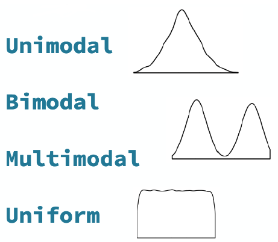
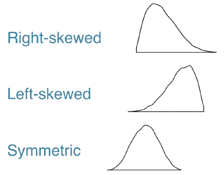

# Exploratory Data Analysis in R

## Exploring Categorical Data

### Categorical data

#### Contingency table

Create a contingency table by `table()`, is a useful way to represent the total counts of observations that fall into each combination of the levels of categorical variables.

`comics` dataset is a collection of characteristics on all of the superheroes created by Marvel and DC comics in the last 80 years.

```{r message=FALSE}
library(tidyverse)

comics <- read_csv("data/comics.csv", col_types = "ffffffffiff")
glimpse(comics)
```

```{r}
# Check levels of align
levels(comics$align)

# Check the levels of gender
levels(comics$gender)

# Create a 2-way contingency table
tab <- table(comics$gender, comics$align); tab
```

#### Dropping levels

The contingency table from the last exercise revealed that there are some levels that have very low counts. To simplify the analysis, it often helps to drop such levels.

Two steps:

1.  filtering out any rows with the levels that have very low counts,

2.  removing these levels from the factor variable with `droplevels()`.

(This is because the `droplevels()` would keep levels that have just 1 or 2 counts; it only drops levels that don't exist in a dataset.)

Find out which level of `align` has the fewest total entries. Then filter out all rows of comics with that level, then drop the unused level with `droplevels()`.

```{r}
# Remove align level
comics_filtered <- comics %>%
  filter(align != "Reformed Criminals") %>%
  droplevels()

# See the result
comics_filtered
```

```{r}
str(comics_filtered$align)
```

#### Side-by-side bar charts

While a contingency table represents the counts numerically, it's often more useful to represent them graphically.

Here you'll construct two side-by-side bar charts of the comics data. This shows that there can often be two or more options for presenting the same data.

```{r}
# Create side-by-side bar chart of gender by alignment
ggplot(comics, aes(x = align, fill = gender)) + 
  geom_bar(position = "dodge")

# Create side-by-side bar chart of alignment by gender
ggplot(comics, aes(x = gender, fill = align)) + 
  geom_bar(position = "dodge") +
  theme(axis.text.x = element_text(angle = 90))
```

### Counts vs. proportions

#### Proportions

```{r}
# Simplify display format
options(scipen = 999, digits = 3) 

tab_cnt <- table(comics$id, comics$align)
tab_cnt
```

Compute the proportions by `prop.table(table)`.

```{r}
prop.table(tab_cnt)
```

Note that because these are all proportions out of the whole dataset, the sum of all of these proportions is 1.

```{r}
sum(prop.table(tab_cnt))
```

#### Conditional proportions

condition on the rows: `prop.table(table, 1)`

```{r}
prop.table(tab_cnt, 1)
```

Because we're conditioning on row, it's every row that now sums to one.

```{r}
rowSums(prop.table(tab_cnt, 1))
```

condition on the columns: `prop.table(table, 2)`

```{r}
prop.table(tab_cnt, 2)
```

Because we're conditioning on column, it's every column that now sums to one.

```{r}
colSums(prop.table(tab_cnt, 2))
```

Approximately 41% of all good characters are secret.

#### Conditional bar chart

Bar charts can tell dramatically different stories depending on whether they represent counts or proportions and, if proportions, what the proportions are conditioned on.

By adding `position = "fill"` to `geom_bar()`, you are saying you want the bars to fill the entire height of the plotting window, thus displaying proportions and not raw counts.

Create a stacked bar chart of gender *counts*.

```{r}
# Plot of gender by align
ggplot(comics, aes(x = align, fill = gender)) +
  geom_bar()
```

Create a stacked bar chart of gender *proportions*.

```{r}
# Plot proportion of gender, conditional on align
ggplot(comics, aes(x = align, fill = gender)) + 
  geom_bar(position = "fill") +
  ylab("proportion")
```

### Distribution of one variable

#### Marginal bar chart

If you are interested in the distribution of alignment of all superheroes, it makes sense to construct a bar chart for just that single variable.

You can improve the interpretability of the plot, though, by implementing some sensible ordering.

```{r}
# Change the order of the levels in align
comics$align <- factor(comics$align, 
                       levels = c("Bad", "Neutral", "Good"))

# Create plot of align
ggplot(comics, aes(x = align)) + 
  geom_bar()
```

#### Conditional bar chart

Now, if you want to break down the distribution of alignment based on gender, you're looking for conditional distributions.

You could make these by creating multiple filtered datasets (one for each gender) or by *faceting* the plot of alignment based on gender.

Create a bar chart of `align` faceted by `gender`.

```{r}
# Plot of alignment broken down by gender
ggplot(comics, aes(x = align)) + 
  geom_bar() +
  facet_wrap(~ gender)
```

#### Improve pie chart

The pie chart is a very common way to represent the distribution of a single categorical variable, but they can be more difficult to interpret than bar charts.

This is a pie chart of a dataset called `pies` that contains the favorite pie flavors of 98 people.

```{r}
pies <- read_delim("data/pies.txt", delim = ",")
pies$flavor <- as.factor(pies$flavor)

# pie chart, 很難看出數量很難看出數量高低
ggplot(pies, aes(x = factor(1), fill = flavor)) +
    geom_bar(width = 1) +
    coord_polar(theta = "y") +
    theme_void()
```

Improve the representation of these data by constructing a bar chart that is ordered in descending order of count.

```{r}
# Put levels of flavor in descending order
lev <- c("apple", "key lime", "boston creme", "blueberry", "cherry", "pumpkin", "strawberry")
pies$flavor <- factor(pies$flavor, levels = lev)

# Create bar chart of flavor
ggplot(pies, aes(x = flavor)) + 
  geom_bar(fill = "chartreuse") + 
  theme(axis.text.x = element_text(angle = 90))
```

## Exploring numerical data

### Numerical Data

#### Faceted histogram

`cars` dataset, which records characteristics on all of the new models of cars for sale in the US in a certain year.

You will investigate the distribution of mileage across a categorical variable,

```{r message=FALSE}
cars <- read_csv("data/cars04.csv")

# Learn data structure
str(cars, give.attr = FALSE)
```

Plot a histogram of `city_mpg` faceted by `suv`, a logical variable indicating whether the car is an SUV or not.

```{r}
# Create faceted histogram
ggplot(cars, aes(x = city_mpg)) +
  geom_histogram() +
  facet_wrap(~ suv)
```

you can facet a plot by any categorical variable using `facet_wrap()`.

#### Boxplots & density plots

The mileage of a car tends to be associated with the size of its engine (as measured by the number of cylinders).

To explore the relationship between these two variables, you'll try your hand at two alternatives: the box plot and the density plot.

A quick look at `ncyl` shows that there are more possible levels of `ncyl` than you might think. Here, restrict attention to the most common levels.

```{r}
unique(cars$ncyl)

# Filter cars with 4, 6, 8 cylinders
common_cyl <- filter(cars, cars$ncyl %in% c(4, 6, 8))
```

Create side-by-side box plots.

```{r}
# Create box plots of city mpg by ncyl
ggplot(common_cyl, aes(x = as.factor(ncyl), y = city_mpg)) +
  geom_boxplot()
```

Create overlaid density plots.

```{r}
# Create overlaid density plots for same data
ggplot(common_cyl, aes(x = city_mpg, fill = as.factor(ncyl))) +
  geom_density(alpha = .3)
```

### Distribution of one variable

#### Marginal & conditional hist

Now, turn your attention to a new variable: `horsepwr`. The goal is to get a sense of the marginal distribution of this variable and then compare it to the distribution of horsepower conditional on the price of the car being less than \$25,000.

```{r}
# Create hist of horsepwr
cars %>%
  ggplot(aes(x = horsepwr)) +
    geom_histogram() +
    ggtitle("marginal distribution of horsepower")

# Create hist of horsepwr for affordable cars
cars %>% 
  filter(msrp < 25000) %>%
  ggplot(aes(x = horsepwr)) +
    geom_histogram() +
    xlim(c(90, 550)) +
    ggtitle("distribution of horsepower conditional on the price less than $25000")
```

#### Binwidths

The binwidth determines how smooth your distribution will appear: the smaller the binwidth, the more jagged your distribution becomes.

It's good practice to consider several binwidths in order to detect different types of structure in your data.

```{r}
# Create hist of horsepwr with binwidth of 3
plot_A <- cars %>%
  ggplot(aes(x = horsepwr)) +
    geom_histogram(binwidth = 3) +
    ggtitle("Plot A, binwidth = 3")

# Create hist of horsepwr with binwidth of 30
plot_B <- cars %>%
  ggplot(aes(x = horsepwr)) +
    geom_histogram(binwidth = 30) +
    ggtitle("Plot B, binwidth = 30")

# Create hist of horsepwr with binwidth of 60
plot_C <- cars %>%
  ggplot(aes(x = horsepwr)) +
    geom_histogram(binwidth = 60) +
    ggtitle("Plot C, binwidth = 60")

# put all plot together to compare
gridExtra::grid.arrange(plot_A, plot_B, plot_C, nrow = 1)
```

Plot A is the only histogram that shows the count for cars with exactly 200 and 300 horsepower.

### Box plots

#### Box plots for outliers

In addition to indicating the center and spread of a distribution, a box plot provides a graphical means to detect outliers.

You can apply this method to the `msrp` column (manufacturer's suggested retail price) to detect if there are unusually expensive or cheap cars.

```{r}
# Construct box plot of msrp
cars %>%
  ggplot(aes(x = 1, y = msrp)) +
    geom_boxplot()

# Exclude outliers from data
cars_no_out <- cars %>%
  filter(msrp < 100000)

# Construct box plot of msrp using the reduced dataset
cars_no_out %>%
  ggplot(aes(x = 1, y = msrp)) +
    geom_boxplot()
```

#### Plot selection

Both density plots and box plots display the central tendency and spread of the data, but the box plot is more robust to outliers.

Consider two other columns in the cars dataset: `city_mpg` and `width`. Which is the most appropriate plot for displaying the important features of their distributions?

For each variable, try both plots and decide which one is better at capturing the important structure.

```{r}
# Create plot of city_mpg
# box plot
city_mpg_boxplot <- cars %>%
  ggplot(aes(x = 1, y = city_mpg)) +
    geom_boxplot()

# density plot
city_mpg_density <- cars %>%
  ggplot(aes(x = city_mpg)) +
    geom_density()

# Create plot of width
# box plot
width_boxplot <- cars %>%
  ggplot(aes(x = 1, y = width)) +
    geom_boxplot()

# density plot
width_density <- cars %>%
  ggplot(aes(x = width)) +
    geom_density()

gridExtra::grid.arrange(city_mpg_boxplot, city_mpg_density, width_boxplot, width_density, nrow = 2)
```

Because the `city_mpg` variable has a much wider range with its outliers, it's best to display its distribution as a box plot.

### Visual in higher dimensions

Higher dimensional plots:

Shape, Size, Color, Pattern, Movement, x-coordinate, y-coordinate

#### three variables plot

*Faceting* is a valuable technique for looking at several conditional distributions at the same time.

If the faceted distributions are laid out in a grid, you can consider the association between a variable and two others, one on the rows of the grid and the other on the columns.

Using `common_cyl`, create a histogram of hwy_mpg. Grid-facet the plot rowwise by `ncyl` and columnwise by `suv`.

```{r}
# Facet hists using hwy mileage and ncyl
common_cyl %>%
  ggplot(aes(x = hwy_mpg)) +
    geom_histogram() +
    facet_grid(ncyl ~ suv) +
    ggtitle("hwy_mpg faceted by ncyl and suv")
```

## Numerical Summaries

Characteristics of a distribution

- Center

- Variability

- Shape

- Outliers

### Measures of center

Center: mean, median, mode

The choice of measure for center can have a dramatic impact on what we consider to be a typical observation, so it is important that you consider the shape of the distribution before deciding on the measure.

#### Calculate center measures

You will use data from `gapminder`, which tracks demographic data in countries of the world over time. How the life expectancy differs from continent to continent?

```{r}
# Create dataset of 2007 data
gap2007 <- filter(gapminder::gapminder, year == 2007)

# Compute groupwise mean and median lifeExp
gap2007 %>%
  group_by(continent) %>%
  summarize(mean(lifeExp),
            median(lifeExp))

# Generate box plots of lifeExp for each continent
gap2007 %>%
  ggplot(aes(x = continent, y = lifeExp)) +
  geom_boxplot()
```

### Measures of variability

Variability: variance, standard deviation, interquartile range(IQR), range

The choice of measure for spread can dramatically impact how variable we consider our data to be, so it is important that you consider the shape of the distribution before deciding on the measure.

IQR is useful when your dataset is heavily skewed or has extreme observations.

#### Calculate spread measures

summarize life expectancies using the `sd()`, the `IQR()`, and the count of countries, `n()`.

```{r}
# Compute groupwise measures of spread
gap2007 %>%
  group_by(continent) %>%
  summarize(sd(lifeExp),
            IQR(lifeExp),
            n())

# Graphically compare the spread of these distributions
# Generate overlaid density plots
gap2007 %>%
  ggplot(aes(x = lifeExp, fill = continent)) +
  geom_density(alpha = 0.3)
```

#### Choose measures for center & spread

Using the shapes of the density plots, calculate the most appropriate measures of center and spread.

```{r}
# The distribution of life expectancy in the countries of the Americas.
gap2007 %>%
  filter(continent == "Americas") %>%
  ggplot(aes(x = lifeExp)) +
    geom_density()
```

```{r}
# Compute stats for lifeExp in Americas
gap2007 %>%
  filter(continent == "Americas") %>%
  summarize(mean(lifeExp),
            sd(lifeExp))
```

```{r}
# The distribution of country populations across the entire gap2007 dataset.
gap2007 %>%
    ggplot(aes(x = pop)) +
    geom_density()
```

median and IQR measure the central tendency and spread, respectively, but are robust to outliers and non-normal data.

```{r}
# Compute stats for population
gap2007 %>%
  summarize(median(pop),
            IQR(pop))
```

### Shape & transformations

**Modality**

The modality of a distribution is the number of prominent humps that show up in the distribution.

{width="271"}

**Skew**

The skew is where the long tail is.

{width="273"}

#### Transformations

Highly skewed distributions can make it very difficult to learn anything from a visualization. Transformations can be helpful in revealing the more subtle structure.

```{r}
# Original pop shape
pop_nontrans_plot <- gap2007 %>%
    ggplot(aes(x = pop)) +
    geom_density() +
    ggtitle("population without transform")

# Transform the skewed pop variable
gap2007 <- gap2007 %>%
  mutate(log_pop = log(pop))

# Create density plot of new variable
pop_trans_plot <- gap2007 %>%
  ggplot(aes(x = log_pop)) +
  geom_density() +
  ggtitle("population with log transform")

# compare transforming
gridExtra::grid.arrange(pop_nontrans_plot, pop_trans_plot, nrow = 1)
```

### Outliers

#### Identify outliers

Consider the distribution, shown here, of the life expectancies of the countries in Asia. The box plot identifies one clear outlier: a country with a notably low life expectancy.

```{r}
# box plot for Asia lifeExp
gap2007 %>%
    filter(continent == "Asia") %>%
    ggplot(aes(x = 1, y = lifeExp)) +
    geom_boxplot()

# which country with lowest lifeExp
gap2007[which.min(gap2007$lifeExp), c("country", "lifeExp")]
```

Building a plot with that country removed.
```{r}
# Filter for Asia, add column indicating outliers
gap_asia <- gap2007 %>%
  filter(continent == "Asia") %>%
  mutate(is_outliner = lifeExp < 50)

# Remove outliers, create box plot of lifeExp
gap_asia %>%
  filter(!is_outliner) %>%
  ggplot(aes(x = 1, y = lifeExp)) +
  geom_boxplot()
```

## Case Study

### New data

What characteristics of an email are associated with it being spam?

Here, you'll use the `email` dataset to settle that question.

```{r warning=FALSE}
library(openintro)

str(email)
```

```{r}
# label factor for easier to read
email$spam <- factor(email$spam, labels = c("non-spam", "spam"))
str(email$spam)
```


#### Spam and num_char

Is there an association between spam and the length of an email?

```{r}
# distribution of num_char
ggplot(email, aes(x = num_char)) +
  geom_density()
```

Compute appropriate measures of the center and spread of `num_char` for both spam and not-spam.

```{r}
# Compute summary statistics
email %>%
  group_by(spam) %>%
  summarise(median(num_char),
            IQR(num_char))
```

Construct side-by-side box plots to visualize the association between the same two variables.

```{r}
# Create plot
email %>%
  mutate(log_num_char = log(num_char)) %>%
  ggplot(aes(x = spam, y = log_num_char)) +
  geom_boxplot()
```

Interpretation: the median length of not-spam emails is greater than that of spam emails.

#### Spam and !!!

Let's look at a more obvious indicator of spam: exclamation marks. `exclaim_mess` contains the number of exclamation marks in each message. 

Using summary statistics and visualization, see if there is a relationship between this variable and whether or not a message is spam.

- Side-by-side box plots

- Faceted histograms

- Overlaid density plots

```{r}
# distribution of exclaim_mess
ggplot(email, aes(x = exclaim_mess)) +
    geom_histogram() +
    facet_wrap(~ spam)
```

Calculate appropriate measures of the center and spread of `exclaim_mess` for both spam and not-spam.
```{r}
# Compute center and spread for exclaim_mess by spam
email %>%
    group_by(spam) %>%
    summarise(median(exclaim_mess),
    IQR(exclaim_mess))
```

Construct an appropriate plot to visualize the association between the same two variables, adding in a log-transformation step if necessary.

`log(0)` is `-Inf` in R, which isn't a very useful value! You can get around this by adding a small number (like `0.01`) to the quantity inside the `log()` function.
```{r}
# Create plot for spam and exclaim_mess
email %>%
    mutate(log_exclaim_mess = log(0.01 + exclaim_mess)) %>%
    ggplot(aes(x = log_exclaim_mess)) +
    geom_histogram() +
    facet_wrap(~ spam)
```

The dominant feature of the exclaim mess variable, though, is the large proportion of cases that report zero or on this log scale, -4 (point) 6 exclamation marks. This is a common occurrence in data analysis that is often termed "zero-inflation".

### Check-in 1

Zero inflation strategies

- Analyze the two components separately (zero / non-zero)

- Collapse into two-level categorical variable (zero / non-zero)

#### Collapsing levels

The number of images attached to each email (`image`) poses even more of a challenge.
```{r}
# get a sense of image's distribution
table(email$image)
```

Given the very low counts at the higher number of images, let's collapse image into a categorical variable that indicates whether or not the email had at least one image.

```{r}
# Create plot of proportion of spam by image
email %>%
  mutate(has_image = image > 0) %>%
  ggplot(aes(x = has_image, fill = spam)) +
  geom_bar(position = "fill")
```

An email without an image is more likely to be not-spam than spam.

#### Data Integrity

In the process of exploring a dataset, you'll sometimes come across something that will lead you to question how the data were compiled. 

Consider the variables `image` and `attach`. Do attached images count as attached files in this dataset?
```{r}
# Test if images count as attachments
sum(email$image > email$attach)
```

Since `image` is never greater than `attach`, we can infer that images are counted as attachments.

#### Answer questions with chains

Build a chain to answer each of the following questions, both about the variable `dollar`.

For emails containing the word "dollar", does the typical spam email contain a greater number of occurrences of the word than the typical non-spam email?
```{r}
# Question 1
email %>%
  filter(dollar > 0) %>%
  group_by(spam) %>%
  summarize(median(num_char))
```

If you encounter an email with greater than 10 occurrences of the word dollar, is it more likely to be `spam` or n`ot-spam`?

```{r}
# Question 2
email %>%
  filter(dollar > 10) %>%
  ggplot(aes(x = spam)) +
  geom_bar()
```

### Check-in 2

#### What's in a number?

Turn your attention to the variable called `number`. It's a factor variable saying whether there was no number, a small number (under 1 million), or a big number.

To explore the association between this variable and `spam`, select and construct an informative plot. 

- Faceted bar charts

- Side-by-side bar charts

- Stacked and normalized bar charts.

```{r}
# Reorder the levels of number so that they preserve the natural ordering.
email$number_reordered <- factor(email$number, levels = c("none", "small", "big"))

# Construct a faceted bar chart of the association between number_reordered and spam.
ggplot(email, aes(x = number_reordered)) +
  geom_bar() +
  facet_wrap(~ spam)
```


