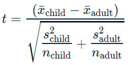

# Hypothesis Testing

## Introduction to Hypothesis Testing

### Hypothesis tests & z-scores

**A/B testing**

-   Involves splitting participants into *control* and *treatment* groups.

-   Let's you compare scenarios to see which best achieves some goal.

**z-scores**

-   $standardized\ value = value − mean / standard\ deviation$

-   $𝑧 = sample\ stat − hypoth. param. value / standard\ error$

-   Standard normal (𝑧) distribution: the normal distribution with mean zero, standard deviation 1.

#### Calculating the sample mean

The `late_shipments` dataset contains supply chain data on the delivery of medical supplies. Each row represents one delivery of a part.

The `late` columns denotes whether or not the part was delivered late.

-   `"Yes"` means that the part was delivered late,

-   `"No"` means the part was delivered on time.

Let's calculating a point estimate (sample statistic), namely the proportion of late shipments.

```{r message=FALSE, warning=FALSE}
library(tidyverse)
library(fst)

late_shipments <- read_fst("data/late_shipments.fst")
glimpse(late_shipments)
```

```{r}
# Calculate the proportion of late shipments
late_prop_samp <- late_shipments %>% 
    summarise(sample_mean = mean(late == "Yes")) %>%
    pull(sample_mean)

# See the results
late_prop_samp
```

The proportion of late shipments is `0.067`.

#### Calculating z-score

Since variables have arbitrary ranges and units, we need to standardize them.

One standardized value of interest in a hypothesis test is called a z-score. To calculate it, we need three numbers:

1.  the sample statistic (point estimate) = `late_prop_samp`

2.  the hypothesized statistic

3.  the standard error of the statistic (which we estimate from the bootstrap distribution).

```{r}
# A bootstrap distribution of the proportion of late shipments
late_shipments_boot_distn <- replicate(
    n = 5000,
    expr = {
        late_shipments %>%
            slice_sample(prop = 1, replace = TRUE) %>%
            summarise(late_prop = mean(late == "Yes")) %>%
            pull(late_prop)
    }
) %>% 
    tibble(late_prop = .)

late_shipments_boot_distn
```

```{r}
# Hypothesize that the proportion is 6%
late_prop_hyp <- 0.06

# Calculate the standard error = the standard deviation of the bootstrap distribution
std_error <- late_shipments_boot_distn %>%
    summarise(sd(late_prop)) %>%
    pull()

# Find z-score of late_prop_samp
z_score <- (late_prop_samp - late_prop_hyp) / std_error

# See the results
z_score
```

The z-score is a standardized measure of the difference between the sample statistic and the hypothesized statistic.

### p-values

**Hypothesis testing**

-   A *hypothesis* is a statement about an unknown population parameter.

-   A *hypothesis test* is a test of two competing hypotheses.

    -   null hypothesis ($H_0$) is the existing "champion" idea.

    -   alternative hypothesis ($H_A$) is the new "challenger" idea of the researcher.

-   Initially the null hypothesis, $H_0$ , is assumed to be true.

-   The test ends in either "reject $H_0$" or "fail to reject $H_0$".

-   If the evidence from the sample is "significant" that $H_A$ is true, choose that hypothesis, else choose $H_0$.

**One-tailed and two-tailed tests**

+-----------------------------------+---------------+------------------------+
| Test                              | Tails         | `pnorm()` = normal CDF |
+===================================+===============+========================+
| alternative *different* from null | two-tailed    |                        |
+-----------------------------------+---------------+------------------------+
| alternative *greater* than null   | right-tailed  | `lower.tail = FALSE`   |
+-----------------------------------+---------------+------------------------+
| alternative *less* than null      | left-tailed   | `lower.tail = TRUE`    |
+-----------------------------------+---------------+------------------------+
|                                   |               |                        |
+-----------------------------------+---------------+------------------------+

**p-values**

-   The "p" in p-value stands for probability.

-   The *smaller* the p-value, the stronger the evidence *against* $H_0$.

#### Calculating p-values

The p-value is calculated by transforming the z-score with the standard normal cumulative distribution function.

```{r}
# standard normal cumulative distribution
args(pnorm)
```

Let's return to the late shipments dataset and the proportion of late shipments.

The null hypothesis ($H_0$): the proportion of late shipments is six percent.

The alternative hypothesis ($H_A$): the proportion of late shipments is *greater than* six percent.

```{r}
# Calculate the z-score of late_prop_samp
z_score <- (late_prop_samp - late_prop_hyp) / std_error

# Calculate the p-value, assuming a right-tailed test
p_value <- pnorm(z_score, lower.tail = FALSE)
                 
# See the result
p_value
```

### Statistical significance

**Significance level**

The significance level of a hypothesis test (*α*) is the threshold point for "beyond a reasonable doubt".

-   Common values of *α* are `0.1` , `0.05` , and `0.01` .

-   If $p ≤ α$, reject $H_0$, else fail to reject $H_0$.

**Confidence intervals**

For a significance level of 0.05, it's common to choose a confidence interval of `1 - 0.05 = 0.95`.

**Types of errors**

+------------------+---------------------+----------------------+
|                  | actual $H_0$        | actual $H_A$         |
+==================+=====================+======================+
| **chosen** $H_0$ | correct             | false negative       |
|                  |                     |                      |
|                  | 1 - 𝛼               | *Type II errors = 𝛽* |
+------------------+---------------------+----------------------+
| **chosen** $H_A$ | false positive      | correct              |
|                  |                     |                      |
|                  | *Type I errors = 𝛼* | 1 - 𝛽                |
+------------------+---------------------+----------------------+
|                  |                     |                      |
+------------------+---------------------+----------------------+

#### Calculating confidence intervals

For example, the hypothesized proportion of late shipments was 6%.

Even if evidence suggests the null hypothesis that the proportion of late shipments is equal to this, for any new sample of shipments, the proportion is likely to be a little different.

Consequently, it's a good idea to state a confidence interval. That is, you say "we are 95% 'confident' the proportion of late shipments is between A and B" (for some value of A and B).

```{r}
# Calculate 95% confidence interval using quantile method
conf_int_quantile <- late_shipments_boot_distn %>%
  summarise(
    lower = quantile(late_prop, 0.025),
    upper = quantile(late_prop, 0.975)
  )

# See the result
conf_int_quantile
```

If the hypothesized population parameter is within the confidence interval, you should fail to reject the null hypothesis. Due to the large p-value, the results are similar.

#### Type I and type II errors


## Two-Sample & ANOVA Tests

### Performing t-tests

#### Two sample mean test statistic

**Test statistics**

-   Sample mean estimates the population mean.

-   $\overline{x}$ denotes a sample mean.

    {width="157"}

While trying to determine why some shipments are late, you may wonder if the weight of the shipments that were late is different from the weight of the shipments that were on time. The `late_shipments` dataset has been split into a "yes" group, where `late == "Yes"` and a "no" group where `late == "No"`. The weight of the shipment is given in the `weight_kilograms` variable.

For convenience, the sample means for the two groups are available as `xbar_no` and `xbar_yes`. The sample standard deviations are `s_no` and `s_yes`. The sample sizes are `n_no` and `n_yes`.

```{r}
xbar_no <- 2082.171
xbar_yes <- 2377.821
s_no <- 6094.609
s_yes <- 2242.502
n_no <- 933
n_yes <- 67

# Calculate the numerator of the test statistic
numerator <- xbar_no - xbar_yes

# Calculate the denominator of the test statistic
denominator <- sqrt((s_yes^2 / n_yes) + (s_no^2 / n_no)) 

# Calculate the test statistic
t_stat <- numerator / denominator

# See the result
t_stat
```

When testing for differences between means, the test statistic is called 't' rather than 'z'.

### Calculating p-values from t-statistics

**t-distributions**

-   The test statistic, t, follows a t-distribution.

-   t-distributions have a parameter named *degrees of freedom (df)*.

-   t-distributions look like normal distributions, with fatter tails.

    {width="361"}

**Degrees of freedom**

-   As you increase the degrees of freedom, the t-distribution gets closer to the normal distribution.

    {width="388"}

-   A normal distribution is a t-distribution with infinite degrees of freedom.

-   Degrees of freedom are the maximum number of logically independent values in the data sample.

-   $df = (n_{group1} - 1) + (n_{group2} − 1)$

#### From t to p

When the standard error is estimated from the sample standard deviation and sample size, the test statistic is transformed into a p-value using the t-distribution.

Previously, you calculated the test statistic for the two-sample problem of whether the mean weight of shipments is lower for shipments that weren't late (`late == "No"`) compared to shipments that were late (`late == "Yes"`). In order to make decisions about it, you need to transform the test statistic with a cumulative distribution function to get a p-value.

t-distribution CDF: `pt(t_stat, df, lower.tail)`

$H_0$: The mean weight of shipments that weren't late is the same as the mean weight of shipments that were late.

$H_A$: The mean weight of shipments that weren't late is less than the mean weight of shipments that were late.

```{r}
# Calculate the degrees of freedom
degrees_of_freedom <- n_no - 1 + n_yes - 1

# Calculate the p-value from the test stat
p_value <- pt(t_stat, degrees_of_freedom, lower.tail = TRUE)

# See the result
p_value
```

Fall to reject $H_0$

### Paired t-tests

If you have *repeated observations* of something, then those observations form *pairs*.

#### Visualizing the difference

Here, you'll look at the proportion of county-level votes for the Democratic candidate in 2012 and 2016, `dem_votes_potus_12_16`. Since the counties are the same in both years, these samples are paired.

```{r}
dem_votes_potus_12_16 <- read_fst("data/dem_county_pres_joined.fst") %>%
    select(state, county, dem_percent_12, dem_percent_16)

glimpse(dem_votes_potus_12_16)
```

Before you start running hypothesis tests, it's a great idea to perform some exploratory data analysis.

```{r}
# Calculate the differences from 2012 to 2016
sample_dem_data <- dem_votes_potus_12_16 %>%
    mutate(diff = dem_percent_12 - dem_percent_16)

# See the result
sample_dem_data
```

```{r}
# Find mean and standard deviation of differences
diff_stats <- sample_dem_data %>%
  summarise(
    xbar_diff = mean(diff),
    s_diff = sd(diff)
  )

# See the result
diff_stats
```

```{r}
# Using sample_dem_data, plot diff as a histogram
ggplot(sample_dem_data, aes(x = diff)) +
  geom_histogram(binwidth = 1)
```

Notice that the majority of the histogram lies to the right of zero.

#### Using t.test()

The comparison of two sample means is called a t-test, and R has a `t.test()` function to accomplish it. This function provides some flexibility in how you perform the test.

``` r
t.test(
    # Vector of data
    sample_data$time1,
    sample_data$time2,
    # Choose between "two.sided", "less", "greater"
    alternative = "less",
    # Null hypothesis population parameter
    mu = 0
    # Set pair
    paired = TRUE
)
```

Conduct a t-test on the sample differences (the `diff` column of `sample_dem_data`). Use an appropriate alternative hypothesis chosen from `"two.sided"`, `"less"`, and `"greater"`.

```{r}
# Conduct a t-test on diff
test_results <- t.test(
    sample_dem_data$diff, 
    alternative = "greater",
    mu = 0
    )

# See the results
test_results
```

Conduct a paired test on the democratic votes in 2012 and 2016.

```{r}
# Conduct a paired t-test on dem_percent_12 and dem_percent_16
test_results <- t.test(
    sample_dem_data$dem_percent_12,
    sample_dem_data$dem_percent_16,
    alternative = "greater",
    mu = 0,
    paired = TRUE
)

# See the results, reject H0
test_results
```

When you have paired data, a paired t-test is preferable to the unpaired version because it gives lower p-values (higher statistical power), which reduces the chance of a false negative error.

### ANOVA tests

ANOVA tests determine whether there are differences between the groups.

``` r
# First fit a linear regression
model <- lm(y ~ x, data)

# Then perform an analysis of variance test
anova(model)
```

The problem is that this method doesn't tell you which two categories they are. For this reason, we then conduct a pairwise t-test.

``` r
pairwise.t.test(numeric variable, categorical variable, p.adjust.method = "")
```

`p.adjust.method`: apply an adjustment to increase the p-values, reducing the chance of getting a false positive.

#### Visualizing many categories

Here, we'll return to the late shipments data, and how the price of each package (`pack_price`) varies between the three shipment modes (`shipment_mode`): `"Air"`, `"Air Charter"`, and `"Ocean"`.

```{r}
# Using late_shipments, group by shipment mode, and calculate the mean and std dev of pack price
late_shipments %>%
    filter(shipment_mode != "N/A") %>%
    group_by(shipment_mode) %>%
    summarise(
        xbar_pack_price = mean(pack_price),
        s_pack_price = sd(pack_price)
    )
```

```{r}
# Using late_shipments, plot pack_price vs. shipment_mode
# as a box plot with flipped x and y coordinates
late_shipments %>%
    filter(shipment_mode != "N/A") %>%
    ggplot(aes(x = shipment_mode, y = pack_price)) +
        geom_boxplot() +
        coord_flip()
```

#### Conducting an ANOVA test

The box plots made it look like the distribution of pack price was different for each of the three shipment modes. However, it didn't tell us whether the mean pack price was different in each category. To determine that, we can use an ANOVA test.

$H_0$: Pack prices for every category of shipment mode are the same.

$H_A$: Pack prices for some categories of shipment mode are different.

We'll set a significance level of 0.1.

```{r}
# Run a linear regression of pack price vs. shipment mode 
mdl_pack_price_vs_shipment_mode <- lm(pack_price ~ shipment_mode, late_shipments)

# See the results
summary(mdl_pack_price_vs_shipment_mode)
```

Perform ANOVA.

```{r}
# Perform ANOVA on the regression model
anova(mdl_pack_price_vs_shipment_mode)
```

There is a significant difference in pack prices between the shipment modes. However, we don't know which shipment modes this applies to.

#### Pairwise t-tests

To pinpoint which categories had differences, we could instead use pairwise t-tests.

```{r}
late_shipments <- late_shipments %>%
    filter(shipment_mode != "N/A") %>%
    mutate(shipment_mode = as.factor(shipment_mode))

# Perform pairwise t-tests on pack price, grouped by shipment mode, no p-value adjustment
test_results <- pairwise.t.test(
    late_shipments$pack_price,
    late_shipments$shipment_mode,
    p.adjust.method = "none"
    )

# See the results
test_results
```

Modify the pairwise t-tests to use Bonferroni p-value adjustment.

```{r}
p.adjust.methods
```

```{r}
# Modify the pairwise t-tests to use Bonferroni p-value adjustment
test_results <- pairwise.t.test(
  late_shipments$pack_price,
  late_shipments$shipment_mode,
  p.adjust.method = "bonferroni"
)

# See the results, "Air" & "Ocean" only
test_results
```

Pairwise t-tests give you more information than ANOVA about where the differences between categories lie, but since you are conducting more tests, the p-values need to be adjusted, making it more difficult to see a significanct difference.

## Proportion Tests

### One-sample proportion tests

#### Test for single proportions

In Chapter 1, you calculated a p-value for a test hypothesizing that the proportion of late shipments was greater than 6%. In that chapter, you used a bootstrap distribution to estimate the standard error of the statistic.

A simpler alternative is to use an equation for the standard error based on the sample proportion, hypothesized proportion, and sample size.

{width="153"}

-   $p$: population proportion (unknown population parameter)

-   $\hat{p}$: sample proportion (sample statistic)

-   $p_0$: hypothesized population proportion

```{r}
# Hypothesize that the proportion of late shipments is 6%
p_0 <- 0.06

# Calculate the sample proportion of late shipments
p_hat <- late_shipments %>% 
    summarise(prop_late = mean(late == "Yes")) %>%
    pull(prop_late)

# Calculate the sample size
n <- nrow(late_shipments)
```

```{r}
# Calculate the numerator of the test statistic
numerator <- p_hat - p_0

# Calculate the denominator of the test statistic
denominator <- sqrt(p_0 * (1 - p_0) / n)

# Calculate the test statistic
z_score <- numerator / denominator

# See the result
z_score
```

Transform the z-score into a p-value, remembering that this is a "greater than" alternative hypothesis.

```{r}
# Calculate the p-value from the z-score
p_value <- pnorm(z_score, lower.tail = FALSE)

# See the result
p_value
```

While bootstrapping can be used to estimate the standard error of any statistic, it is computationally intensive.

For proportions, using a simple equation of the hypothesized proportion and sample size is easier to compute, and the resulting p-value is almost identical (0.19 rather than 0.17).

### Two-sample proportion tests

#### Test of two proportions

You may wonder if the amount paid for freight affects whether or not the shipment was late.

Recall that in `late_shipments` dataset, whether or not the shipment was late is stored in the `late` column. Freight costs are stored in the `freight_cost_group` column, and the categories are `"expensive"` and `"reasonable"`.

$H_0: late_{expensive} - late_{reasonable} = 0$

$H_A: late_{expensive} - late_{reasonable} > 0$

```{r message=FALSE}
freight_cost_group <- read_delim("data/late_shipments_add_freight_cost_group.txt", delim = ",")

late_shipments <- read_fst("data/late_shipments.fst") %>% 
    add_column(freight_cost_group)

glimpse(late_shipments)
```

```{r}
# p_hats contains the estimates of population proportions (sample proportions) for the "expensive" and "reasonable" groups.
p_hats <- c(expensive = 0.09611830, reasonable = 0.03267974); p_hats

# ns contains the sample sizes for these groups.
ns <- c(expensive = 541, reasonable = 459); ns
```

Calculate the pooled sample proportion, $\hat{p}$ as the mean of `p_hats` weighted by `ns`. *Use `weighted.mean()` or arithmetic with this equation.*

$$\hat{p} = \frac{n_{expensive} * \hat{p}_{expensive} + n_{reasonable} * \hat{p}_{reasonable}}{n_{expensive} + n_{reasonable}}$$

```{r}
# Calculate the pooled estimate of the population proportion
p_hat <- (ns[1] * p_hats[1] + ns[2] * p_hats[2]) / sum(ns)

# See the result
p_hat
```

```{r}
# using weighted.mean function
weighted.mean(p_hats, ns)
```

Calculate the standard error of the sample. *Use this equation.*

{width="395" height="63"}

```{r}
# Calculate sample prop'n times one minus sample prop'n
p_hat_times_not_p_hat <- p_hat * (1 - p_hat)

# Divide this by the sample sizes
p_hat_times_not_p_hat_over_ns <- p_hat_times_not_p_hat / ns

# Calculate std. error
std_error <- sqrt(sum(p_hat_times_not_p_hat_over_ns))

# See the result
std_error
```

Calculate the z-score. *Use the following equation. You'll need square bracket indexing to access elements of `p_hats`.*


```{r}
# Calculate the z-score
z_score <- (p_hats["expensive"] - p_hats["reasonable"]) / std_error

# See the result
z_score
```

Calculate the p-value from the z-score.

```{r}
# Calculate the p-value from the z-score
p_value <- pnorm(z_score, lower.tail = FALSE)

# See the result
p_value
```

#### prop_test() for two samples

For daily usage, it's better to use the `infer` package.

``` r
library(infer)
stack_overflow %>%
    prop_test(
        # proportions ~ categories
        hobbyist ~ age_cat, 
        # which p-hat to subtract
        order = c("At least 30", "Under 30"), 
        # which response value to count proportions of
        success = "Yes", 
        # type of alternative hypothesis
        alternative = "two-sided", 
        # should Yates' continuity correction be applied?
        correct = FALSE 
)
```

Using the `late_shipments` dataset, use `prop_test()` to perform a proportion test appropriate to the hypotheses.

-   Specify a hypothesis of `late` versus `freight_cost_group`.

-   Set the `order` of the freight cost groups.

-   Specify the `success` value for `late` and the type of `alternative` hypothesis.

-   Don't use Yates' continuity correction.

```{r message=FALSE}
library(infer)

# Perform a proportion test appropriate to the hypotheses 
test_results <- late_shipments %>%
  prop_test(
    late ~ freight_cost_group,
    order = c("expensive", "reasonable"),
    success = "Yes",
    alternative = "greater",
    correct = FALSE
)

# See the results
test_results
```

### Chi-square test of independence

**Declaring the hypotheses**

The *chi-square independence test* compares proportions of successes of a categorical variable across categories of another categorical variable.

-   Q: *Are the variables X and Y independent?*

-   Test statistic denoted $\chi^2$.

-   Direction and tails

    -   Observed and expected counts are square numbers, so it is always non-negative.

    -   chi-square tests are almost always *right-tailed*.

**The chi-square distribution**

-   Chi-square hypothesis tests rely on the chi-square distribution.

-   Like the t-distribution, the chi-square distribution has *degrees of freedom* and *non-centrality* parameters.

    -   When these parameters are large, the chi-square distribution can be approximated by a normal distribution.

    -   *df* = (No. of response categories − 1) × (No. of explanatory categories − 1)

#### Performing a chi-square test

Flow:

1.  Exploratory visualization: proportional stacked bar plot.

2.  Chi-square independence test using `chisq_test(y ~ x)`

The `late_shipments` dataset includes a `vendor_inco_term` that describes the incoterms that applied to a given shipment. The choices are:

-   [**`EXW`**](https://www.investopedia.com/terms/e/exw.asp): "Ex works". The buyer pays for transportation of the goods.

-   [**`CIP`**](https://www.investopedia.com/terms/c/carriage-and-insurance-paid-cip.asp): "Carriage and insurance paid to". The seller pays for freight and insurance until the goods board a ship.

-   [**`DDP`**](https://www.investopedia.com/terms/d/delivery-duty-paid.asp): "Delivered duty paid". The seller pays for transportation of the goods until they reach a destination port.

-   [**`FCA`**](https://www.investopedia.com/terms/f/fca.asp): "Free carrier". The seller pays for transportation of the goods.

Perhaps the incoterms affect whether or not the freight costs are expensive. Test these hypotheses with a significance level of `0.01`.

$H_0$: `vendor_inco_term` and `freight_cost_group` are *independent*.

$H_A$: `vendor_inco_term` and `freight_cost_group` are *associated*.

Draw a proportional stacked bar plot.

```{r}
# Plot vendor_inco_term filled by freight_cost_group.
# Make it a proportional stacked bar plot.
late_shipments %>%
    filter(vendor_inco_term %in% c("CIP", "DDP", "EXW", "FCA")) %>%
    ggplot(aes(vendor_inco_term, fill = freight_cost_group)) +
    geom_bar(position = "fill") +
    ylab("proportion")
```

Perform a chi-square test of independence.

```{r}
late_shipments <- late_shipments %>%
    filter(vendor_inco_term %in% c("CIP", "DDP", "EXW", "FCA"))

# Perform a chi-square test of independence on freight_cost_group and vendor_inco_term
# infer package
test_results <- late_shipments %>%
    chisq_test(freight_cost_group ~ vendor_inco_term)

# See the results
test_results
```

Reject the null hypothesis and conclude that `vendor_inco_term` and `freight_cost_group` are associated.

### Chi-square goodness of fit tests

The chi-square goodness of fit test compares proportions of each level of a categorical variable to hypothesized values.

**Declaring the hypotheses**

The test statistic $\chi^2$ measures how far observed results are from expectations in each group.

$H_0$: The sample matches with the hypothesized distribution.

$H_A$: The sample does not match with the hypothesized distribution.

Flow:

1.  Hypothesized counts by category: `tribble()`

2.  Visualizing counts: `geom_col() + geom_point()`

3.  chi-square goodness of fit test using `chisq_test(response, p = hypothesized_props)`

#### Visualizing goodness of fit

Before running such a test, it can be helpful to visually compare the distribution in the sample to the hypothesized distribution.

Recall the vendor incoterms in the `late_shipments` dataset. Let's hypothesize that the four values occur with these frequencies in the population of shipments.

-   `EXW`: 0.75

-   `CIP`: 0.05

-   `DDP`: 0.1

-   `FCA`: 0.1

```{r}
# Using late_shipments, count the vendor incoterms
vendor_inco_term_counts <- late_shipments %>%
  count(vendor_inco_term)


# Get the number of rows in the whole sample
n_total <- nrow(late_shipments)

hypothesized <- tribble(
  ~ vendor_inco_term, ~ prop,
  "EXW", 0.75,
  "CIP", 0.05,
  "DDP", 0.1,
  "FCA", 0.1
) %>%
  # Add a column of hypothesized counts for the incoterms
  mutate(n = prop * n_total)

# See the results
hypothesized
```

```{r}
# Using vendor_inco_term_counts, plot n vs. vendor_inco_term 
ggplot(vendor_inco_term_counts, aes(vendor_inco_term, n)) +
  # Make it a (precalculated) bar plot
  geom_col() +
  # Add points from hypothesized 
  geom_point(data = hypothesized, color = "red")
```

Two of the bars in the sample are very close to the hypothesized values, one is a little high, and one is a little low. We'll need a test to see if the differences are statistically significant.

#### Performing a goodness of fit test

To decide which hypothesis to choose, we'll set a significance level of `0.1`.

```{r}
hypothesized_props <- c(
  EXW = 0.75, CIP = 0.05, DDP = 0.1, FCA = 0.1
)

# Run chi-square goodness of fit test on vendor_inco_term
test_results <- late_shipments %>%
    chisq_test(
        response = vendor_inco_term,
        p = hypothesized_props
        )

# See the results
test_results
```

Fall to reject $H_0$

## Non-Parametric Tests

### Assumptions in hypothesis testing

All hypothesis tests assume that the data are

-   **Randomness**: samples are collected at random from the population.

-   **Independence of observations**: each row is independent of the others.

-   **Large sample size**: the sample size is big enough to mitigate uncertainty, and so that the Central Limit Theorem applies.

#### Testing sample size

The minimum sample size depends on the type of hypothesis tests you want to perform.

-   t-test

    -   one sample, two samples, paired samples, ANOVA ⟶ $n$ ≥ 30

-   proportion tests

    -   One sample, two samples ⟶ $n$ ≥ 10

-   chi-square tests

    -   $n$ ≥ 5

Let's test some scenarios on the `late_shipments` dataset.

```{r}
late_shipments <- read_fst("data/late_shipments.fst") %>% 
    add_column(freight_cost_group)
```

Whether the counts are "big enough" for a two sample t-test.

```{r}
# Get counts by freight_cost_group
counts <- late_shipments %>% count(freight_cost_group)

# See the result
counts

# Inspect whether the counts are big enough
all(counts$n >= 30)
```

Whether the counts are "big enough" for a one sample proportion test.

```{r}
# Get counts by late
counts <- late_shipments %>% count(late)

# See the result
counts

# Inspect whether the counts are big enough
all(counts$n >= 10)
```

Whether the counts are "big enough" for a chi-square independence test.

```{r}
# Count the values of vendor_inco_term and freight_cost_group
counts <- late_shipments %>% count(vendor_inco_term, freight_cost_group)

# See the result
counts

# Inspect whether the counts are big enough
all(counts$n >= 5)
```

Whether the counts are "big enough" for an ANOVA test.

```{r}
# Count the values of shipment_mode
counts <- late_shipments %>% count(shipment_mode)

# See the result
counts

# Inspect whether the counts are big enough
all(counts$n >= 30)
```

While randomness and independence of observations can't easily be tested programmatically, you can test that your sample sizes are big enough to make a hypothesis test appropriate.

### Simulation-based infer pipeline

*Simulation-based* hypothesis tests allow more flexibility, and are not bound by the assumptions of traditional hypothesis tests.

**A grammar of hypothesis tests**

The `infer` pipeline for hypothesis testing requires four steps to calculate the null distribution: specify, hypothesize, generate, and calculate.

``` r
null_distn <- dataset %>%
    specify() %>%
    hypothesize() %>%
    generate() %>%
    calculate()
    
obs_stat <- dataset %>%
    specify() %>%
    calculate()
    
get_p_value(null_distn, obs_stat)
```

-   `specify()`

    -   selects the variable(s) you want to test.

    -   For 2 sample tests: `response ~ explanatory`.

    -   For 1 sample tests: `response ~ NULL`.

-   `hypothesize()`

    -   declares the type of null hypothesis.

    -   For 2 sample tests: `"independence"` or `"point"`.

    -   For 1 sample tests: `"point"`.

-   `generate()`

    -   generates simulated data reflecting the null hypothesis.

    -   For "independence" null hypotheses: `type = "permute"`.

    -   For "point" null hypotheses: set `type` to `"bootstrap"` or `"simulate"`.

        {width="474"}

-   `calculate()`

    -   calculates a distribution of test statistics known as the null distribution.

        {width="477"}

#### Specifying & hypothesizing

In Chapter 3, you ran a two sample proportion test on the proportion of late shipments across freight cost groups. Recall the hypotheses.

$H_0: late_{expensive} - late_{reasonable} = 0$

$H_A: late_{expensive} - late_{reasonable} > 0$

Let's compare that traditional approach using `prop_test()` with a simulation-based infer pipeline.

```{r}
# Perform a proportion test appropriate to the hypotheses 
test_results <- late_shipments %>% 
  prop_test(
    late ~ freight_cost_group,
    order = c("expensive", "reasonable"),
    success = "Yes",
    alternative = "greater",
    correct = FALSE
  )

# See the results, Reject null hypothesis
test_results
```

Simulation-based infer pipeline.

```{r}
# Specify that we are interested in late proportions across freight_cost_groups, where "Yes" denotes success
specified <- late_shipments %>%
    specify(late ~ freight_cost_group, 
            success = "Yes")

# See the result
specified
```

```{r}
# Extend the pipeline to declare a null hypothesis that the variables are independent
hypothesized <- late_shipments %>% 
  specify(
    late ~ freight_cost_group, 
    success = "Yes"
  ) %>% 
  hypothesize(null = "independence")

# See the result
hypothesized
```

The first two steps in the infer pipeline add attributes to the dataset in order to set up the simulation.

#### Generating & calculating

Extend the infer pipeline to generate two thousand permutation replicates.

```{r}
# Extend the pipeline to generate 2000 permutations
generated <- late_shipments %>% 
  specify(
    late ~ freight_cost_group, 
    success = "Yes"
  ) %>% 
  hypothesize(null = "independence") %>% 
  generate(reps = 2000, type = "permute")

# See the result
generated
```

Complete the infer pipeline for the null distribution by calculating the difference in proportions, setting the order to expensive proportion minus reasonable proportion.

```{r}
# Extend the pipeline to calculate the difference in proportions (expensive minus reasonable)
null_distn <- late_shipments %>% 
  specify(
    late ~ freight_cost_group, 
    success = "Yes"
  ) %>% 
  hypothesize(null = "independence") %>% 
  generate(reps = 2000, type = "permute") %>% 
  calculate(
    stat = "diff in props",
    order = c("expensive", "reasonable")
  )

# See the result
null_distn
```

Visualize the null distribution.
```{r}
# Visualize the null distribution
visualize(null_distn)
```


To determine a result from the test, we need to compare this null distribution to the observed statistic.

#### Observed statistic & p-value

In order to get a p-value and weigh up the evidence against the null hypothesis, you need to calculate the difference in proportions that is observed in the `late_shipments` sample.


Copy, paste, and modify the null distribution pipeline to get the observed statistic.
```{r}
# Copy, paste, and modify the pipeline to get the observed statistic
obs_stat <- late_shipments %>% 
  specify(
    late ~ freight_cost_group, 
    success = "Yes"
  ) %>%  
  calculate(
    stat = "diff in props", 
    order = c("expensive", "reasonable")
  )

# See the result
obs_stat
```

Visualize the null distribution, adding a vertical line at the observed statistic.

```{r}
# Visualize the null dist'n, adding a vertical line at the observed statistic
visualize(null_distn) +
  geom_vline(data = obs_stat,
  aes(xintercept = stat),
  color = "red")
```


Get the p-value from the null distribution and observed statistic, assuming an appropriate direction for the alternative hypothesis.
```{r warning=FALSE}
# Get the p-value
p_value <- get_p_value(
  null_distn,
  obs_stat,
  direction = "greater"
)

# See the result
p_value
```

The p-value is calculated from the null distribution and the observed statistic. Here, the observed difference in proportions appears way outside of the null distribution histogram, which resulted in a p-value of zero. This can be interpreted as “p is very small”, rather than actually zero.

### Non-parametric ANOVA & unpaired t-tests

**Non-parametric tests**

A non-parametric test is a hypothesis test that doesn't assume a probability distribution for the test statistic.

There are two types of non-parametric hypothesis test:

1. Simulation-based.

    - `infer` pipeline

2. Rank-based.

    - Wilcoxon-Mann-Whitney test: is a t-test on the ranks of the numeric input.
    
        - `wilcox.test(y ~ x, data, alternative, correct)`
    
    - Kruskal-Wallis test: Kruskal-Wallis test is to Wilcoxon-Mann-Whitney test as ANOVA is to t-test.
    
        - `kruskal.test(y ~ x, data)`

#### Simulation-based t-test

In Chapter 2 you manually performed the steps for a t-test to explore these hypotheses.

$H_0$: The mean weight of shipments that weren't late is the same as the mean weight of shipments that were late.

$H_A$: The mean weight of shipments that weren't late is less than the mean weight of shipments that were late.

You can run the test more concisely using infer's `t_test()`.

```{r}
late_shipments %>% 
  t_test(
    weight_kilograms ~ late,
    order = c("No", "Yes"),
    alternative = "less"
  )
```

`t_test()` assumes that the null distribution is normal. We can avoid assumptions by using a simulation-based non-parametric equivalent.

```{r}
# Fill out the null distribution pipeline
null_distn <- late_shipments %>% 
  # Specify weight_kilograms vs. late
  specify(weight_kilograms ~ late) %>% 
  # Declare a null hypothesis of independence
  hypothesize(null = "independence") %>% 
  # Generate 1000 permutation replicates
  generate(reps = 1000, type = "permute") %>% 
  # Calculate the difference in means ("No" minus "Yes")
  calculate(
    stat = "diff in means",
    order = c("No", "Yes")
  )

# See the results
null_distn
```

Calculate the difference in means observed in the `late_shipments` dataset.
```{r}
# Calculate the observed difference in means
obs_stat <- late_shipments %>% 
  specify(weight_kilograms ~ late) %>%  
  calculate(stat = "diff in means", order = c("No", "Yes"))

# See the result
obs_stat
```

Get the p-value from the null distribution and the observed difference in means, setting an appropriate direction.
```{r}
# Get the p-value
p_value <- get_p_value(
  null_distn, obs_stat,
  direction = "less"
)

# See the result
p_value
```

The p-value with the traditional t-test was 0.19, and the p-value from the simulation was close to 0.21.

This difference in p-values could have important consequences for whether or not to reject the null hypothesis.

#### Rank sum tests

Ranks are the positions of numeric values from smallest to largest.

By calculating on the ranks of data instead of the actual values, you can avoid making assumptions about the distribution of the test statistic. It's most robust in the same way that a median is more robust than a mean.

Two commonly used rank-based tests are the Wilcoxon-Mann-Whitney test, which is like a non-parametric t-test, and the Kruskal-Wallis test, which is like a non-parametric ANOVA.

Run a Wilcoxon-Mann-Whitney test on the weight in kilograms versus whether or not the shipment was late.
```{r}
# Run a Wilcoxon-Mann-Whitney test on weight_kilograms vs. late
test_results <- wilcox.test(
  weight_kilograms ~ late, 
  data = late_shipments
)

# See the result
test_results
```

Run a Kruskal-Wallace test on the weight in kilograms versus the shipment mode.
```{r}
# Run a Kruskal-Wallace test on weight_kilograms vs. shipment_mode
test_results <- kruskal.test(
    weight_kilograms ~ shipment_mode,
    data = late_shipments
)

# See the result
test_results
```


