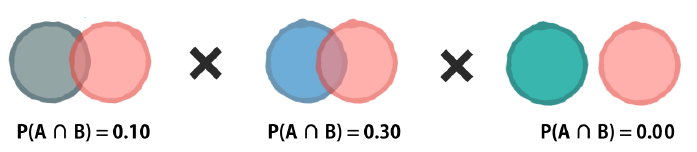
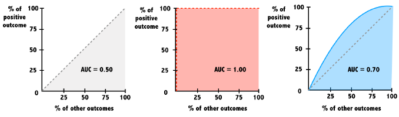

# Supervised Learning: Classification

## k-Nearest Neighbors (kNN)

### Classification with Nearest Neighbors

**Measuring similarity with distance**

Many nearest neighbor learners use the Euclidean distance formula here, which measures the straight-line distance between two points.

$dist(p, q) = \sqrt{(p_1 - q_1)^2 + (p_2 - q_2)^2 + ... + (p_n - q_n)^2}$

**Applying nearest neighbors in R**

``` r
library(class)
pred <- knn(training_data, testing_data, training_labels)
```

#### Recognizing a road sign with kNN

After several trips with a human behind the wheel, it is time for the self-driving car to attempt the test course alone.

As it begins to drive away, its camera captures the following image:

{alt="Stop Sign"}

Apply a kNN classifier to help the car recognize this sign.

The dataset `signs` is loaded in your workspace along with the data frame `next_sign`, which holds the observation you want to classify.

```{r message=FALSE}
library(tidyverse)

signs <- read_csv("data/knn_traffic_signs.csv")
signs
```

```{r}
# Testing data
next_sign <- signs %>% 
    filter(sample == "example") %>%
    select(-c(1:3))

str(next_sign)
```

```{r}
# Training data
signs <- signs %>%
    filter(sample == "train") %>%
    select(-c(1, 2))

signs
```

-   Create a vector of sign labels to use with kNN by extracting the column `sign_type` from `signs`.

-   Identify the `next_sign` using the `knn()` function.

    -   Set the `train` argument equal to the `signs` data frame *without* the first column.

    -   Set the `test` argument equal to the data frame `next_sign`.

    -   Use the vector of labels you created as the `cl` argument.

```{r}
library(class)

# Create a vector of labels
sign_types <- signs$sign_type

# Classify the next sign observed
knn(train = signs[-1], test = next_sign, cl = sign_types)
```

knn simply looks for the most similar example.

#### Exploring the traffic sign dataset

To better understand how the `knn()` function was able to classify the stop sign, it may help to examine the training dataset it used.

Each previously observed street sign was divided into a 4x4 grid, and the red, green, and blue level for each of the 16 center pixels is recorded as illustrated here.

{alt="Stop Sign Data Encoding" width="256"}

The result is a dataset that records the `sign_type` as well as 16 x 3 = 48 color properties of each sign.

```{r}
# Examine the structure of the signs dataset
str(signs)
```

Use `table()` to count the number of observations of each sign type by passing it the column containing the labels.

```{r}
# Count the number of signs of each type
table(signs$sign_type)
```

Run the provided `aggregate()` command to see whether the average red level might vary by sign type.

```{r}
# Check r10's average red level by sign type
aggregate(r10 ~ sign_type, data = signs, mean)
```

As you might have expected, stop signs tend to have a higher average red value. This is how kNN identifies similar signs.

#### Classifying a collection of road signs

Now that the autonomous vehicle has successfully stopped on its own, your team feels confident allowing the car to continue the test course.

The test course includes 59 additional road signs divided into three types:

{alt="Stop Sign"} {alt="Speed Limit Sign"} {alt="Pedestrian Sign"}

At the conclusion of the trial, you are asked to measure the car's overall performance at recognizing these signs.

So is the data frame `test_signs`, which holds a set of observations you'll test your model on.

```{r message=FALSE}
# whole testing data
test_signs <- read_csv("data/knn_traffic_signs.csv") %>%
    filter(sample == "test") %>%
    select(-c(1, 2))

test_signs
```

-   Classify the `test_signs` data using `knn()`.

    -   Set `train` equal to the observations in `signs` *without* labels.

    -   Use `test_signs` for the `test` argument, again without labels.

    -   For the `cl` argument, use the vector of labels provided for you.

```{r}
# Use kNN to identify the test road signs
sign_types <- signs$sign_type
signs_pred <- knn(train = signs[-1], test = test_signs[-1], cl = sign_types)
```

-   Use `table()` to explore the classifier's performance at identifying the three sign types (the confusion matrix).

    -   Create the vector `signs_actual` by extracting the labels from `test_signs`.

    -   Pass the vector of predictions and the vector of actual signs to `table()` to cross tabulate them.

```{r}
# Create a confusion matrix of the predicted versus actual values
signs_actual <- test_signs$sign_type

table(signs_pred, signs_actual)
```

-   Compute the overall accuracy of the kNN learner using the `mean()` function.

```{r}
# Compute the accuracy
mean(signs_pred == signs_actual)
```

The confusion matrix lets you look for patterns in the classifier's errors.

### 'k' in kNN

The letter k is a variable that specifies the number of neighbors to consider when making the classification. You can imagine it as determining the size of the neighborhoods.

**Bigger 'k' is not always better**

{width="337"}

A *small k creates very small neighborhoods*; the classifier is able to discover very subtle patterns. As this image illustrates, you might imagine it as being able to distinguish between groups even when their boundary is somewhat "fuzzy."

On the other hand, sometimes a "fuzzy" boundary is not a true pattern, but rather due to some other factor that adds randomness into the data. This is called *noise*.

Setting *k larger*, as this image shows, ignores some potentially-noisy points in an effort to discover a broader, *more general pattern*.

**Choosing 'k'**

In practice, the optimal value depends on the complexity of the pattern to be learned, as well as the impact of noisy data.

Some suggest a rule of thumb starting with k equal to the square root of the number of observations in the training data.

#### Testing other 'k' values

By default, the `knn()` function in the `class` package uses only the single nearest neighbor.

Setting a `k` parameter allows the algorithm to consider additional nearby neighbors. This enlarges the collection of neighbors which will vote on the predicted class.

Compare `k` values of 1, 7, and 15 to examine the impact on traffic sign classification accuracy.

Modify the `knn()` function call by setting `k = number` and again find accuracy value.

```{r}
# Compute the accuracy of the baseline model (default k = 1)
k_1 <- knn(train = signs[-1], test = test_signs[-1], cl = sign_types)
mean(k_1 == signs_actual)

# Modify the above to set k = 7
k_7 <- knn(train = signs[-1], test = test_signs[-1], cl = sign_types, k = 7)
mean(k_7 == signs_actual)

# Set k = 15 and compare to the above
k_15 <- knn(train = signs[-1], test = test_signs[-1], cl = sign_types, k = 15)
mean(k_15 == signs_actual)
```

k = 7 has the higest accurancy.

#### Seeing how the neighbors voted

When multiple nearest neighbors hold a vote, it can sometimes be useful to examine whether the voters were unanimous or widely separated.

For example, knowing more about the voters' confidence in the classification could allow an autonomous vehicle to use caution in the case there is any chance at all that a stop sign is ahead.

Build a kNN model with the `prob = TRUE` parameter to compute the vote proportions.

```{r}
# Use the prob parameter to get the proportion of votes for the winning class
sign_pred <- knn(train = signs[-1], test = test_signs[-1], cl = sign_types, k = 7, prob = TRUE)
```

Use the `attr()` function to obtain the vote proportions for the predicted class. These are stored in the attribute `"prob"`.

```{r}
# Get the "prob" attribute from the predicted classes
sign_prob <- attr(sign_pred, "prob")

# Examine the first several predictions
head(sign_pred)

# Examine the proportion of votes for the winning class
# see how the confidence varies from sign to sign
head(sign_prob)
```

Now you can get an idea of how certain your kNN learner is about its classifications.

### 1-3.Data preparation for kNN

-   1/0 dummy variables

-   Variables with different scale: allows the features with a wider range to have more influence over the distance calculation

    -   Normalizing data: Rescaling reduces the influence of extreme values on kNN's distance function.

``` r
# define a min-max normalize() function
normalize <- function(x) {
    return((x - min(x)) / (max(x) - min(x)))
}
```

## Naive Bayes

### Understanding Bayesian methods

-   Joint probability and independent events

    -   The joint probability of events A and B is denoted P(A and B)

    -   One event is independent of another if knowing one doesn't give you information about how likely the other is.

-   Conditional probability and dependent events

    -   The conditional probability of events A and B is denoted P(A \| B)

    -   Knowing that one occurred tells you much about the status of the other.

    -   $P(A|B) = \frac{P(A\ and\ B)}{P(B)}$

-   Making predictions with Naive Bayes

    ``` r
    # building a Naive Bayes model
    library(naivebayes)
    model <- naive_bayes(y ~ x, data)

    # making predictions with Naive Bayes
    future_predict <- predict(model, future_conditions)
    ```

#### Computing probabilities

Calculations like these are the basis of the Naive Bayes destination prediction model you'll develop in later exercises.

```{r message=FALSE}
location <- read_csv("data/locations.csv")
location
```

The `where9am` data frame contains 91 days (thirteen weeks) worth of data in which Brett recorded his `location` at 9am each day as well as whether the `daytype` was a weekend or weekday.

```{r}
where9am <- location %>%
    filter(hour == 9) %>%
    select(daytype, location) %>%
    mutate(location = factor(location, levels = c("appointment", "campus", "home", "office")))

where9am
```

Using the conditional probability formula, you can compute the probability that Brett is working in the office, given that it is a weekday.

$P(A|B) = \frac{P(A\ and\ B)}{P(B)}$

```{r}
# Compute P(A) 
#Find P(office) using nrow() and subset() to count rows in the dataset and save the result as p_A.
p_A <- nrow(subset(where9am, location == "office")) / nrow(where9am)

# Compute P(B)
# Find P(weekday), using nrow() and subset() again, and save the result as p_B.
p_B <- nrow(subset(where9am, daytype == "weekday")) / nrow(where9am)

# Compute the observed P(A and B)
# Find P(office and weekday)
p_AB <- nrow(subset(where9am, daytype == "weekday" & location == "office")) / nrow(where9am)

# Compute P(A | B) and print its value
p_A_given_B <- p_AB / p_B
p_A_given_B
```

There is a 60% chance Brett is in the office at 9am given that it is a weekday.

#### A simple Naive Bayes model

The previous exercises showed that the probability that Brett is at work or at home at 9am is highly dependent on whether it is the weekend or a weekday.

To see this finding in action, use the `where9am` data frame to build a Naive Bayes model on the same data.

You can then use this model to predict the future: where does the model think that Brett will be at 9am on Thursday and at 9am on Saturday?

```{r}
# Load the naivebayes package
library(naivebayes)

# Build the location prediction model
locmodel <- naive_bayes(location ~ daytype, data = where9am)
```

Forecast the Thursday 9am location using `predict()` with the `thursday9am` object as the `newdata` argument.

```{r}
thursday9am <- data.frame(daytype = "weekday")

# Predict Thursday's 9am location
predict(locmodel, thursday9am)
```

Do the same for predicting the saturday9am location.

```{r}
saturday9am <- data.frame(daytype = "weekend")

# Predict Saturdays's 9am location
predict(locmodel, saturday9am)
```

Not surprisingly, Brett is most likely at the office at 9am on a Thursday, but at home at the same time on a Saturday!

#### Examining "raw" probabilities

Typing the name of the model object provides the a *priori* (overall) and conditional probabilities of each of the model's predictors.

Alternatively, R will compute the *posterior* probabilities for you if the `type = "prob"` parameter is supplied to the `predict()` function.

Using these methods, examine how the model's predicted 9am location probability varies from day-to-day.

View the computed a priori and conditional probabilities.

```{r}
# Examine the location prediction model
locmodel
```

See the predicted probabilities for Thursday at 9am.

```{r}
# Obtain the predicted probabilities for Thursday at 9am
predict(locmodel, thursday9am, type = "prob")
```

Compare these to the predicted probabilities for Saturday at 9am.

```{r}
# Obtain the predicted probabilities for Saturday at 9am
predict(locmodel, saturday9am, type = "prob")
```

Notice the predicted probability of Brett being at the office on a Saturday is essentially zero.

### Understanding NB's "naivety"

-   The challenge of multiple predictors

    -   When adding more predictor, it becomes more inefficient to calculate the overlap.

-   A "naive" simplification

    -   Naive Bayes algorithm uses a shortcut to approximate the conditional probability we hope to compute.
    -   Rather than treating the problem as the intersection of all of the related events, the algorithm makes a so-called "naive" assumption about the data.
        -   Specifically, it assumes that the events are independent. When events are independent, the joint probability can be computed by multiplying the individual probabilities.

            {width="324"}

-   An "infrequent" problem

    -   Suppose further that one of those events has never been observed previously in combination with the outcome. And whenever zero is multiplied in a chain, the entire sequence becomes zero.

        {width="368"}

        -   The Laplace correction

            -   The solution to this problem involves adding a small number, usually '1', to each event and outcome combination to eliminate this veto power.

                {width="363"}

            -   As a result, there will be at least some predicted probability for every future outcome even if it has never been seen before.

#### A more sophisticated location model

The `locations` dataset records Brett's location every hour for 13 weeks. Each hour, the tracking information includes the `daytype` (weekend or weekday) as well as the `hourtype` (morning, afternoon, evening, or night).

Using this data, build a more sophisticated model to see how Brett's predicted location not only varies by the day of week but also by the time of day.

```{r warning=FALSE}
# Build a NB model of location
locmodel <- naive_bayes(location ~ daytype + hourtype, location)

# Predict Brett's location on a weekday afternoon
weekday_afternoon <- data.frame(daytype = "weekday", hourtype = "afternoon")
predict(locmodel, weekday_afternoon)

# Predict Brett's location on a weekday evening
weekday_evening <- data.frame(daytype = "weekday", hourtype = "evening")
predict(locmodel, weekday_evening)
```

Naive Bayes model forecasts that Brett will be at the office on a weekday afternoon and at home in the evening.

#### Preparing for unforeseen circumstances

While Brett was tracking his location over 13 weeks, he never went into the office during the weekend. Consequently, the joint probability of P(office and weekend) = 0.

Explore how this impacts the predicted probability that Brett may go to work on the weekend in the future. Additionally, you can see how using the Laplace correction will allow a small chance for these types of unforeseen circumstances.

`naive_bayes(..., laplace = 1)`

Output predicted probabilities for a weekend afternoon.

```{r}
weekend_afternoon <- data.frame(daytype = "weekend", hourtype = "afternoon")

# Observe the predicted probabilities for a weekend afternoon
predict(locmodel, weekend_afternoon, type = "prob")
```

Create a new naive Bayes model with the Laplace smoothing parameter set to `1`.

```{r}
# Build a new model using the Laplace correction
locmodel2 <- naive_bayes(location ~ daytype + hourtype, location, laplace = 1)

# Observe the new predicted probabilities for a weekend afternoon
predict(locmodel2, weekend_afternoon, type = "prob")
```

Adding the Laplace correction allows for the small chance that Brett might go to the office on the weekend in the future.

The small probability added to every outcome ensures that they are all possible even if never previously observed.

## Logistic Regression

### Making binary predictions with regression

**Making predictions with logistic regression**

{width="429"}

Sometimes you may need to set this threshold (0.5) higher or lower to make the model more or less aggressive.

#### Building simple logistic regression models

The `donors` dataset contains 93,462 examples of people mailed in a fundraising solicitation for paralyzed military veterans. The `donated` column is `1` if the person made a donation in response to the mailing and `0` otherwise. This binary outcome will be the *dependent* variable for the logistic regression model.

The remaining columns are features of the prospective donors that may influence their donation behavior. These are the model's *independent variables*.

```{r message=FALSE}
donors <- read_csv("data/donors.csv")

# Examine the dataset to identify potential independent variables
glimpse(donors)
```

Count the number of occurrences of each level of the `donated` variable.

```{r}
# Explore the dependent variable
table(donors$donated)
```

Hypothesis about which independent variables will be predictive of the dependent variable.

-   The `bad_address` column, which is set to `1` for an invalid mailing address and `0` otherwise, seems like it might reduce the chances of a donation.

-   One might suspect that religious interest (`interest_religion`)

-   Interest in veterans affairs (`interest_veterans`) would be associated with greater charitable giving.

```{r}
# Build the donation model
donation_model <- glm(
    donated ~ bad_address + interest_religion + interest_veterans, 
    data = donors, 
    family = "binomial")

# Summarize the model results
summary(donation_model)
```

#### Making a binary prediction

In the previous exercise, you used the `glm()` function to build a logistic regression model of donor behavior.

By default, `predict()` outputs predictions in terms of log odds unless `type = "response"` is specified. This converts the log odds to probabilities.

Because a logistic regression model estimates the probability of the outcome, it is up to you to determine the threshold at which the probability implies action. One must balance the extremes of being too cautious versus being too aggressive.

```{r}
# Estimate the donation probability
# Estimate each person's donation probability
donors$donation_prob <- predict(donation_model, type = "response")

# Find the donation probability of the average prospect
# Find the actual probability that an average person would donate
mean(donors$donated)
```

Use `ifelse()` to predict a donation if their predicted donation probability is greater than average. Then calculate the model's accuracy.

```{r}
# Predict a donation if probability of donation is greater than average (0.0504)
donors$donation_pred <- ifelse(donors$donation_prob > 0.0504, 1, 0)

# Calculate the model's accuracy
mean(donors$donation_pred == donors$donated)
```

With an accuracy of nearly 80%, the model seems to be doing its job. But is it too good to be true? There are the limitations of accuracy.

### Model performance tradeoffs

As the previous exercise illustrated, rare events create challenges for classification models. When one outcome is very rare, predicting the opposite can result in a very high accuracy.

***ROC curves***

{width="254"}

-   Provides a way to better understand a model's ability to distinguish between positive and negative predictions the outcome of interest versus all others.

-   The ROC curve depicts the relationship between the percentage of positive examples as it relates to the percentage of the other outcomes.

-   The diagonal line is the baseline performance for a very poor model. The further another curve is away from this, the better it is performing.

**Area under the ROC curve (AUC)**

{width="521"}

-   The baseline model that is no better than random chance has an AUC = 0.5.

-   A perfect model has an AUC = 1.

-   The closer the AUC is to 1, the better.

**Using AUC and ROC appropriately**

Curves of varying shapes can have the same AUC value. For this reason, it is important to look not only at the AUC but also how the shape of each curve indicates how a model is performing across the range of predictions.

{width="241"}

For example, one model may do extremely well at identifying a few easy cases at first but perform poorly on more difficult cases. Another model may do just the opposite.

When AUC values are very close, it's important to know more about how the model will be used.

#### Calculating ROC Curves and AUC

Graphing the model's performance better illustrates the tradeoff between a model that is overly aggressive and one that is overly passive.

Create a ROC curve with `roc(actual, predicted)` and the columns of actual and predicted donations.

```{r}
# Load the pROC package
library(pROC)

# Create a ROC curve
ROC <- roc(donors$donated, donors$donation_prob)
```

Use `plot()` to draw the ROC object.

```{r}
# Plot the ROC curve
plot(ROC, col = "blue")
```

Compute the area under the curve with `auc()`.

```{r}
# Calculate the area under the curve (AUC)
auc(ROC)
```

Based on this visualization, the model isn't doing much better than baseline---a model doing nothing but making predictions at random.

### Dummy variables, missing data, and interactions

#### Dummy coding

Sometimes a dataset contains numeric values that represent a categorical feature.

In the `donors` dataset, `wealth_rating` uses numbers to indicate the donor's wealth level:

-   0 = Unknown

-   1 = Low

-   2 = Medium

-   3 = High

This exercise illustrates how to prepare this type of categorical feature and examines its impact on a logistic regression model.

-   Create a factor `wealth_levels` from the numeric `wealth_rating` with labels as shown above.

-   Then, use `relevel()` to change the reference category to `Medium`. (參照組)

-   Build a logistic regression model using the column `wealth_levels` to predict `donated` and display the result with `summary()`.

```{r}
# Convert the wealth rating to a factor
donors$wealth_levels <- factor(donors$wealth_rating, 
                               levels = c(0, 1, 2, 3), 
                               labels = c("Unknown", "Low", "Medium", "High"))

# Use relevel() to change reference category 
donors$wealth_levels <- relevel(donors$wealth_levels, ref = "Medium")

# See how our factor coding impacts the model
summary(glm(donated ~ wealth_levels, donors, family = "binomial"))
```

#### Handling missing data

Some of the prospective donors have missing `age` data. Unfortunately, R will exclude any cases with NA values when building a regression model.

One workaround is to replace, or impute, the missing values with an estimated value.

After doing so, you may also create a *missing data indicator* to model the possibility that cases with missing data are different in some way from those without.

```{r}
# Find the average age among non-missing values
summary(donors$age)
```

Use `ifelse()` and the test `is.na(donors$age)` to impute the average (rounded to 2 decimal places) for cases with missing age. Be sure to also ignore `NA`s.

Create a binary dummy variable named `missing_age` indicating the presence of missing data using another `ifelse()` call and the same test.

```{r}
# Impute missing age values with the mean age
donors$imputed_age <- ifelse(is.na(donors$age), 61.65, donors$age)

# Create missing value indicator for age
donors$missing_age <- ifelse(is.na(donors$age), 1, 0)

head(donors %>% select(age, imputed_age, missing_age))
```

Sometimes missing data has to be dealt with using more complicated methods.

#### Building a interaction model

One of the best predictors of future giving is a history of recent, frequent, and large gifts. In marketing terms, this is known as R/F/M:

-   Recency

-   Frequency

-   Money

Donors that haven't given both recently and frequently may be especially likely to give again; in other words, the *combined* impact of recency and frequency may be greater than the sum of the separate effects.

Because these predictors together have a greater impact on the dependent variable, their joint effect must be modeled as an interaction.

-   Create a logistic regression model of `donated` as a function of `money` plus the interaction of `recency` and `frequency`.

```{r}
# Build a recency, frequency, and money (RFM) model
rfm_model <- glm(donated ~ money + recency * frequency, donors, family = "binomial")

# Summarize the RFM model to see how the parameters were coded
summary(rfm_model)
```

Compute the AUC for the new model with the function `auc()` and compare performance to the simpler model.

```{r}
# Compute predicted probabilities for the RFM model
rfm_prob <- predict(rfm_model, type = "response")

# Plot the ROC curve and find AUC for the new model
ROC <- roc(donors$donated, rfm_prob)
plot(ROC, col = "red")
auc(ROC)
```

Based on the ROC curve, you've confirmed that past giving patterns are certainly predictive of future giving.

### Automatic feature selection

**Stepwise regression**

-   Backward stepwise

    -   Begins with a model containing all of the predictors.

    -   It then checks to see what happens when each one of the predictors is removed from the model. If removing a predictor does not substantially impact the model's ability to predict the outcome, then it can be safely deleted.

    -   At each step, the predictor that impacts the model the least is removed. This continues step-by-step until only important predictors remain.

-   Forward stepwise

    -   Beginning with a model containing no predictors.

    -   It examines each potential predictor to see which one, if any, offers the greatest improvement to the model's predictive power.

    -   Predictors are added step-by-step until no new predictors add substantial value to the model.

{width="593"}

It is possible that the two could come to completely different conclusions about the most important predictors.

#### Building a stepwise regression model

In the absence of subject-matter expertise, stepwise regression can assist with the search for the most important predictors of the outcome of interest.

In this exercise, you will use a forward stepwise approach to add predictors to the model one-by-one until no additional benefit is seen.

-   Specify the base model with no predictors.

-   Specify the model with all predictors.

```{r}
# Specify a null model with no predictors
null_model <- glm(donated ~ 1, data = donors, family = "binomial")

# Specify the full model using all of the potential predictors
full_model <- glm(donated ~ ., data = donors, family = "binomial")
```

Apply `step()` to these models to perform forward stepwise regression.

`step(null, scope = list(lower = null, upper = full), direction = "forward")`

```{r}
# Use a forward stepwise algorithm to build a parsimonious model
step_model <- step(null_model, scope = list(lower = null_model, upper = full_model), direction = "forward")
```

```{r}
# Estimate the stepwise donation probability
step_prob <- predict(step_model, type = "response")

# Plot the ROC of the stepwise model
ROC <- roc(donors$donated, step_prob)
plot(ROC, col = "red")
auc(ROC)
```

Despite the caveats of stepwise regression, it seems to have resulted in a relatively strong model!

## Classification Trees

### Making decisions with trees

**A decision tree model**

{width="502"}

-   Beginning at the *root node*, data flows through if/else decision nodes that split the data according to its attributes.

-   The *branches* indicate the potential choices.

-   The *leaf nodes* denote the final decisions. These are also known as *terminal nodes* because they terminate the decision making process.

**Building trees in R**

``` r
# building a simple rpart classification tree
library(rpart)
model <- rpart(y ~ x, data, method = "class")

# making predictions from an rpart tree
p <- predict(model, test_data, type = "class")
```

#### Building a simple decision tree

The `loans` dataset contains 11,312 randomly-selected people who applied for and later received loans from Lending Club, a US-based peer-to-peer lending company.

You will use a decision tree to try to learn patterns in the outcome of these loans (either repaid or default) based on the requested loan amount and credit score at the time of application.

Then, see how the tree's predictions differ for an applicant with good credit versus one with bad credit.

```{r message=FALSE}
loans <- read_csv("data/loans.csv")
glimpse(loans)
```

```{r}
# Setup dataset
loans <- loans %>% 
    filter(keep == 1) %>% 
    mutate(outcome = factor(default, 
                            levels = c(0, 1), 
                            labels = c("repaid", "default"))) %>%
    select(-c(keep, rand, default))

loans$outcome <- relevel(loans$outcome, ref = "default")

# view structure
str(loans)

# view outcome size
table(loans$outcome)
```

Fit a decision tree model.

```{r}
# Load the rpart package
library(rpart)

# Build a lending model predicting loan outcome versus loan amount and credit score
loan_model <- rpart(outcome ~ loan_amount + credit_score, 
                    data = loans, 
                    method = "class", 
                    control = rpart.control(cp = 0))
```

Use `predict()` with the resulting loan model to predict the outcome for the `good_credit` applicant.

```{r}
good_credit <- head(loans %>%
  filter(home_ownership == "MORTGAGE"), 1) 

# Make a prediction for someone with good credit
predict(loan_model, good_credit, type = "class")
```

Do the same for the `bad_credit` applicant.

```{r}
bad_credit <- head(loans %>%
  filter(home_ownership == "RENT", debt_to_income == "LOW", emp_length == "6 - 9 years"), 1)

# Make a prediction for someone with bad credit
predict(loan_model, bad_credit, type = "class")
```

#### Visualizing classification trees

Due to government rules to prevent illegal discrimination, lenders are required to explain why a loan application was rejected.

The structure of classification trees can be depicted visually, `rpart.plot()`, which helps to understand how the tree makes its decisions.

Type `loan_model` to see a text representation of the classification tree.

```{r}
# Examine the loan_model object
loan_model
```

Apply the `rpart.plot()` to the loan model to visualize the tree.

```{r}
# Load the rpart.plot package
library(rpart.plot)

# Plot the loan_model with default settings
rpart.plot(loan_model)
```

Changing other plotting parameters.

```{r}
# Plot the loan_model with customized settings
rpart.plot(loan_model, 
           type = 3, 
           box.palette = c("red", "green"), 
           fallen.leaves = TRUE)
```

### Growing larger classification trees

**Axis-parallel splits**

-   Decision tree always creates axis-parallel splits (divide-and-conquer process).

-   The split that produces the purest partitions will be used first. As the tree continues to grow, it creates smaller and more homogeneous partitions.

-   However, decision tree can be overly complex.

**The problem of overfitting**

-   When a tree has grown overly large and overly complex, it may experience the problem of overfitting.

-   Rather than modeling the most important trends in the data, a tree that has been over-fitted tends to model the noise.

-   Because it perfectly classifies every training example correctly does not mean it will do so on unseen data

**Evaluating model performance**

-   train / test split dataset

-   If the tree performs much more poorly on the test set than the training set, it suggests the model may have been over-fitted.

#### Creating random test datasets

Before building a more sophisticated lending model, it is important to hold out a portion of the loan data to simulate how well it will predict the outcomes of future loan applicants.

{width="246"}

The `sample()` function can be used to generate a random sample of rows to include in the training set. Simply supply it the total number of observations and the number needed for training.

Use the resulting vector of row IDs to subset the loans into training and testing datasets.

```{r}
# Determine the number of rows for training
nrow(loans) * 0.75
```

-   Use the `sample()` function to create an integer vector of row IDs for the 75% sample. The first argument of `sample()` should be the number of rows in the data set, and the second is the number of rows you need in your training set.

-   Subset the `loans` data using the row IDs to create the training dataset. Save this as `loans_train`.

-   Subset `loans` again, but this time select all the rows that are *not* in `sample_rows`. Save this as `loans_test` .

```{r}
# Create a random sample of row IDs
sample_rows <- sample(nrow(loans), 8484)

# Create the training dataset
loans_train <- loans[sample_rows, ]


# Create the test dataset
loans_test <- loans[-sample_rows, ]

list(train = dim(loans_train), test = dim(loans_test))
```

#### Building and evaluating a larger tree

Lending Club has additional information about the applicants, such as home ownership status, length of employment, loan purpose, and past bankruptcies, that may be useful for making more accurate predictions.

Using all of the available applicant data, build a more sophisticated lending model using the random training dataset created previously. Then, use this model to make predictions on the testing dataset to estimate the performance of the model on future loan applications.

```{r}
# Grow a tree using all of the available applicant data
loan_model <- rpart(outcome ~ ., data = loans_train, method = "class", control = rpart.control(cp = 0))

# Make predictions on the test dataset. Don't forget the type argument.
loans_test$pred <- predict(loan_model, loans_test, type = "class")

# Examine the confusion matrix
table(loans_test$pred, loans_test$outcome)
```

Compute the accuracy of the predictions.

```{r}
# Compute the accuracy on the test dataset
mean(loans_test$pred == loans_test$outcome)
```

### Tending to classification trees

**Pre-pruning**

{width="519"}

**Post-pruning**

{width="494"}

#### Preventing overgrown trees

Using the pre-pruning methods for early stopping, you can prevent a tree from growing too large and complex. See how the `rpart` control options for maximum tree depth and minimum split count impact the resulting tree.

`rpart(..., control = rpart.control(cp, maxdepth, minsplit))`

See how the test set accuracy of the simpler model compares to the original accuracy of 57%.

```{r}
# Grow a tree with maxdepth of 6
loan_model <- rpart(outcome ~ ., loans_train, method = "class", 
                    control = rpart.control(cp = 0, maxdepth = 6))

# Make a class prediction on the test set
loans_test$pred <- predict(loan_model, loans_test, type = "class")

# Compute the accuracy of the simpler tree
mean(loans_test$pred == loans_test$outcome)
```

```{r}
# Swap maxdepth for a minimum split of 500 
loan_model <- rpart(outcome ~ ., data = loans_train, method = "class", 
                    control = rpart.control(cp = 0, minsplit = 500))

# Run this. How does the accuracy change?
loans_test$pred <- predict(loan_model, loans_test, type = "class")
mean(loans_test$pred == loans_test$outcome)
```

Creating a simpler decision tree may actually result in greater performance on the test dataset.

#### Creating a pruned tree

Stopping a tree from growing all the way can lead it to ignore some aspects of the data or miss important trends it may have discovered later.

By using post-pruning, you can intentionally grow a large and complex tree then prune it to be smaller and more efficient later on.

In this exercise, you will have the opportunity to construct a visualization of the tree's performance versus complexity, and use this information to prune the tree to an appropriate level.

-   Use all of the applicant variables and no pre-pruning to create an overly complex tree. Make sure to set `cp = 0` in `rpart.control()` to prevent pre-pruning.

-   Create a complexity plot by using `plotcp()` on the model.

```{r}
# Grow an overly complex tree
loan_model <- rpart(outcome ~ ., loans_train, method = "class", 
                    control = rpart.control(cp = 0))

# Examine the complexity plot
plotcp(loan_model)
```

-   Based on the complexity plot, prune the tree to a complexity of 0.0014 by using the `prune(model, cp)` .

-   Compare the accuracy of the pruned tree to the original accuracy.

```{r}
# Prune the tree
loan_model_pruned <- prune(loan_model, cp = 0.0014)

# Compute the accuracy of the pruned tree
loans_test$pred <- predict(loan_model_pruned, loans_test, type = "class")
mean(loans_test$pred == loans_test$outcome)
```

As with pre-pruning, creating a simpler tree actually improved the performance of the tree on the test dataset.

### Seeing the forest from the trees

**Making decisions as an ensemble**

{width="481"}

- Allocating each tree a random subset of data. So, both the features and examples may differ from tree to tree.

    - Though each tree may reflect only a narrow portion of the data, the overall consensus is strengthened by these diverse perspectives.
    
- All *ensemble methods* are based on the principle that weaker learners become stronger with teamwork.

    - In a random forest, each tree is asked to make a prediction, and the group's overall prediction is determined by a majority vote. 
    
    - The teamwork-based approach of the random forest may help it find important trends a single tree may miss.

**Random forests in R**

``` r
# building a simple random forest
library(randomForest)
m <- randomForest(y ~ x, data,
                  ntree = num, # number of trees in the forest
                  mtry = sqrt(p)) # number of predictors (p) per tree

# making predictions from a random forest
p <- predict(m, test_data)
```

#### Building a random forest model

Using the `randomForest` package, build a random forest and see how it compares to the single trees you built previously.

Keep in mind that due to the random nature of the forest, the results may vary slightly each time you create the forest.

- Build a random forest model using all of the loan application variables.

- Compute the accuracy of the random forest model to compare to the original tree's accuracy.
```{r message=FALSE}
# Load the randomForest package
library(randomForest)

# Build a random forest model
loan_model <- randomForest(outcome ~ ., data = loans_train)

# Compute the accuracy of the random forest
loans_test$pred <- predict(loan_model, loans_test)
mean(loans_test$pred == loans_test$outcome)
```

```{r}
# See the model
loan_model
```


