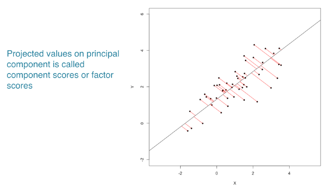

# Unsupervised Learning

## k-means clustering

### Types of machine learning

-   Unsupervised learning

    | *Finding structure* in *unlabeled data*.

    -   Clustering

        -   Finding *homogeneous subgroups* within larger group.

    -   Dimensionality reduction

        -   Finding *patterns in the features* of the data.

        -   Visualization of high dimensional data.

        -   Pre-processing before supervised learning.

-   Supervised learning

    | *Making* *predictions* based on *labeled data*.

    -   Regression: continous DV

    -   Classification: categorical DV

-   Reinforcement learning

### Introduction to k-means

**k-means in R**

`kmeans(x, centers = num, nstart = num)`

-   `x` : data

-   `centers` : the number of predetermined groups or clusters

-   `nstart` : run algorithm multiple times to improve odds of the best model.

    (kmeans algorithm has a random component. A single run of kmeans may not find the optimal solution to kmeans.)

#### k-means clustering

```{r message=FALSE}
library(tidyverse)

# str(x): num [1:300, 1:2]
x <- read_tsv("data/x_k_means.txt", col_select = -1) %>% as.matrix()
head(x)
```

Plot to see possible centers.

```{r}
plot(x[,1], x[,2])
```

```{r}
# Create the k-means model: km.out
km.out <- kmeans(x, centers = 3, nstart = 20)

# Inspect the result
summary(km.out)
```

Access the cluster component directly. This is useful anytime you need the cluster membership for each observation of the data used to build the clustering model.

```{r}
# Print the cluster membership component of the model
km.out$cluster
```

Human friendly output of basic modeling results.

```{r}
# Print the km.out object
km.out
```

#### Visualizing and interpreting

One of the more intuitive ways to interpret the results of k-means models is by plotting the data as a scatter plot and using color to label the samples' cluster membership (`col = km.out$cluster`).

```{r}
# Scatter plot of x
plot(x, col = km.out$cluster,
     main = "k-means with 3 clusters",
     xlab = "",
     ylab = "")
```

### Model selection

Best outcome is based on total within cluster sum of squares:

-   For each cluster

    -   For each observation in the cluster

        -   Determine squared distance from observation to cluster center

    -   Sum all of them together

Running algorithm multiple times helps find the *global minimum* total within cluster sum of squares.

#### Handling random algorithms

This random initialization can result in assigning observations to different cluster labels. Also, the random initialization can result in finding different *local minima* for the k-means algorithm.

At the top of each plot, the measure of model quality---total within cluster sum of squares error---will be plotted. Look for the model(s) with the lowest error to find models with the better model results.

Your task is to generate six `kmeans()` models on the data, plotting the results of each, in order to see the impact of random initializations on model results.

```{r}
# Set up 2 x 3 plotting grid
par(mfrow = c(2, 3))

# Set seed
set.seed(1)

for(i in 1:6) {
  # Run kmeans() on x with three clusters and one start
  km.out <- kmeans(x, centers = 3, nstart = 1)
  
  # Plot clusters
  plot(x, col = km.out$cluster, 
       main = km.out$tot.withinss, # total within cluster sum of squares error
       xlab = "", ylab = "")
}
```

Because of the random initialization of the k-means algorithm, there's quite some variation in cluster assignments among the six models.

#### Selecting number of clusters

If you do not know the number of clusters and need to determine it, you will need to run the algorithm multiple times, each time with a different number of clusters. From this, you can observe how a measure of model quality changes with the number of clusters.

Plots displaying this information help to determine the number of clusters and are often referred to as *scree plots*. The *elbow* indicates the number of clusters inherent in the data.

```{r}
# Initialize total within sum of squares error: wss
wss <- 0

# For 1 to 15 cluster centers
for (i in 1:15) {
  km.out <- kmeans(x, centers = i, nstart = 20)
  # Save total within sum of squares to wss variable
  wss[i] <- km.out$tot.withinss
}

wss
```

```{r}
# Plot total within sum of squares vs. number of clusters
plot(1:15, wss, type = "b",
     xlab = "Number of Clusters", 
     ylab = "Within groups sum of squares")

# Set k equal to the number of clusters corresponding to the elbow location
k <- 2
```

### Pokemon data

**Data challenges**

-   Selecting the variables to cluster upon

-   Scaling the data

-   Determining the number of clusters

    -   Often no clean "elbow" in scree plot

    -   This will be a core part of the exercises

-   Visualize the results for interpretation

#### Real world data

The first challenge with the Pokemon data is that there is no pre-determined number of clusters. You will determine the appropriate number of clusters, keeping in mind that in real data the elbow in the scree plot might be less of a sharp elbow. Use your judgment on making the determination of the number of clusters.

```{r message=FALSE}
# convert df to matrix, dim: 800*6
pokemon <- read_csv("data/Pokemon.csv") %>% 
    select(6:11) %>% 
    as.matrix()

head(pokemon)
```

Find appropriate number of clusters.

```{r}
# Initialize total within sum of squares error: wss
wss <- 0

# Look over 1 to 15 possible clusters
for (i in 1:15) {
  # Fit the model: km.out
  km.out <- kmeans(pokemon, centers = i, nstart = 20, iter.max = 50)
  # Save the within cluster sum of squares
  wss[i] <- km.out$tot.withinss
}

# Produce a scree plot
plot(1:15, wss, type = "b", 
     xlab = "Number of Clusters", 
     ylab = "Within groups sum of squares")
```

```{r}
# Select number of clusters
k <- 3

# Build model with k clusters: km.out
km.out <- kmeans(pokemon, centers = k, nstart = 20, iter.max = 50)

# View the resulting model
km.out
```

```{r}
# Plot of Defense vs. Speed by cluster membership
plot(pokemon[, c("Defense", "Speed")],
     col = km.out$cluster,
     main = paste("k-means clustering of Pokemon with", k, "clusters"),
     xlab = "Defense", ylab = "Speed")
```

## Hierarchical clustering

### Introduction

**Hierarchical clustering**

-   Number of clusters is not known ahead of time

-   Two kinds:

    -   bottom-up: starts by assigning each point to its own cluster. Then find the closest two clusters and to join them together into a single cluster. This process continues iteratively. Until there is only one cluster.

    -   top-down

**Hierarchical clustering in R**

``` r
# Calculates similarity as Euclidean distance
# between observations
dist_matrix <- dist(x)

# Returns hierarchical clustering model
hclust(d = dist_matrix)
```

#### Hierarchical clustering results

In this exercise, you will create your first hierarchical clustering model using the `hclust()` function. Your task is to create a hierarchical clustering model of `x`.

Remember the first step to hierarchical clustering is determining the similarity between observations, which you will do with the `dist()` function.

```{r}
# str: num [1:50, 1:2]
x <- x[1:50, ]
head(x)
```

```{r}
# Create hierarchical clustering model: hclust.out
hclust.out <- hclust(d = dist(x))

# Inspect the result
summary(hclust.out)
```

### Selecting number of clusters

**Dendrogram**

-   Tree shaped structure used to interpret hierarchical clustering models.

-   The distance between the clusters is represented as the height of the horizontal line on the dendrogram.

-   Dendrogram plotting in R:

    ``` r
    # Draws a dendrogram
    plot(hclust.out)

    # determine the number of clusters
    # drawing a cut line at a particular 'height' or 'distance'
    abline(h = 6, col = "red")

    # Tree "cutting"
    # Cut by height h
    cutree(hclust.out, h = 6)

    # Cut by number of clusters k
    cutree(hclust.out, k = 2)
    ```

    -   Specifying height of the line, `h`, is the equivalent of specifying that you want clusters that are no further apart than that height.

#### Cutting the tree

`cutree()` is the R function that cuts a hierarchical model. The `h` and `k` arguments to `cutree()` allow you to cut the tree based on a certain height `h` or a certain number of clusters `k`.

```{r}
# draw dendrogram
plot(hclust.out)

# cut 3 cluster
abline(h = 3.4, col = "red")
```

```{r}
# Cut by height
cutree(hclust.out, h = 3.4)

# Cut by number of clusters
cutree(hclust.out, k = 3)
```

The output of each `cutree()` call represents the cluster assignments for each observation in the original dataset.

### Clustering linkage

**Linking clusters in hierarchical clustering**

-   How is distance between clusters determined? Rules?

-   *Four methods* to determine which cluster should be linked:

1.  **Complete**: pairwise similarity between all observations in cluster 1 and cluster 2, and uses *largest of similarities*

    -   `hclust(d, method = "complete")`

2.  **Single**: same as above but uses *smallest of similarities*

    -   `hclust(d, method = "single")`

3.  **Average**: same as above but uses *average of similarities*

    -   `hclust(d, method = "average")`

4.  **Centroid**: *finds centroid* of cluster 1 and centroid of cluster 2, and uses *similarity between two centroids*

#### Linkage methods

You will produce hierarchical clustering models using different linkages and plot the dendrogram for each, observing the overall structure of the trees.

```{r}
# Cluster using complete linkage: hclust.complete
hclust.complete <- hclust(dist(x), method = "complete")

# Cluster using average linkage: hclust.average
hclust.average <- hclust(dist(x), method = "average")

# Cluster using single linkage: hclust.single
hclust.single <- hclust(dist(x), method = "single")

# Plot dendrogram of hclust.complete
plot(hclust.complete, main = "Complete")

# Plot dendrogram of hclust.average
plot(hclust.average, main = "Average")

# Plot dendrogram of hclust.single
plot(hclust.single, main = "Single")
```

Whether you want balanced or unbalanced trees for your hierarchical clustering model depends on the context of the problem you're trying to solve.

Balanced trees (complete, average) are essential if you want an even number of observations assigned to each cluster.

On the other hand, if you want to detect outliers, for example, an unbalanced tree is more desirable because pruning an unbalanced tree can result in most observations assigned to one cluster and only a few observations assigned to other clusters.

#### Scaling

Clustering real data may require scaling the features if they have different distributions.

-   Normalized features: mean = 0, sd = 1

You will observe the `pokemon` dataset, its distribution (mean and standard deviation) of each feature, scale the data accordingly, then produce a hierarchical clustering model using the complete linkage method.

```{r}
# View column means
colMeans(pokemon)
```

Since the variables are the columns of your matrix, use `apply(X, MARGIN, FUN)` to calculate sd. Where, `x`: array or matrix; `MARGIN`: for a matrix `1` indicates rows, `2` indicates columns.

```{r}
# View column standard deviations
apply(pokemon, 2, sd)
```

Use `scale()` to normalized.

```{r}
# Scale the data
pokemon.scaled <- scale(pokemon)
apply(pokemon.scaled, 2, sd)
```

```{r}
# Create hierarchical clustering model: hclust.pokemon
hclust.pokemon <- hclust(dist(pokemon.scaled), method = "complete")

summary(hclust.pokemon)
```

#### Compare kmeans() and hclust()

Comparing k-means and hierarchical clustering, you'll see the two methods produce different cluster memberships. This is because the two algorithms make different assumptions about how the data is generated.

```{r}
# Apply cutree() to hclust.pokemon: cut.pokemon
cut.pokemon <- cutree(hclust.pokemon, k = 3)

# Compare methods
table(km.out$cluster, cut.pokemon)
```

It looks like the hierarchical clustering model assigns most of the observations to cluster 1, while the k-means algorithm distributes the observations relatively evenly among all clusters.

It's important to note that there's no consensus on which method produces better clusters. The job of the analyst in unsupervised clustering is to observe the cluster assignments and make a judgment call as to which method provides more insights into the data.

## Dimensionality reduction - PCA

### Introduction

**Dimensionality reduction**

-   A popular method is principal component analysis (PCA)

-   Three goals when finding lower dimensional representation of features:

1.  Find linear combination of variables to create principal components

    -   Regression line of x & y represent the principal component

        {width="401"}

2.  Maintain most variance in the data

3.  Principal components are uncorrelated (i.e., orthogonal to each other)

#### PCA using prcomp()

``` r
prcomp(x = data,
      scale = FALSE / TRUE,
      center = TRUE)
```

Your task is to create a PCA model of the `pokemon`, which has four dimensions, then to inspect the resulting model.

```{r message=FALSE}
pokemon <- read_delim("data/pokemon_pca.txt", delim = ",")

rowname <- as.matrix(pokemon)[,1]
pokemon <- data.matrix(pokemon)[,-1]
row.names(pokemon) <- rowname
head(pokemon)
```

```{r}
# Perform scaled PCA: pr.out
pr.out <- prcomp(pokemon, scale = TRUE, center = TRUE)

# Inspect model output
summary(pr.out)
```

The first two principal components describe around 77% of the variance.

#### Additional results of PCA

PCA models in R produce additional diagnostic and output components:

-   `center`: the column means used to center to the data, or `FALSE` if the data weren't centered

-   `scale`: the column standard deviations used to scale the data, or `FALSE` if the data weren't scaled

-   `rotation`: the directions of the principal component vectors in terms of the original features/variables. This information allows you to define new data in terms of the original principal components

-   `x`: the value of each observation in the original dataset projected to the principal components

You can access these the same as other model components. For example, use `pr.out$rotation` to access the `rotation` component.

```{r}
pr.out$rotation
```

```{r}
pr.out$center
```

```{r}
pr.out$scale
```

```{r}
list(dim = dim(pr.out$x), head = head(pr.out$x))
```

### Visualizing and interpreting

-   Biplots

`biplot(pca_model)`

-   Scree plots

``` r
# Getting proportion of variance for a scree plot
pr.var <- pr.iris$sdev^2
pve <- pr.var / sum(pr.var)

# Plot variance explained for each principal component
plot(pve, xlab = "Principal Component",
     ylab = "Proportion of Variance Explained",
     ylim = c(0, 1), type = "b")
```

#### Interpreting biplots

`HitPoints` and `Defense` have approximately the same loadings in the first two principal components.

Aerodactyl and Avalugg, this two Pokemon are the least similar in terms of the second principal component.

```{r}
biplot(pr.out)
```

#### Variance explained

The second common plot type for understanding PCA models is a *scree plot*. A scree plot shows the variance explained as the number of principal components increases. Sometimes the cumulative variance explained is plotted as well.

Square of the standard deviations of the principal components (i.e., the variance), is available in the `sdev` component of the PCA model object.

```{r}
# Variability of each principal component: pr.var
pr.var <- pr.out$sdev^2
pr.var
```

The proportion of the variance explained, calculated by dividing `pr.var` by the total variance explained by all principal components.

```{r}
# Variance explained by each principal component: pve
pve <- pr.var / sum(pr.var)
pve
```

#### Visualize variance explained

Now you will create a scree plot showing the proportion of variance explained by each principal component, as well as the cumulative proportion of variance explained.

One way to determine the number of principal components to retain is by looking for an elbow in the scree plot showing that as the number of principal components increases, the rate at which variance is explained decreases substantially.

```{r}
# Plot variance explained for each principal component
plot(pve, xlab = "Principal Component",
     ylab = "Proportion of Variance Explained",
     ylim = c(0, 1), type = "b")
```

`cumsum()` for cumulative proportion of variance.

```{r}
# Plot cumulative proportion of variance explained
plot(cumsum(pve), xlab = "Principal Component",
     ylab = "Cumulative Proportion of Variance Explained",
     ylim = c(0, 1), type = "b")
```

Notice that when the number of principal components is equal to the number of original features in the data, the cumulative proportion of variance explained is 1.

### Practical issues

#### Scaling

Scaling your data before doing PCA changes the results of the PCA modeling. Here, you will perform PCA with and without scaling, then visualize the results using biplots.

Sometimes scaling is appropriate when the variances of the variables are substantially different. This is commonly the case when variables have different units of measurement.

```{r message=FALSE}
# add new variable "Total" for pokemon data
pokemon_total <- read_delim("data/pokemon_add_total.txt")
pokemon_total
```

```{r}
# set up pokemon
pokemon <- pokemon_total %>% select(-1) %>% as.matrix()
row.names(pokemon) <- pokemon_total$...1

head(pokemon)
```

See how the scale of the variables differs. You can see that `Total` column has larger mean and sd.

```{r}
# Mean of each variable
colMeans(pokemon)

# Standard deviation of each variable
apply(pokemon, 2, sd)
```

```{r}
# PCA model with scaling: pr.with.scaling
pr.with.scaling <- prcomp(pokemon, scale = TRUE)

# PCA model without scaling: pr.without.scaling
pr.without.scaling <- prcomp(pokemon, scale = FALSE)

# Create biplots of both for comparison
biplot(pr.with.scaling)
biplot(pr.without.scaling)
```

The new `Total` column contains much more variation, on average, than the other four columns, so it has a disproportionate effect on the PCA model when scaling is not performed. After scaling the data, there's a much more even distribution of the loading vectors.

## Case study

### Introduction

**Example use case**

-   Human breast mass data:

    -   Ten features measured of each cell nuclei

    -   Summary information is provided for each group of cells

    -   Includes diagnosis: benign (not cancerous) and malignant (cancerous)

-   Analysis

    -   Download data and prepare data for modeling

    -   Exploratory data analysis (\# observations, \# features, etc.)

    -   Perform PCA and interpret results

    -   Complete two types of clustering

    -   Understand and compare the two types

    -   Combine PCA and clustering

#### Preparing the data

```{r message=FALSE}
# load dataset
wisc.df <- read.csv("data/WisconsinCancer.csv")
glimpse(wisc.df)
```

```{r}
# Convert the features of the data: wisc.data
wisc.data <- as.matrix(wisc.df[, 3:32])
head(wisc.data, 2)
```

```{r}
# Set the row names of wisc.data
row.names(wisc.data) <- wisc.df$id
head(wisc.data, 2)
```

```{r}
# Create diagnosis vector, 1 = malignant ("M"), 0
diagnosis <- as.numeric(wisc.df$diagnosis == "M")
str(diagnosis)
```

#### Exploratory data analysis

How many observations are in this dataset?

```{r}
# ans: 569
dim(wisc.data)
```

How many variables/features in the data are suffixed with `_mean`?

```{r}
# detect string pattern
str_detect(colnames(wisc.data), "_mean") %>% sum()
```

How many of the observations have a malignant diagnosis?

```{r}
#  malignant diagnosis = 1
sum(diagnosis)
```

#### Performing PCA

The next step in your analysis is to perform PCA on `wisc.data`.

It's important to check if the data need to be scaled before performing PCA. Recall two common reasons for scaling data:

1.  The input variables use different units of measurement.

2.  The input variables have significantly different variances.

```{r}
# Check column means
colMeans(wisc.data)
```

```{r}
# Check standard deviations
apply(wisc.data, 2, sd)
```

```{r}
# Execute PCA, scaling if appropriate: wisc.pr
wisc.pr <- prcomp(wisc.data, scale = TRUE)

# Look at summary of results
summary(wisc.pr)
```

#### Interpreting PCA results

Now you'll use some visualizations to better understand your PCA model.

What stands out to you about this plot? Is it easy or difficult to understand?

```{r}
# Create a biplot of wisc.pr
biplot(wisc.pr)
```

Scatter plot each observation by principal components 1 and 2, coloring the points by the diagnosis.

```{r}
# Scatter plot observations by components 1 and 2
plot(wisc.pr$x[, c(1, 2)], col = (diagnosis + 1), 
     xlab = "PC1", ylab = "PC2")
```

Repeat the same for principal components 1 and 3. What do you notice about these plots?

```{r}
# Repeat for components 1 and 3
plot(wisc.pr$x[, c(1, 3)], col = (diagnosis + 1), 
     xlab = "PC1", ylab = "PC3")
```

Because principal component 2 explains more variance in the original data than principal component 3, you can see that the first plot has a cleaner cut separating the two subgroups.

#### Variance explained

You will produce scree plots showing the proportion of variance explained as the number of principal components increases.

```{r}
# Set up 1 x 2 plotting grid
par(mfrow = c(1, 2))

# Calculate variability of each component
pr.var <- wisc.pr$sdev^2

# Variance explained by each principal component: pve
pve <- pr.var / sum(pr.var)

# Plot variance explained for each principal component
plot(pve, xlab = "Principal Component", 
     ylab = "Proportion of Variance Explained", 
     ylim = c(0, 1), type = "b")

# Plot cumulative proportion of variance explained
plot(cumsum(pve), xlab = "Principal Component", 
     ylab = "Cumulative Proportion of Variance Explained", 
     ylim = c(0, 1), type = "b")
```

What is the minimum number of principal components needed to explain 80% of the variance in the data?

### Next steps

-   Complete hierarchical clustering

-   Complete k-means clustering

-   Combine PCA and clustering

-   Contrast results of hierarchical clustering with diagnosis

-   Compare hierarchical and k-means clustering results

-   PCA as a pre-processing step for clustering

#### Communicating PCA results

The loadings, represented as vectors, explain the mapping from the original features to the principal components. The principal components are naturally ordered from the most variance explained to the least variance explained.

For the first principal component, what is the component of the loading vector for the feature `concave.points_mean`? 

```{r}
# -0.26085376
wisc.pr$rotation[,"PC1"]
```

What is the minimum number of principal components required to explain 80% of the variance of the data?

```{r}
# PC5 Cumulative Proportion = 0.84734 & screen plot
summary(wisc.pr)
```

#### Hierarchical clustering

```{r}
# Scale the wisc.data data: data.scaled
data.scaled <- scale(wisc.data)

# Calculate the (Euclidean) distances: data.dist
data.dist <- dist(data.scaled)

# Create a hierarchical clustering model: wisc.hclust
wisc.hclust <- hclust(data.dist, method = "complete")

# plot
plot(wisc.hclust)
```

What is the height at which the clustering model has 4 clusters? ANS: 20

#### Selecting number of clusters

You will compare the outputs from your hierarchical clustering model to the actual diagnoses. Normally when performing unsupervised learning like this, a target variable isn't available. We do have it with this dataset, however, so it can be used to check the performance of the clustering model.

When performing supervised learning, using clustering to create new features may or may not improve the performance of the final model. This exercise will help you determine if, in this case, hierarchical clustering provides a promising new feature.

```{r}
# Cut tree so that it has 4 clusters: wisc.hclust.clusters
wisc.hclust.clusters <- cutree(wisc.hclust, k = 4)

# Compare cluster membership to actual diagnoses
table(wisc.hclust.clusters, diagnosis)
```

#### k-means clustering & compare

You will create a k-means clustering model on the Wisconsin breast cancer data and compare the results to the actual diagnoses and the results of your hierarchical clustering model.

```{r}
# Create a k-means model on wisc.data: wisc.km
wisc.km <- kmeans(scale(wisc.data), centers = 2, nstart = 20)

# Compare k-means to actual diagnoses
table(wisc.km$cluster, diagnosis)
```

```{r}
# Compare k-means to hierarchical clustering
table(wisc.km$cluster, wisc.hclust.clusters)
```

Looking at the second table you generated, it looks like clusters 1, 2, and 4 from the hierarchical clustering model can be interpreted as the cluster 1 equivalent from the k-means algorithm, and cluster 3 can be interpreted as the cluster 2 equivalent.

#### Clustering on PCA results

You will put together several steps you used earlier and, in doing so, you will experience some of the creativity that is typical in unsupervised learning.

Recall from earlier exercises that the PCA model required significantly fewer features to describe 80% and 95% of the variability of the data. In addition to normalizing data and potentially avoiding overfitting, PCA also uncorrelates the variables, sometimes improving the performance of other modeling techniques.

Let's see if PCA improves or degrades the performance of hierarchical clustering.

```{r}
# Using the minimum number of principal components required to describe at least 90% of the variability in the data
# PC7 = 0.91
summary(wisc.pr)
```

Create a hierarchical clustering model with complete linkage.
```{r}
# Create a hierarchical clustering model: wisc.pr.hclust
wisc.pr.hclust <- hclust(dist(wisc.pr$x[, 1:7]), method = "complete")

# Cut model into 4 clusters: wisc.pr.hclust.clusters
wisc.pr.hclust.clusters <- cutree(wisc.pr.hclust, k = 4)

# Compare to actual diagnoses
table(wisc.pr.hclust.clusters, diagnosis)
```

```{r}
# Compare previous k-means and actual diagnosis
table(wisc.km$cluster, diagnosis)


# Compare previous hierarchical and actual diagnosis
table(wisc.hclust.clusters, diagnosis)
```


