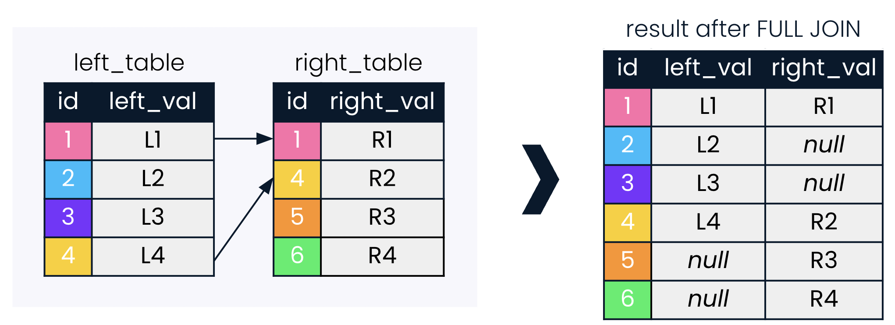
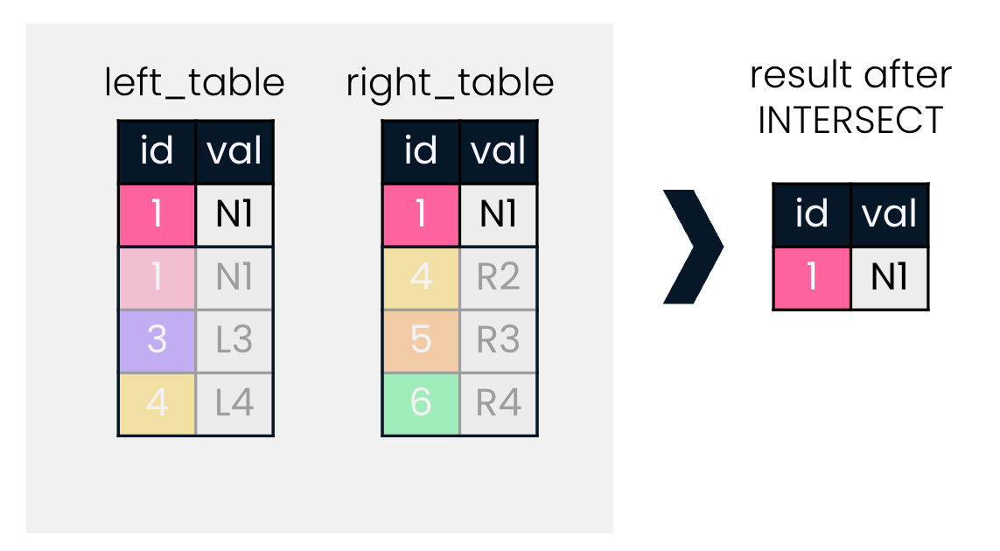
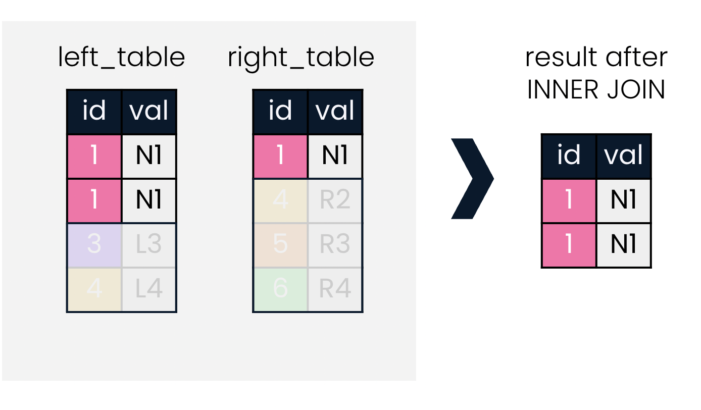
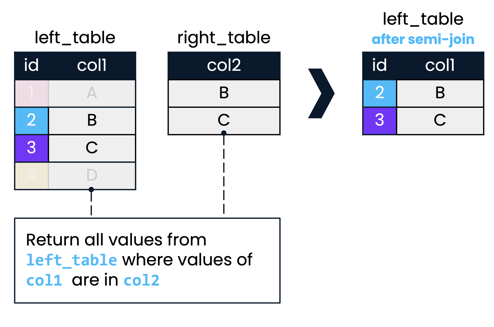
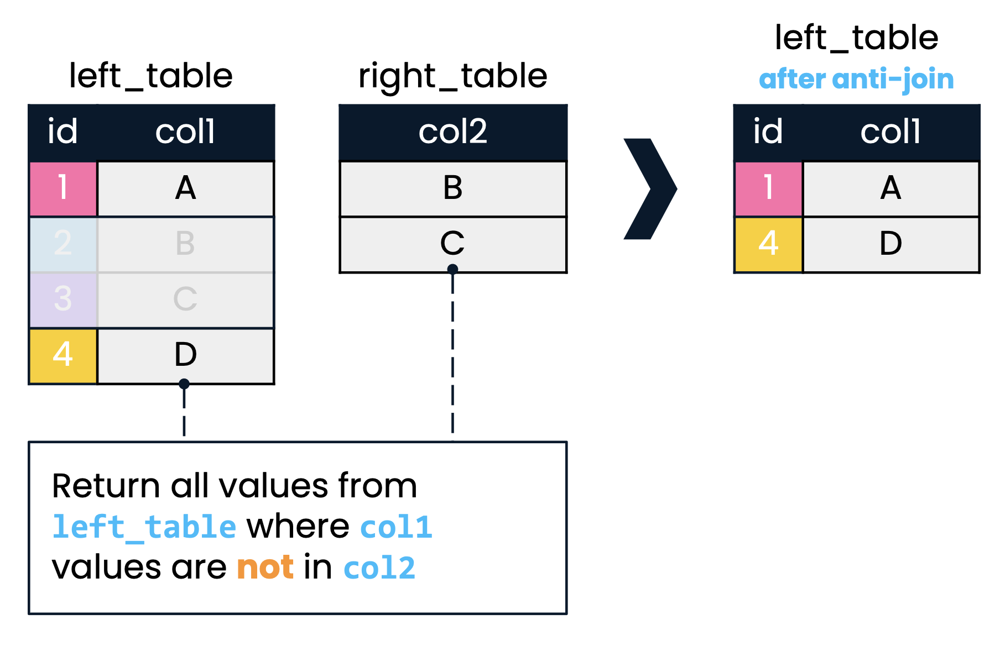

# Joining Data in SQL

## Inner Joins

### ins & outs of INNER JOIN

{width="490"}

-   The `table.column_name` format must be used when selecting columns that exist in both tables.

    ``` sql
    -- Inner join of presidents and prime_ministers, joining on country
    SELECT prime_ministers.country, prime_ministers.continent, prime_minister, president
    FROM prime_ministers
    INNER JOIN presidents
    ON prime_ministers.country = presidents.country; 👈
    ```

-   Aliasing tables, then can use in `SELECT` and `ON` clauses.

    ``` sql
    --Inner join of presidents and prime_ministers, joining on country
    SELECT p1.country, p1.continent, prime_minister, president
    FROM prime_ministers AS p1   👈
    INNER JOIN presidents AS p2  👈
    ON p1.country = p2.country;
    ```

-   USING: when joining on two identical column names, we can employ `USING(shared_column_name)`

    ``` sql
    --Inner join of presidents and prime_ministers, joining on country
    SELECT p1.country, p1.continent, prime_minister, president
    FROM prime_ministers AS p1
    INNER JOIN presidents AS p2
    USING(country); 👈
    ```

**Setup films database**

```{r}
# Creating a new database
# Connect to the default postgres database
library(DBI)
con <- dbConnect(RSQLite::SQLite(), "")
knitr::opts_chunk$set(connection = "con")

# List database tables
dbListTables(con)
```

```{sql}
-- Setup database schema, cities
CREATE TABLE cities (
  name                    VARCHAR   PRIMARY KEY,
  country_code            VARCHAR,
  city_proper_pop         REAL,
  metroarea_pop           REAL,
  urbanarea_pop           REAL
);
```

```{sql}
-- Setup database schema, countries
CREATE TABLE countries (
  code                  VARCHAR     PRIMARY KEY,
  name                  VARCHAR,
  continent             VARCHAR,
  region                VARCHAR,
  surface_area          REAL,
  indep_year            INTEGER,
  local_name            VARCHAR,
  gov_form              VARCHAR,
  capital               VARCHAR,
  cap_long              REAL,
  cap_lat               REAL
);
```

```{sql}
-- Setup database schema, languages
CREATE TABLE languages (
  lang_id               INTEGER     PRIMARY KEY,
  code                  VARCHAR,
  name                  VARCHAR,
  percent               REAL,
  official              BOOLEAN
);
```

```{sql}
-- Setup database schema, economies
CREATE TABLE economies (
  econ_id               INTEGER     PRIMARY KEY,
  code                  VARCHAR,
  year                  INTEGER,
  income_group          VARCHAR,
  gdp_percapita         REAL,
  gross_savings         REAL,
  inflation_rate        REAL,
  total_investment      REAL,
  unemployment_rate     REAL,
  exports               REAL,
  imports               REAL
);

```

```{sql}
-- Setup database schema, currencies
CREATE TABLE currencies (
  curr_id               INTEGER     PRIMARY KEY,
  code                  VARCHAR,
  basic_unit            VARCHAR,
  curr_code             VARCHAR,
  frac_unit             VARCHAR,
  frac_perbasic         REAL
);
```

```{sql}
-- Setup database schema, populations
CREATE TABLE populations (
  pop_id                INTEGER     PRIMARY KEY,
  country_code          VARCHAR,
  year                  INTEGER,
  fertility_rate        REAL,
  life_expectancy       REAL,
  size                  REAL
);
```

```{sql}
-- Setup database schema, economies2015
CREATE TABLE economies2015 (
  code                  VARCHAR     PRIMARY KEY,
  year                  INTEGER,
  income_group          VARCHAR,
  gross_savings         REAL
);
```

```{sql}
-- Setup database schema, economies2019
CREATE TABLE economies2019 (
  code                  VARCHAR     PRIMARY KEY,
  year                  INTEGER,
  income_group          VARCHAR,
  gross_savings         REAL
);
```

```{sql}
-- Setup database schema, eu_countries
CREATE TABLE eu_countries (
  code                  VARCHAR     PRIMARY KEY,
  name                  VARCHAR
);
```

```{r warning=FALSE}
# List database tables
dbListTables(con)
```

```{r message=FALSE}
# Loading data
cities <- read.csv("data/countries/countries/cities.csv", na.strings = "")
countries <- read.csv("data/countries/countries/countries.csv", na.strings = "")
currencies <- read.csv("data/countries/countries/currencies.csv", na.strings = "")
economies <- read.csv("data/countries/countries/economies.csv", na.strings = "")
economies2015 <- read.csv("data/countries/countries/economies2015.csv", na.strings = "")
economies2019 <- read.csv("data/countries/countries/economies2019.csv", na.strings = "")
eu_countries <- read.csv("data/countries/countries/eu_countries.csv", na.strings = "")
languages <- read.csv("data/countries/countries/languages.csv", na.strings = "")
populations <- read.csv("data/countries/countries/populations.csv", na.strings = "")

# Create database tables
dbWriteTable(con, "cities", cities, overwrite = TRUE)
dbWriteTable(con, "countries", countries, overwrite = TRUE)
dbWriteTable(con, "currencies", currencies, overwrite = TRUE)
dbWriteTable(con, "economies", economies, overwrite = TRUE)
dbWriteTable(con, "economies2015", economies2015, overwrite = TRUE)
dbWriteTable(con, "economies2019", economies2019, overwrite = TRUE)
dbWriteTable(con, "eu_countries", eu_countries, overwrite = TRUE)
dbWriteTable(con, "languages", languages, overwrite = TRUE)
dbWriteTable(con, "populations", populations, overwrite = TRUE)

# List database tables
dbListTables(con)
```

#### INNER JOIN

You'll be working with the `countries` database, which contains information about the most populous world cities in the world, along with country-level economic, population, and geographic data. The database also contains information on languages spoken in each country.

Use the `cities` and `countries` tables to build your first inner join.

```{sql}
-- Select all columns from cities
SELECT *
FROM cities;
```

Perform an inner join with the `cities` table on the left and the `countries` table on the right.

```{sql}
SELECT * 
FROM cities
-- Inner join to countries
INNER JOIN countries
-- Match on country codes
ON cities.country_code = countries.code;
```

Keep only the name of the city, the name of the country, and the region the country is located in.

```{sql}
-- Select name fields (with alias) and region 
SELECT 
    cities.name AS city, 
    countries.name AS country, 
    countries.region
FROM cities
INNER JOIN countries
ON cities.country_code = countries.code;
```

#### Joining with aliased tables

You'll use data from both the `countries` and `economies` tables to examine the inflation rate in 2010 and 2015.

```{sql}
-- Select fields with aliases
SELECT 
    c.code AS country_code,
    c.name,
    e.year,
    e.inflation_rate
FROM countries AS c
-- Join to economies (alias e)
INNER JOIN economies AS e
-- Match on code field using table aliases
ON c.code = e.code;
```

Notice that only the `code` field is ambiguous, so it requires a table name or alias before it. All the other fields (`name`, `year`, and `inflation_rate`) do not occur in more than one table name, so do not require table names or aliasing in the `SELECT` statement.

#### USING

When both the field names being joined on are the same, you can take advantage of the `USING` clause.

```{sql}
SELECT c.name AS country, l.name AS language, official
FROM countries AS c
INNER JOIN languages AS l
-- Match using the code column
USING(code);
```

It looks like Afghanistan has multiple official and unofficial languages.

### Defining relationships

**One-to-many relationships**

{width="272"}

**One-to-one relationships**

{width="279"}

**Many-to-many relationships**

{width="278"}

#### Relationships in our database

1.  What best describes the relationship between `code` in the `countries` table and `country_code` in the `cities` table?

    ANS: one-to-many

2.  Which of these options best describes the relationship between the `countries` table and the `languages` table?

    ANS: many-to-many

#### Inspecting a relationship

You've just identified that the `countries` table has a many-to-many relationship with the `languages` table. That is, many languages can be spoken in a country, and a language can be spoken in many countries.

First, what is the best way to query all the different languages spoken in a country?

Second, how is this different from the best way to query all the countries that speak each language?

Recall that when writing joins, many users prefer to write SQL code out of order by writing the join first (along with any table aliases), and writing the `SELECT` statement at the end.

```{sql}
-- Select country and language names, aliased
SELECT c.name AS country, l.name AS language
-- From countries (aliased)
FROM countries AS c
-- Join to languages (aliased)
INNER JOIN languages AS l
-- Use code as the joining field with the USING keyword
USING(code)
ORDER BY country;
```

```{sql}
-- Rearrange SELECT statement, keeping aliases
SELECT l.name AS language, c.name AS country
FROM countries AS c
INNER JOIN languages AS l
USING(code)
-- Order the results by language
ORDER BY language;
```

When we read SQL results, we expect the most important column to be on the far left, and it's helpful if results are ordered by relevance to the question at hand.

By default, results are ordered by the column from the left table, but you can change this using `ORDER BY`.

### Multiple joins

**Chaining joins**

``` sql
SELECT *
FROM left_table
INNER JOIN right_table
ON left_table.id = right_table.id
INNER JOIN another_table
ON left/right_table.id = another_table.id;
```

**Joining on multiple keys**

{width="622"}

``` sql
SELECT *
FROM left_table
INNER JOIN right_table
-- INNER JOIN ON the id AND date field
ON left_table.id = right_table.id
    AND left_table.date = right_table.date;
```

#### Joining multiple tables

Suppose you are interested in the relationship between fertility and unemployment rates. Your task in this exercise is to join tables to return the country name, year, fertility rate, and unemployment rate in a single result from the `countries`, `populations` and `economies` tables.

```{sql}
-- Select relevant fields
SELECT name, year, fertility_rate
-- Inner join countries and populations, aliased, on code
FROM countries AS c
INNER JOIN populations AS p
ON c.code = p.country_code;
```

Chain another inner join to your query with the `economies` table. Select `name`, and select `year` and `unemployment_rate` from `economies`.

```{sql}
-- Select fields
SELECT name, e.year, fertility_rate, e.unemployment_rate
FROM countries AS c
INNER JOIN populations AS p
ON c.code = p.country_code
-- Join to economies (as e)
INNER JOIN economies AS e
-- Match on country code
USING(code);
```

#### Checking multi-table joins

Have a look at the results for Albania from the previous query below. You can see that the 2015 `fertility_rate` has been paired with 2010 `unemployment_rate`, and vice versa.

```{sql}
SELECT name, e.year, fertility_rate, e.unemployment_rate
FROM countries AS c
INNER JOIN populations AS p
ON c.code = p.country_code
-- Join to economies (as e)
INNER JOIN economies AS e
-- Match on country code
USING(code)
WHERE name = 'Albania';
```

Instead of four records, the query should return two: one for each year.

Fix the query by explicitly stating that both the country `code` and `year` should match!

```{sql}
SELECT name, e.year, fertility_rate, unemployment_rate
FROM countries AS c
INNER JOIN populations AS p
ON c.code = p.country_code
INNER JOIN economies AS e
ON c.code = e.code
-- Add an additional joining condition such that you are also joining on year
	AND p.year = e.year;
```

There are only two lines of Albania results now: one for 2010 and one for 2015.

## Outer, Cross & Self Joins

### LEFT & RIGHT JOINs

**LEFT JOIN**

-   Return all records in the left table, and those records in the right table that match on the joining field provided.

-   More intuitive to users when typing from left to right.

    {width="522"}

**RIGHT JOIN**

-   Less commonly used than `LEFT JOIN`

-   Any `RIGHT JOIN` can be re-written as a `LEFT JOIN`

    {width="531"}

#### LEFT JOIN

As before, you will be using the `cities` and `countries` tables.

You'll begin with an `INNER JOIN` with the `cities` table (left) and `countries` table (right). This helps if you are interested only in records where a country is present in both tables.

You'll then change to a `LEFT JOIN`. This helps if you're interested in returning all countries in the `cities` table, whether or not they have a match in the `countries` table.

```{sql}
SELECT 
    c1.name AS city,
    code,
    c2.name AS country,
    region,
    city_proper_pop
FROM cities AS c1
-- Perform an inner join with cities as c1 and countries as c2 on country code
INNER JOIN countries AS c2
ON c1.country_code = c2.code
ORDER BY code DESC;
```

```{sql}
SELECT 
	c1.name AS city, 
    code, 
    c2.name AS country,
    region, 
    city_proper_pop
FROM cities AS c1
-- Join right table (with alias)
LEFT JOIN countries AS c2
ON c1.country_code = c2.code
ORDER BY code DESC;
```

Notice that the `INNER JOIN` resulted in 230 records, whereas the `LEFT JOIN` returned 236 records.

Remember that the LEFT JOIN is a type of outer join: its result is not limited to only those records that have matches for both tables on the joining field.

**Building on your LEFT JOIN**

ou will use `AVG()` in combination with a `LEFT JOIN` to determine the average gross domestic product (GDP) per capita by `region` in 2010.

```{sql}
SELECT name, region, gdp_percapita
FROM countries AS c
LEFT JOIN economies AS e
-- Match on code fields
USING(code)
-- Filter for the year 2010
WHERE year = 2010;
```

```{sql}
-- Select region, and average gdp_percapita as avg_gdp
SELECT region, AVG(gdp_percapita) AS avg_gdp
FROM countries AS c
LEFT JOIN economies AS e
USING(code)
WHERE year = 2010
-- Group by region
GROUP BY region;
```

```{sql}
SELECT region, AVG(gdp_percapita) AS avg_gdp
FROM countries AS c
LEFT JOIN economies AS e
USING(code)
WHERE year = 2010
GROUP BY region
-- Order by descending avg_gdp
ORDER BY avg_gdp DESC
-- Return only first 10 records
LIMIT 10; 
```

#### RIGHT JOIN

```{sql}
-- Modify this query to use RIGHT JOIN instead of LEFT JOIN
SELECT countries.name AS country, languages.name AS language, percent
FROM languages
RIGHT JOIN countries
USING(code)
WHERE language IS NOT NULL
ORDER BY language;
```

This is same as below left join.

```{sql}
-- Modify this query to use LEFT JOIN
SELECT countries.name AS country, languages.name AS language, percent
FROM countries
LEFT JOIN languages
USING(code)
WHERE language IS NOT NULL
ORDER BY language;
```

### FULL JOIN

**FULL JOIN**

-   A `FULL JOIN` combines a `LEFT JOIN` and a `RIGHT JOIN`.

    {width="521"}

#### Comparing joins

You'll examine how results can differ when performing a full join compared to a left join and inner join by joining the `countries` and `currencies` tables. You'll be focusing on the North American `region` and records where the `name` of the country is missing.

Begin with a full join with `countries` on the left and `currencies` on the right.

Then complete a similar left join and conclude with an inner join, observing the results you see along the way.

FUll JOIN

```{sql}
SELECT name AS country, code, region, basic_unit
FROM countries
-- Join to currencies
FULL JOIN currencies 
USING (code)
-- Where region is North America or name is null
WHERE (region = 'North America')
    OR (name IS NULL)
ORDER BY region DESC;
```

LEFT JOIN

```{sql}
SELECT name AS country, code, region, basic_unit
FROM countries
-- Join to currencies
LEFT JOIN currencies 
USING (code)
WHERE region = 'North America' 
	OR name IS NULL
ORDER BY region;
```

INNER JOIN

```{sql}
SELECT name AS country, code, region, basic_unit
FROM countries
-- Join to currencies
INNER JOIN currencies 
USING (code)
WHERE region = 'North America' 
	OR name IS NULL
ORDER BY region;
```

The `FULL JOIN` query returned 18 records, the `LEFT JOIN` returned 4 records, and the `INNER JOIN` only returned 3 records.

#### Chaining FULL JOINs

uppose you are doing some research on Melanesia and Micronesia, and are interested in pulling information about languages and currencies into the data we see for these regions in the `countries` table. Since `languages` and `currencies` exist in separate tables, this will require two consecutive full joins involving the `countries`, `languages` and `currencies` tables.

```{sql}
SELECT 
	c1.name AS country, 
    region, 
    l.name AS language,
	basic_unit, 
    frac_unit
FROM countries as c1 
-- Full join with languages (alias as l)
FULL JOIN languages AS l 
USING(code)
-- Full join with currencies (alias as c2)
FULL JOIN currencies AS c2 
USING(code)
WHERE region LIKE 'M%esia';
```

The first `FULL JOIN` in the query pulled countries and languages, and the second `FULL JOIN` added in currency data for each record in the result of the first `FULL JOIN`.

### CROSS JOIN

-   creates all possible combinations of two tables.

    {width="288"}

``` sql
SELECT id1, id2
FROM table1
CROSS JOIN table2;
```

**Histories and languages**

`CROSS JOIN` can be incredibly helpful when asking questions that involve looking at all possible combinations or pairings between two sets of data.

Imagine you are a researcher interested in the languages spoken in two countries: Pakistan and India. You are interested in asking:

1.  What are the languages presently spoken in the two countries?

2.  Given the shared history between the two countries, what languages could *potentially* have been spoken in either country over the course of their history?

Explore how `INNER JOIN` and `CROSS JOIN` can help answer these two questions, respectively.

```{sql}
SELECT c.name AS country, l.name AS language
-- Inner join countries as c with languages as l on code
FROM countries AS c
INNER JOIN languages AS l
USING(code)  
WHERE c.code IN ('PAK','IND')
	AND l.code in ('PAK','IND');
```

Look at possible combinations of languages that could have been spoken in the two countries given their history.

```{sql}
SELECT c.name AS country, l.name AS language
FROM countries AS c        
-- Perform a cross join to languages (alias as l)
CROSS JOIN languages AS l
WHERE c.code in ('PAK','IND')
	AND l.code in ('PAK','IND');
```

Notice that the `INNER JOIN` returned 25 records, whereas the `CROSS JOIN` returned 50 records, as it took all combinations of languages returned by the `INNER JOIN` for both countries. (25\*2=50)

**Choosing your join**

Determine the names of the five countries and their respective regions with the lowest life expectancy for the year 2010.

```{sql}
SELECT 
	c.name AS country,
    region,
    life_expectancy AS life_exp
FROM countries AS c
-- Join to populations (alias as p) using an appropriate join
FULL JOIN populations AS p
ON c.code = p.country_code
-- Filter for only results in the year 2010
WHERE year = 2010 AND life_exp IS NOT NULL
-- Sort by life_exp
ORDER BY life_exp
-- Limit to five records
LIMIT 5;
```

Notice that all four types of joins we have learned will return the same result.

### Self joins

-   Self joins are tables joined with themselves

-   They can be used to compare parts of the same table

**Comparing a country to itself**

Suppose you are interested in finding out how much the populations for each country changed from 2010 to 2015. You can visualize this change by performing a self join.

Since you'll be joining the `populations` table to itself, you can alias `populations` first as `p1` and again as `p2`. This is good practice whenever you are aliasing tables with the same first letter.

```{sql}
-- Select aliased fields from populations as p1
SELECT 
  p1.country_code, 
  p1.size AS size2010,
  p2.size AS size2015
FROM populations AS p1
-- Join populations as p1 to itself, alias as p2, on country code
INNER JOIN populations AS p2
ON p1.country_code = p2.country_code
```

Since you want to compare records from 2010 and 2015, eliminate unwanted records by extending the `WHERE` statement to include only records where the `p1.year` matches `p2.year - 5`.

```{sql}
SELECT 
	p1.country_code, 
    p1.size AS size2010, 
    p2.size AS size2015
FROM populations AS p1
INNER JOIN populations AS p2
ON p1.country_code = p2.country_code
WHERE p1.year = 2010
-- Filter such that p1.year is always five years before p2.year
    AND (p2.year = 2015);
```

**All joins on deck**


## Set Theory for SQL Joins

**Venn diagrams and set theory**

{width="348"}

### UNION vs. UNION ALL

-   `UNION` takes two tables as input, and returns all records from both tables, *excluding duplicates*

    ``` sql
    SELECT *
    FROM left_table
    UNION
    SELECT *
    FROM right_table;
    ```

    {width="360"}

-   `UNION ALL` takes two tables and returns all records from both tables, *including duplicates*

    ``` sql
    SELECT *
    FROM left_table
    UNION ALL
    SELECT *
    FROM right_table;
    ```

    {width="346"}

**UNION and UNION ALL syntax**

Both queries on the left and right of the set operation must have the *same data types*. The names of the fields do not need to be the same, as the result will always contain field names from the left query.

{width="534"}

Two tables, `languages` and `currencies`:

``` sql
SELECT code 
FROM languages
UNION
SELECT curr_id 
FROM currencies;
```

❌A SQL error, because `languages` and `currencies` do not have the same number of fields.

``` sql
SELECT code 
FROM languages
UNION
SELECT curr_id 
FROM currencies;
```

❌A SQL error, because `code` and `curr_id` are not of the same data type.

```{sql}
SELECT code FROM
languages
UNION ALL
SELECT code FROM 
currencies;
```

⭕An unordered list of each country `code` in `languages` and `currencies`, including duplicates.

**Comparing global economies**

In this exercise, you have two tables, `economies2015` and `economies2019`, available to you under the tabs in the console. You'll perform a set operation to stack all records in these two tables on top of each other, *excluding duplicates*.

When drafting queries containing set operations, it is often helpful to write the queries on either side of the operation first, and then call the set operator.

```{sql}
-- Select all fields from economies2015
SELECT *
FROM economies2015    
-- Set operation
UNION
-- Select all fields from economies2019
SELECT *
FROM economies2019
ORDER BY code, year;
```

`UNION` can be helpful for consolidating data from multiple tables into one result, which as you have seen, can then be ordered in meaningful ways.

**Comparing two set operations**

In this exercise, you will looking at cases for when `UNION` is appropriate compared to `UNION ALL`.

You will be looking at combinations of country code and year from the `economies` and `populations` tables.

```{sql}
-- Query that determines all pairs of code and year from economies and populations, without duplicates
SELECT code, year
FROM economies
UNION
SELECT country_code, year
FROM populations
ORDER BY code, year;
```

```{sql}
-- Amend the query to return all combinations (including duplicates)
SELECT code, year
FROM economies
-- Set theory clause
UNION ALL
SELECT country_code, year
FROM populations
ORDER BY code, year;
```

`UNION` returned 434 records, whereas `UNION ALL` returned 814. Are you able to spot the duplicates in the `UNION ALL`?

### INTERSECT

-   `INTERSECT` is a robust set operation for finding the set of identical records between two sets of records.

{width="354"}

**INTERSECT vs. INNER JOIN on two columns**

+-----------------------------------------------------------------------------------------------------------------------------+-------------------------------------------------------------------------------------------------------------------------+
| INTERSECT                                                                                                                   | INNER JOIN                                                                                                              |
+=============================================================================================================================+=========================================================================================================================+
| ``` sql                                                                                                                     | ``` sql                                                                                                                 |
| SELECT *                                                                                                                    | SELECT *                                                                                                                |
| FROM left_table                                                                                                             | FROM left_table                                                                                                         |
| INTERSECT                                                                                                                   | INNER JOIN right_table                                                                                                  |
| SELECT *                                                                                                                    | ON left.id = right.id                                                                                                   |
| FROM right_table;                                                                                                           |     AND left.val = right.val                                                                                            |
| ```                                                                                                                         | ```                                                                                                                     |
+-----------------------------------------------------------------------------------------------------------------------------+-------------------------------------------------------------------------------------------------------------------------+
|                                                                        |                                                                   |
+-----------------------------------------------------------------------------------------------------------------------------+-------------------------------------------------------------------------------------------------------------------------+
| removes duplicates                                                                                                          | return duplicates, if id is duplicated in either table                                                                  |
+-----------------------------------------------------------------------------------------------------------------------------+-------------------------------------------------------------------------------------------------------------------------+
| return `NULL`                                                                                                               | never return `NULL`                                                                                                     |
+-----------------------------------------------------------------------------------------------------------------------------+-------------------------------------------------------------------------------------------------------------------------+
| A set-based operator that compares complete rows between two sets and can never return more rows than in the smaller table. | An operator that generally matches on a limited set of columns and can return zero rows or more rows from either table. |
+-----------------------------------------------------------------------------------------------------------------------------+-------------------------------------------------------------------------------------------------------------------------+
|                                                                                                                             |                                                                                                                         |
+-----------------------------------------------------------------------------------------------------------------------------+-------------------------------------------------------------------------------------------------------------------------+

Let's say you are interested in those countries that share names with cities. Return all city names that are also country names.

```{sql}
-- Return all cities with the same name as a country
SELECT name
FROM cities
INTERSECT
SELECT name
FROM countries;
```

It looks as though Singapore is the only country in our database that has a city with the same name!

### EXCEPT

-   `EXCEPT` retains only records from the left table that are not present in the right table

    {width="415"}

Find the names of cities that *do not have the same names* as their countries.

```{sql}
-- Return all cities that do not have the same name as a country
SELECT name
FROM cities
EXCEPT
SELECT name
FROM countries
ORDER BY name;
```

Note that if `countries` had been on the left and `cities` on the right, you would have returned the opposite: all countries that do not have the same name as a city.

```{sql}
SELECT name
FROM countries
EXCEPT
SELECT name
FROM cities
ORDER BY name;
```

**Calling all set operators**

{width="673"}

## Subqueries

### With semi joins & anti joins

**Additive joins**

{width="585"}

-   The six joins we've worked with so far are all "additive" in that they add columns to the original "left" table.

    1.  `INNER JOIN`

    2.  `LEFT JOIN`

    3.  `RIGHT JOIN`

    4.  `FULL JOIN`

    5.  `CROSS JOIN`

    6.  `Self joins`

**None additive joins**

+------------------------------------------------------------------------------------+----------------------------------------------------------------------------------------+
| **Semi join**                                                                      | **Anti join**                                                                          |
+------------------------------------------------------------------------------------+----------------------------------------------------------------------------------------+
| Chooses records in the first table where a condition *is met* in the second table. | Chooses records in the first table where a condition *is NOT met* in the second table. |
+------------------------------------------------------------------------------------+----------------------------------------------------------------------------------------+
|                                               |                                                   |
+------------------------------------------------------------------------------------+----------------------------------------------------------------------------------------+
| ``` sql                                                                            | ``` sql                                                                                |
| SELECT president, country, continent                                               | SELECT country, president                                                              |
| FROM presidents                                                                    | FROM presidents                                                                        |
| WHERE country IN 👈                                                                | WHERE continent LIKE '%America'                                                        |
|     (SELECT country                                                                |     AND country NOT IN  👈                                                             |
|      FROM states                                                                   |         (SELECT country                                                                |
|      WHERE indep_year < 1800);                                                     |          FROM states                                                                   |
| ```                                                                                |          WHERE indep_year < 1800);                                                     |
|                                                                                    | ```                                                                                    |
+------------------------------------------------------------------------------------+----------------------------------------------------------------------------------------+
|                                                                                    |                                                                                        |
+------------------------------------------------------------------------------------+----------------------------------------------------------------------------------------+

#### Semi join

Let's say you are interested in identifying languages spoken in the Middle East. The `languages` table contains information about languages and countries, but it does not tell you what region the countries belong to. You can build up a semi join by filtering the `countries` table by a particular `region`, and then using this to further filter the `languages` table.

```{sql}
-- Select country code for countries in the Middle East
SELECT code
FROM countries
WHERE region = 'Middle East';
```

```{sql}
-- Select unique language names
SELECT DISTINCT name
FROM languages
-- Order by the name of the language
ORDER BY name;
```

Create a semi join out of the two queries you've written, which filters unique languages returned in the first query for only those languages spoken in the `'Middle East'`.

```{sql}
SELECT DISTINCT name
FROM languages
-- Add syntax to use bracketed subquery below as a filter
WHERE code IN
    (SELECT code
    FROM countries
    WHERE region = 'Middle East')
ORDER BY name;
```

#### Anti join

The anti join is a related and powerful joining tool. It can be particularly useful for identifying whether an incorrect number of records appears in a join.

Say you are interested in identifying currencies of Oceanian countries.

You have written the following `INNER JOIN`, which returns 15 records.

```{sql}
SELECT c1.code, name, basic_unit AS currency
FROM countries AS c1
INNER JOIN currencies AS c2
ON c1.code = c2.code
WHERE c1.continent = 'Oceania';
```

1.  Now, you want to ensure that all Oceanian countries from the countries table are included in this result.

```{sql}
-- Select code and name of countries from Oceania
SELECT code, name
FROM countries
WHERE continent = 'Oceania';
```

There're 19 records.

2.  If there are any Oceanian countries excluded in this INNER JOIN, you want to return the names of these countries.

```{sql}
SELECT code, name
FROM countries
WHERE continent = 'Oceania'
-- Filter for countries not included in the bracketed subquery
  AND code NOT IN
    (SELECT code
    FROM currencies);
```

Anti join determined which five out of 19 countries that were not included in the `INNER JOIN` provided.

### Inside WHERE & SELECT

**Syntax for subqueries inside WHERE**

-   All semi joins and anti joins we have seen included a subequery in `WHERE`

-   `WHERE` is the most common place for subqueries

    ``` sql
    -- example
    SELECT *
    FROM some_table
    WHERE some_field IN
        (SELECT some_numeric_field
         FROM another_table
         WHERE field2 = some_condition);
    ```

**Subqueries inside SELECT**

``` sql
-- example
SELECT DISTINCT continent,
    (SELECT COUNT(*)
     FROM monarchs
     WHERE states.continent = monarch.continent) AS monarch_count
FROM states;
```

#### Subquery inside WHERE

In this exercise, you will nest a subquery from the `populations` table inside another query from the same table, `populations`.

Your goal is to figure out which countries had high average life expectancies in 2015. Suppose you only want records from 2015 with `life_expectancy` above `1.15 * avg_life_expectancy`.

``` sql
SELECT *
FROM populations
WHERE life_expectancy > 1.15 * avg_life_expectancy
  AND year = 2015;
```

1.  Write a query to calculate a value for `avg_life_expectancy`.

```{sql}
-- Select average life_expectancy from the populations table
SELECT AVG(life_expectancy)
FROM populations
-- Filter for the year 2015
WHERE year = 2015;
```

2.  Nest this calculation into another query.

```{sql}
SELECT *
FROM populations
-- Filter for only those populations where life expectancy is 1.15 times higher than average
WHERE life_expectancy > 1.15 *
  (SELECT AVG(life_expectancy)
   FROM populations
   WHERE year = 2015) 
    AND year = 2015;
```

Many of these country codes as being relatively wealthy countries, which makes sense as we might expect life expectancy to be higher in wealthier nations.

**WHERE do people live?**

Identifying capital cities in order of largest to smallest population. Get the urban area population for capital cities only.

```{sql}
-- Select relevant fields from cities table
SELECT name, country_code, urbanarea_pop
FROM cities
-- Filter using a subquery on the countries table
WHERE name IN
    (SELECT capital FROM countries)
ORDER BY urbanarea_pop DESC;
```

#### Subquery inside SELECT

1.  Begin with a `LEFT JOIN` combined with a `GROUP BY` to select the nine countries with the most cities appearing in the cities table, along with the counts of these cities.

```{sql}
-- Find top nine countries with the most cities
SELECT countries.name AS country, COUNT(cities.name) AS cities_num
FROM countries
LEFT JOIN cities
ON countries.code = cities.country_code
GROUP BY countries.name
-- Order by count of cities as cities_num
ORDER BY cities_num DESC, country ASC
LIMIT 9;
```

2.  Write a query that returns the same result as the join, but leveraging a nested query instead.

```{sql}
SELECT countries.name AS country,
-- Subquery that provides the count of cities   
  (SELECT COUNT(*)
   FROM cities
   WHERE cities.country_code = countries.code) AS cities_num
FROM countries
ORDER BY cities_num DESC, country
LIMIT 9;
```

Notice how the subquery involves only one additional step in your `SELECT` statement, whereas the `JOIN` and `GROUP BY` are a two-step process.

### Inside FROM

-   Include a subquery as a *temporary table* in `FROM` clause and then `SELECT` from it.

#### Subquery inside FROM

Subqueries inside `FROM` can help select columns from multiple tables in a single query.

Say you are interested in determining the number of languages spoken for each country. You want to present this information alongside each country's `local_name`, which is a field only present in the `countries` table and not in the `languages` table. Use a subquery inside `FROM` to bring information from these two tables together.

```{sql}
-- Select code, and language count as lang_num = sub
SELECT code, COUNT(name) AS lang_num
FROM languages
GROUP BY code;
```

```{sql}
-- Select local_name and lang_num from appropriate tables
SELECT countries.local_name, sub.lang_num
FROM countries,
  (SELECT code, COUNT(*) AS lang_num
  FROM languages
  GROUP BY code) AS sub
-- Where codes match, only present in the countries and not in the languages
WHERE countries.code = sub.code
ORDER BY lang_num DESC;
```

#### Subquery challenge

Suppose you're interested in analyzing inflation and unemployment rate for certain countries in 2015. You are **not** interested in countries with `"Republic"` or `"Monarchy"` as their form of government, but *are* interested in all other forms of government, such as emirate federations, socialist states, and commonwealths.

You will use the field `gov_form` to filter for these two conditions, which represents a country's form of government.

```{sql}
-- Select relevant fields
SELECT code, inflation_rate, unemployment_rate
FROM economies
WHERE year = 2015 
-- Anti join
  AND code NOT IN
-- Subquery returning country codes filtered on gov_form
	(SELECT code
     FROM countries
-- Filter which do not contain the words "Republic" or "Monarchy" in gov_form.
     WHERE gov_form LIKE '%Republic%'
         OR gov_form LIKE '%Monarchy%')
ORDER BY inflation_rate DESC;
```

In 2015, South Sudan (with country code SSD) had inflation above 50%!

#### Final challenge

Your task is to determine the top 10 capital cities in Europe and the Americas by `city_perc`, a metric you'll calculate. `city_perc` is a percentage that calculates the "proper" population in a city as a percentage of the total population in the wider metro area, as follows:

`city_proper_pop / metroarea_pop * 100`

Do not use table aliasing in this exercise.

```{sql}
-- Select fields from cities
SELECT 
    name, country_code, city_proper_pop, metroarea_pop,
    -- avoid integer dived by integer return integer, so multiple 1.0
    ((city_proper_pop * 1.0) / (metroarea_pop * 1.0) * 100) AS city_perc
FROM cities
-- Use subquery to filter city name, capital cities in Europe and Americas
WHERE name IN
    (SELECT capital
     FROM countries
     WHERE continent LIKE 'Europe'  
        OR continent LIKE '%America') -- with 'America' at the end of name
-- Add filter condition such that metroarea_pop does not have null values
    AND (metroarea_pop IS NOT NULL)
-- Sort and limit the result
ORDER BY city_perc DESC
LIMIT 10;
```

Lima has the highest percentage of people living in the city 'proper', relative to the wider metropolitan population.

```{r}
# disconnect the sql connection
dbDisconnect(con)
```

